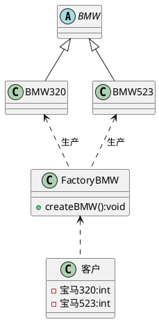
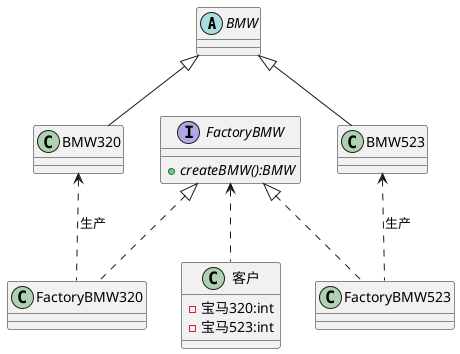
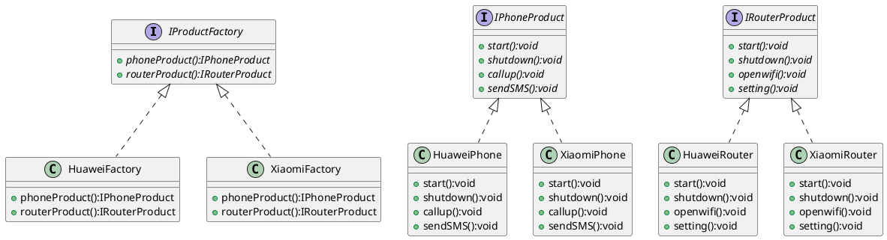

+++
weight = -6
image = 'Java_logo.svg'
categories = ['大学学习']
date = '2025-11-17T17:33:08+08:00'
title = '软件构造期末复习知识点'
description = '软件构造一些重要概念和知识点的归纳总结'
tags = ['Java', '软件构造', '设计模式']
lastmod = '2025-11-18T14:11:00+08:00'
+++

## 01 面向对象的软件构造概述

核心结论：软件构造需遵循特定流程与目标，面向对象思想通过三大特性解决传统开发问题，与面向过程方法形成关键差异。

### 一、软件构造基本流程及目标

#### 1. 传统软件开发过程模型的问题

- 瀑布模型：线性推进、阶段划分清晰，但无法适应需求增加或变化，灵活性差。
- 增量过程、原型过程虽有改进，但传统模型整体对需求变更的响应能力较弱，难以支持快速迭代。

#### 2. 测试驱动的开发（TDD）

- 核心流程：红灯（测试用例编译失败）→ 绿灯（编写功能代码使测试通过）→ 重构（优化代码且保证测试通过）。
- 核心逻辑：先写测试用例，再编写仅满足测试的功能代码，通过测试推动开发。
- 优势：强化需求理解、促使松耦合设计、尽早发现错误、便于维护重构、测试代码即文档、提升开发信心。

#### 3. 软件构造的目标

- 可理解性：遵循命名规范、有充足注释、代码布局合理、文件组织清晰、方法长度适中、避免多层嵌套。
- 可维护性：模块化编程（高内聚低耦合），灵活运用设计模式，以小代价适应软件变化。
- 可复用性：构造可重复使用的模块/API，通过模块化、泛型化、抽象化实现多场景复用。
- 时空性能：兼顾内存性能、算法性能和 I/O 性能，保障软件运行效率。

### 二、面向对象思想

#### 1. 结构化方法（面向过程）v.s. 面向对象方法

| 对比维度 | 结构化方法 | 面向对象方法 |
|----------|------------|--------------|
| 核心思路 | 聚焦“过程/功能”，设计算法解决问题 | 聚焦“对象”，模拟客观世界事物及联系 |
| 数据与行为关系 | 数据与行为分离，需单独设计数据存储和处理逻辑 | 数据与行为封装在对象中，对象负责自身任务 |
| 复用方式 | 重复编写相似功能代码，复用性差 | 通过类和继承复用代码，支持快速扩展 |
| 应对变化 | 一处变化需修改多处相关代码，维护成本高 | 封装使变化局部化，仅需修改对应对象/类 |
| 典型示例 | 自己开车去深圳北站（需关注每一步操作流程） | 打车去深圳北站（创建出租车对象，调用其方法） |

#### 2. 面向对象三大特性

- 封装（Encapsulation）：隐藏对象属性和实现细节，仅对外公开访问方法。既能增强数据安全性，也能简化编程，减少外部依赖。
- 继承（Inheritance）：子类继承父类的特征和行为，无需重复编写相同代码，实现高效代码复用。
- 多态（Polymorphism）：同一行为有多种表现形态，即“一个接口，多个方法”。可降低代码耦合度，提高程序扩展性和可维护性（如不同球员对“投篮”指令的不同执行方式）。

---

## 02 Java 语言基础

核心结论：聚焦 Java 基本数据类型与常量、数组、Java 虚拟机与垃圾回收三大核心模块，涵盖关键定义、用法、规则及特点。

### 一、Java 基本数据类型与常量

#### 1. 8 种基本数据类型及表数范围

Java 基本数据类型共 8 种，分四类，存储大小和表数范围固定，确保跨平台可移植性。

- 整数类型（4 种）：
  - `byte`：1 字节，表数范围 -128~127
  - `short`：2 字节，表数范围 -2¹⁵~2¹⁵-1
  - `int`：4 字节，表数范围 -2³¹~2³¹-1（约 21 亿），整型常量默认为此类型
  - `long`：8 字节，表数范围 -2⁶³~2⁶³-1，声明常量需在数字末尾加“l”或“L”
- 浮点类型（2 种）：
  - `float`：4 字节，表数范围 -3.403E38~3.403E38，声明常量需加“f”或“F”
  - `double`：8 字节，表数范围 -1.798E308~1.798E308，浮点型常量默认为此类型
- 字符类型（1 种）：
  - `char`：2 字节，基于 UTF-16 编码，可表示单个字符、转义字符（如 '\n'）或 Unicode 值（如 '\u000a'），支持运算（对应 Unicode 码）
- 布尔类型（1 种）：
  - `boolean`：仅取值 true 和 false，用于逻辑判断，不可用 0 或非 0 整数替代

#### 2. 不同数据类型间的转换

数据类型转换分自动转换和强制转换，核心依据精度等级（从低到高：`byte` → `short` → `int` → `long` → `float` → `double`）。

- 自动转换：低精度值赋给高精度变量时，系统自动完成，例如 `int` 型 200 可直接赋值给 `float` 变量。
- 强制转换：高精度值赋给低精度变量时，需用语法“(目标类型名) 要转换的值”，可能导致精度丢失，例如 `long` 型 26 转换为 `int` 需写为 `(int)26L`。
- 特殊转换：字符串数字可通过包装类方法转换为数值，如 `Integer.parseInt("260")` 将字符串转为 `int` 型，`Float.parseFloat("23.5")` 转为 `float` 型。

#### 3. 常量的用法

常量是程序运行中值不变的量，分直接常量和符号常量。

- 直接常量分类：包括布尔常量（`true`、`false`）、整数常量（十进制、八进制、十六进制）、浮点常量（`float` 需加 `f`/`F`，`double` 可加 `d`/`D` 或无后缀）、字符常量（单引号包裹，支持转义字符、Unicode 值）、字符串常量（双引号包裹）。
- 符号常量定义：需用 `final` 关键字，格式为 `[修饰符] final 类型标识符 常量名 = 直接常量`，修饰符可指定作用域（`public`、`private` 等）。
- 符号常量特点：定义时必须初始化，命名通常全大写，单词间用下划线分隔（如 `MONTH_OF_YEAR`），分静态常量、成员常量和局部常量三类。

### 二、数组

#### 1. 数组的创建与访问

数组是 Java 内建类型，长度创建后不可更改，支持随机访问。

- 声明方式：两种合法声明，推荐第一种 `类型[] 数组名`（如 `int[] a`），第二种为 C 语言风格 `类型 数组名[]`（如 `int a[]`）。
- 创建方式：指定长度创建（如 `int[] c = new int[2]`）或直接赋值创建（如 `int[] d = new int[]{0,1}`）。
- 访问规则：数组下标从 0 开始，最大下标为“数组长度 - 1”，通过 `数组名[下标]` 访问元素；通过 `length` 属性获取数组长度（如 `a.length`）。

#### 2. 数组的越界异常

数组访问存在下标范围限制，超出范围会抛出异常。

- 异常触发条件：访问下标小于 0 或大于等于数组长度时，触发 `ArrayIndexOutOfBoundsException` 异常（如 `int[] a = new int[2]`，访问 `a[2]` 会报错）。
- 异常特点：与集合越界异常类似，均为运行时异常，需通过代码逻辑避免（如循环中控制下标范围在 0 ~ length - 1 之间）。

### 三、Java 虚拟机与垃圾回收

#### 1. Java 虚拟机（JVM）的概念及其特点

- 概念：JVM 是通过软件模拟 Java 字节码指令集的运行环境，可模拟完整硬件系统，为 Java 程序提供隔离运行空间，不仅支持 Java 语言，还能运行 Groovy、Kotlin 等转换后的字节码文件。
- 核心特点：
  - 一次编译，到处运行：Java 程序编译为字节码文件后，可在不同操作系统（Windows、Linux、Mac）的对应 JVM 上运行，无需重新编译。
  - 自动内存管理：JVM 负责内存的分配与管理，屏蔽底层内存细节，开发者无需手动处理内存分配。
  - 自动垃圾回收功能：内置垃圾回收机制，自动识别并回收无用对象占用的内存，减少内存泄漏风险。

#### 2. 垃圾回收的分配机制

Java 采用隐式分配器实现垃圾回收，与 C/C++ 的显式分配器形成区别。

- 核心逻辑：开发者仅需创建对象并使用堆内存，内存回收无需手动操作，由 JVM 中的垃圾回收器自动完成。
- 对比显式分配器：C/C++ 需通过 `malloc()` 分配内存、`free()` 释放内存，手动释放不当易导致内存泄漏；Java 隐式分配器无需手动释放，降低开发难度和内存泄漏风险。
- 垃圾回收器作用：跟踪监控所有 Java 对象，回收不可达对象的内存，同时清理内存碎片，优化内存使用效率。

---

## 03 类和对象

### 一、对象与类：类与对象的关系

- 类是对象的抽象，是创建对象的模板，封装了同一批对象的共性特征与行为。
- 对象是类的具体实例，是客观存在的实体，具有自身的属性差异。
- 同一个类可创建多个对象，二者是一对多的对应关系。

### 二、类的声明与构造

#### 1. 类修饰符

- `public`：公共类，可被其他所有类访问。
- `abstract`：抽象类，用于继承场景，不能直接实例化。
- `final`：最终类，不可被其他类继承。

#### 2. 属性的封装

- 核心是用 `private` 关键字隐藏类的属性，外部无法直接访问。
- 必须通过 `getter` 方法（取值）和 `setter` 方法（赋值）操作属性，`setter` 可添加数据合法性校验。

#### 3. 封装的优点

- 安全性：控制属性访问权限，避免非法数据赋值。
- 高内聚：内部实现细节隐藏，外部无需关心，便于修改内部代码。
- 低耦合：降低不同对象间的依赖，简化外部调用。
- 可复用性：便于组织代码，提升开发效率。

#### 4. 构造方法

- 与类名同名，无返回值类型（无需写 `void`）。
- 一个类可声明多个构造方法（重载），参数列表不同。
- 若未显式定义构造方法，系统会自动生成默认构造方法（无参、空实现）。

#### 5. this 关键字的用法

- 作用：区分类的成员变量与方法参数（同名时），如 `this.name = name`。
- 与 `super` 关键字的异同：
  - 相同点：均用于访问类的成员，需在非静态方法中使用。
  - 不同点：`this` 指代当前对象，访问本类成员；`super` 指代父类对象，访问父类成员（如继承中调用父类构造方法）。

### 三、类的访问域

4 种访问权限的作用范围如下：

| 访问权限 | 同一个类中 | 同一个包中 | 子类中 | 全局范围内 |
|----------|------------|------------|--------|------------|
| `private` | √          |            |        |            |
| `default`（无修饰符） | √      | √          |        |            |
| `protected` | √        | √          | √      |            |
| `public` | √          | √          | √      | √          |

### 四、static 修饰符

#### 1. 类属性的特点与好处

- 特点：属于类本身，而非单个对象，所有对象共享一个副本。
- 加载时机：类初次加载时初始化，早于对象创建。
- 访问方式：`类名.属性名`（推荐）或 `对象名.属性名`。
- 好处：节省内存空间（避免重复存储相同公共数据），可直接通过类名访问，无需实例化对象。

#### 2. 非静态与静态方法的相互访问

- 核心规则：
  - 静态方法（`static` 修饰）：不能访问非静态属性和非静态方法。
  - 非静态方法：可以访问静态属性和静态方法。
- 原因：
  - 非静态成员依赖对象实例，必须创建对象后才能调用。
  - 静态成员属于类，无需实例化即可通过类名访问，加载时机早于对象。

#### 3. 静态块的使用

- 格式：`static { 代码逻辑 }`。
- 位置：可置于类中任意位置，一个类可包含多个静态块。
- 执行规则：类加载时执行，且仅执行一次，按定义顺序依次执行。
- 用途：初始化静态属性、调用静态方法，完成类级别的预处理操作。

### 五、数组

#### 1. 数组声明（一维/多维）

- 核心要求：声明时不能指定长度。
- 一维数组声明（两种方式）：
  - 推荐：`int[] arr`
  - 不推荐（C 语言风格）：`int arr[]`
- 多维数组声明：
  - 二维数组：`int[][] arr`（推荐）或 `int arr[][]`
  - 注意：`int[][3] arr` 为非法声明，不能在第二维指定长度。

#### 2. 数组初始化（动态/静态）

##### （1）一维数组初始化

- 动态初始化：先分配空间，后赋值

  ```java
  int[] arr = new int[3];
  arr[0] = 3;
  arr[1] = 9;
  arr[2] = 8;
  ```

- 静态初始化：声明时直接赋值（两种方式）

  ```java
  int[] arr = new int[] {3, 9, 8};
  int[] arr = {3, 9, 8}; // 简化写法
  ```

##### （2）多维数组初始化

- 动态初始化：
  - 规则矩阵：`int[][] arr = new int[2][3];`（2 个一维数组，每个含 3 个元素）
  - 不规则矩阵：`int[][] arr = new int[2][];`（先指定一维数组个数，后续单独初始化每个一维数组）

    ```java
    arr[0] = new int[3];
    arr[1] = new int[2];
    ```

- 静态初始化：

  ```java
  int[][] arr = new int[][] {{1,2,3}, {4,5}, {6}};
  ```

#### 3. 数组引用

- 一维数组：通过下标访问，下标从 0 开始，范围为“0 ~ 数组长度 - 1”。
- 多维数组：通过多层下标访问，如 `arr[0][1]`（访问二维数组第 1 个一维数组的第 2 个元素）。
- 长度获取：通过 `length` 属性，一维数组 `arr.length` 表示元素个数，二维数组 `arr.length` 表示一维数组的个数。

#### 4. 与集合的异同（核心区别）

- 相同点：均用于存储多个数据。
- 不同点：
  - 数组：长度固定，只能存储相同数据类型，访问效率高，不支持动态增删元素。
  - 集合（如 `ArrayList`）：长度可变，支持动态增删元素，可存储不同类型对象（需使用泛型限制），底层依赖数组实现，访问效率略低。

#### 5. 常见错误

- 声明时指定长度：`int[] arr = new int[3];` 合法，但 `int[] arr[3]` 非法。
- 数组越界：访问下标超出“0 ~ 长度 - 1”范围，抛出 `ArrayIndexOutOfBoundsException`。
- 静态初始化拆分：`int[] arr = new int[3]; arr = {1,2,3};` 非法，静态初始化必须在一条语句中完成。

---

## 04 接口与继承

### 一、继承

#### 核心结论

继承是面向对象三大特性之一，通过 `extends` 关键字实现子类复用父类属性和方法，同时存在优缺点。

#### 继承的特点

- 子类与父类是“is-a-kind-of”的关系，子类是父类的具体延伸。
- 子类能复用父类的非私有属性和方法，还可新增专属属性和方法。
- Java 中仅支持单继承，一个子类只能有一个直接父类。

#### Java 中继承的使用

- 定义父类：无需特殊关键字，按普通类声明格式定义，包含共性属性和方法。

```java
public class Person {
    private String name;
    private int age;
    // 父类构造方法
    public Person(String name, int age) {
        this.name = name;
        this.age = age;
    }
    // 父类成员方法
    public String getName() {
        return name;
    }
}
```

- 定义子类：使用 `extends` 关键字指定父类，子类不能直接继承父类构造方法，需通过 `super` 关键字调用。

```java
public class Student extends Person {
    // 子类新增属性
    private String school;
    // 子类构造方法，通过 super 调用父类构造
    public Student(String name, int age, String school) {
        super(name, age);
        this.school = school;
    }
    // 子类新增方法
    public String getSchool() {
        return school;
    }
}
```

#### 继承的优缺点

- 优点：提高代码可复用性，减少重复代码；增强程序扩展性，子类可灵活扩展功能；为多态提供基础。
- 缺点：增加类的耦合性，父类的修改可能影响子类；限制类的灵活性，单继承机制使子类无法同时继承多个父类的特性。

### 二、接口与抽象类

#### 1. 抽象方法与抽象类的定义

- 抽象方法：用 `abstract` 修饰，无方法体，仅定义方法签名，格式为 `public abstract 返回值类型 方法名(参数列表);`。
- 抽象类：包含抽象方法的类，需用 `abstract` 修饰，格式如下：

```java
public abstract class Person {
    // 普通成员方法
    public String getName() {
        return name;
    }
    // 抽象方法
    public abstract void getMission();
}
```

#### 2. 抽象类的作用与限制

- 核心作用：定义“规范”，强制子类实现抽象方法；作为父类支持多态；只能被继承，不能直接实例化（`Person p = new Person();` 会编译错误）。

#### 3. 接口的定义

- 接口用 `interface` 关键字定义，所有方法默认是 `public abstract` 类型，无字段（可定义常量），类通过 `implements` 关键字实现接口。

```java
// 接口定义
public interface Person {
    void getMission();
    void getDuty();
}
// 类实现接口
public class Student implements Person {
    @Override
    public void getMission() {
        System.out.println("为中华之崛起而读书");
    }
    @Override
    public void getDuty() {
        System.out.println("好好学习");
    }
}
```

#### 4. 接口与抽象类的对比

| 对比维度 | 抽象类（Abstract Class） | 接口（Interface） |
| --- | --- | --- |
| 抽象方法 | 可定义抽象方法，也可包含普通方法 | 所有方法均为抽象方法（默认 `public abstract`） |
| 字段 | 可定义普通字段、静态字段 | 无普通字段，仅可定义常量（默认 `public static final`） |
| 继承规则 | 只能通过 `extends` 继承一个抽象类 | 可通过 `implements` 实现多个接口，接口间可多继承 |

### 三、多态与重写

#### 1. 多态的定义

多态指程序中定义的变量和方法在编译时不确定，运行时才确定具体实现，即同一方法调用可根据对象类型呈现不同行为。

#### 2. 多态的三种实现方式

1. 重写（Override）：子类定义与父类名称、参数列表、返回类型完全一致的方法，覆盖父类方法逻辑，需添加 `@Override` 注解校验。

```java
// 父类
public class Person {
    public void getTarget() {
        System.out.println("美好生活");
    }
}
// 子类重写方法
public class Student extends Person {
    @Override
    public void getTarget() {
        System.out.println("功夫到家");
    }
}
```

2. 抽象类与抽象方法：抽象类定义规范，子类实现抽象方法，通过父类引用指向子类对象实现多态。

```java
Person engineer = new Engineer();
engineer.getTarget(); // 调用 Engineer 类的实现
```

3. 接口：接口定义方法规范，类实现接口后，通过接口引用指向实现类对象实现多态。

```java
GetTarget talent = new Talent();
talent.getTarget(); // 调用 Talent 类的实现
```

#### 3. 注意点

- 必须添加 `@Override` 注解，帮助编译器检查重写是否正确（如方法签名不一致会报错）。
- 多态的核心语法：`父类/接口 引用名称 = new 子类/实现类();`，如 `Person student = new Student();`。

### 四、Java 多继承问题

#### 1. Java 不直接支持多继承的原因

- 成员变量冲突：若子类继承的多个父类有同名成员变量，子类无法确定引用哪个父类的变量。
- 方法冲突：若多个父类有同名同参数方法，且子类未重写，调用时无法确定执行哪个父类的方法，会导致歧义。

#### 2. Java 实现多继承的两种方式

1. 内部类：子类通过定义内部类分别继承不同父类，间接获取多个父类的属性和方法。

```java
// 父类 1
public class Father {
    public int strong() {
        return 9;
    }
}
// 父类 2
public class Mother {
    public int smart() {
        return 8;
    }
}
// 子类通过内部类实现多继承
public class Son {
    // 内部类继承 Father
    class FatherInner extends Father {
        @Override
        public int strong() {
            return super.strong() + 1;
        }
    }
    // 内部类继承 Mother
    class MotherInner extends Mother {
        @Override
        public int smart() {
            return super.smart() + 2;
        }
    }
    // 子类对外提供方法，调用内部类功能
    public int getStrong() {
        return new FatherInner().strong();
    }
    public int getSmart() {
        return new MotherInner().smart();
    }
}
```

2. 接口：接口支持多继承，类可实现多个接口，间接获得多个“规范”的实现。

```java
// 接口 1
public interface Father {
    void strong();
}
// 接口 2
public interface Mother {
    void smart();
}
// 接口多继承
public interface Daughter extends Father, Mother {
    void kind();
}
// 类实现接口，实现所有抽象方法
public class Girl implements Daughter {
    @Override
    public void strong() {
        System.out.println("She's not strong.");
    }
    @Override
    public void smart() {
        System.out.println("She's very smart.");
    }
    @Override
    public void kind() {
        System.out.println("She's very kind.");
    }
}
```

### 五、超类与 `super` 关键字

#### 1. `Object` 类的特性

- `Object` 类是 Java 中所有类的始祖，所有类默认直接或间接继承 `Object`。
- 显式继承：`public class Student extends Object {}`；隐式继承：`public class Student {}`（编译时自动导入 `java.lang.Object`）。
- `Object` 类型变量可引用任何对象，需强制类型转换才能调用具体类的方法：

```java
Object obj = new Student("Zhangsan", 19);
Student zhangsan = (Student) obj;
```

#### 2. `equals()` 方法

- 作用：比较两个对象的引用是否指向同一个对象（默认实现），返回 `boolean` 类型。

```java
Student student1 = new Student("Zhangsan", 19);
Student student2 = new Student("Lisi", 18);
Student student3 = student1;
System.out.println(student1.equals(student2)); // false（不同对象）
System.out.println(student1.equals(student3)); // true（同一对象引用）
```

#### 3. `super` 关键字的作用

1. 调用父类构造方法：在子类构造方法中使用 `super(参数列表)`，必须位于子类构造方法第一行。

```java
public class Student extends Person {
    public Student(String name, int age, String school) {
        super(name, age); // 调用父类有两个参数的构造方法
        this.school = school;
    }
}
```

2. 访问父类成员：当子类与父类有同名成员变量或方法时，用 `super.成员名` 访问父类成员。

```java
class Person {
    int age = 39;
    void getTarget() {
        System.out.println("美好生活");
    }
}
class Student extends Person {
    int age = 18;
    @Override
    void getTarget() {
        System.out.println("功夫到家");
    }
    void display() {
        System.out.println("父类年龄：" + super.age); // 访问父类变量
        super.getTarget(); // 访问父类方法
    }
}
```

### 六、异常的继承框架

#### 1. 异常的定义

异常是程序运行时发生的不被期望的事件，会阻止程序正常执行，例如输入非数字、文件不存在等场景。

#### 2. 异常的继承框架

- 根类：`java.lang.Throwable`，继承自 `Object`。
- 两大分支：
  - `Error`：严重错误，程序无法处理（如栈溢出），无需捕获。
  - `Exception`：可处理的异常，分为两类：
    - 运行时异常（`RuntimeException` 子类）：编译时可忽略（如空指针异常、数组越界异常）。
    - 检查性异常：编译时必须处理（如 `SQLException`、`IOException`）。

#### 3. 设计自定义异常

- 规则：必须继承 `Throwable` 子类，继承 `Exception` 为检查性异常，继承 `RuntimeException` 为运行时异常。
- 实例：自定义成绩校验异常。

```java
// 自定义异常类
public class MyException extends Exception {
    // 无参构造
    public MyException() {
        super();
    }
    // 带异常信息的构造
    public MyException(String message) {
        super(message);
    }
}
// 测试类
import java.util.Scanner;
public class ExceptionTest {
    public static void main(String[] args) {
        Scanner input = new Scanner(System.in);
        System.out.println("请输入你的考试成绩：");
        try {
            int score = input.nextInt();
            if (score < 0) {
                throw new MyException("成绩为负！");
            } else if (score > 100) {
                throw new MyException("你的优秀已经溢出了！");
            } else {
                System.out.println("你的成绩为：" + score);
            }
        } catch (InputMismatchException e1) {
            System.out.println("输入的成绩不是数字！");
        } catch (MyException e2) {
            System.out.println(e2.getMessage());
        }
    }
}
```

## 05 设计模式导论

### 一、面向对象设计原则

面向对象设计需遵循 7 个核心原则，旨在提升代码可复用性、灵活性和可维护性：

1. **单一职责原则（SRP）**：一个类仅有一个引起它变化的原因，避免职责耦合。
2. **开闭原则（OCP）**：对扩展开放、对修改关闭，通过抽象类/接口实现稳定抽象层。
3. **里氏代换原则（LSP）**：子类可替换父类，引用父类的地方能透明使用子类对象。
4. **依赖倒转原则（DIP）**：高层与低层模块均依赖抽象，针对接口编程而非实现。
5. **合成复用原则（CARP）**：优先使用对象组合/聚合复用，而非继承，继承需遵循 LSP。
6. **接口隔离原则（ISP）**：使用多个专门接口，避免客户端依赖无需的接口。
7. **迪米特法则（LoD）**：软件实体应尽量少与其他实体交互，限制通信宽度和深度。

### 二、设计模式概述

#### 1. 概念和作用

- **概念**：一套被反复使用、分类编目的代码设计经验总结，描述重复问题的核心解决方案，本质是面向对象设计原则的实际运用。
- **作用**：重用设计与代码、简化团队沟通、降低开发错误、支持系统扩展、节省开发时间。

#### 2. 分类方式

##### 按目的分类（核心用途）

- 创建型模式：分离对象创建与使用，如单例、工厂方法等。
- 结构型模式：描述类/对象的组合布局，如适配器、装饰器等。
- 行为型模式：描述类/对象协作与职责分配，如策略、观察者等。

##### 按范围分类（适用对象）

- 类模式：处理类与子类关系，基于继承，静态且编译期确定。
- 对象模式：处理对象间关系，基于组合/聚合，动态且运行期可变。

### 三、单例模式

#### 1. 目的

保证一个类仅有一个实例，并提供全局访问点，避免重复实例化造成的资源浪费（如数据库连接、系统时钟）。

#### 2. 实现方法

##### （1）饿汉式

类加载时立即实例化，天然线程安全，调用效率高。

```java
public class Singleton {
    // 类初始化时直接实例化
    private static final Singleton instance = new Singleton();
    // 私有构造器阻止外部创建实例
    private Singleton() {}
    // 全局访问方法
    public static Singleton getInstance() {
        return instance;
    }
}
```

- **优点**：实现简单无锁，天然线程安全，获取实例速度快（类加载时初始化）。
- **缺点**：类加载即创建实例，若实例长期未使用，会造成内存资源浪费。

##### （2）懒汉式

调用访问方法时才实例化，默认线程不安全。

```java
public class Singleton {
    private static Singleton instance;
    private Singleton() {}
    public static Singleton getInstance() {
        if (instance == null) {
            instance = new Singleton(); // 多线程下可能创建多个实例
        }
        return instance;
    }
}
```

- **优点**：延迟加载，仅在首次调用时创建实例，节省内存资源。
- **缺点**：线程不安全，多线程并发调用时可能创建多个实例，破坏单例特性。

##### （3）同步锁

通过 `synchronized` 保证线程安全，但效率较低。

```java
public class Singleton {
    private static Singleton instance;
    private Singleton() {}
    public static synchronized Singleton getInstance() {
        if (instance == null) {
            instance = new Singleton();
        }
        return instance;
    }
}
```

- **优点**：兼具延迟加载特性，通过同步锁（synchronized）保证线程安全。
- **缺点**：锁竞争导致性能损耗，多线程下每次获取实例都需等待锁，效率较低。

### 四、简单工厂模式与工厂方法模式

#### 1. 遵循的设计原则

- 简单工厂模式：部分遵循“单一职责原则”（工厂集中创建对象），**不遵循开闭原则**（新增产品需修改工厂逻辑）。
- 工厂方法模式：遵循“开闭原则”（新增产品只需扩展子类）、“依赖倒转原则”（面向抽象接口编程）。

#### 2. UML结构图

##### （1）简单工厂模式



##### （2）工厂方法模式



#### 3. 区别（特点）

| 对比维度 | 简单工厂模式 | 工厂方法模式 |
|----------|--------------|--------------|
| 核心逻辑 | 工厂类集中创建所有产品，含判断逻辑 | 抽象工厂定义接口，子类负责具体产品创建 |
| 开闭原则 | 违反，新增产品需修改工厂代码 | 遵循，新增产品只需扩展工厂和产品子类 |
| 客户端感知 | 无需感知具体产品类，仅需传入参数 | 需感知具体工厂类，由子类决定产品类型 |
| 类复杂度 | 工厂类逻辑随产品增多而复杂 | 类数量成倍增加，但单个类逻辑简单 |
| 扩展方式 | 横向扩展（新增产品）需修改工厂 | 横向扩展（新增产品/工厂）仅需新增子类 |

### 五、抽象工厂设计模式

#### 1. 核心概念

- **产品族**：同一品牌下的所有产品（如华为的手机、路由器）。
- **产品等级**：不同品牌下的同种产品（如华为手机、小米手机）。

#### 2. 特点及优缺点

##### 特点

- 围绕超级工厂创建其他工厂，超级工厂称为“工厂的工厂”。
- 用于创建多个产品族的产品，客户端通过工厂接口获取整套产品。

##### 优点

- 保证客户端始终使用同一产品族的对象，避免产品搭配错误。
- 新增产品族（如新增苹果品牌）无需修改原有代码，符合开闭原则。

##### 缺点

- 新增产品等级（如新增笔记本电脑）需修改工厂抽象类和所有具体工厂，扩展困难。
- 系统抽象性和理解难度较高。

#### 3. 结构图



## 未完待续


