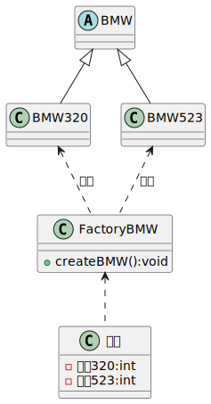
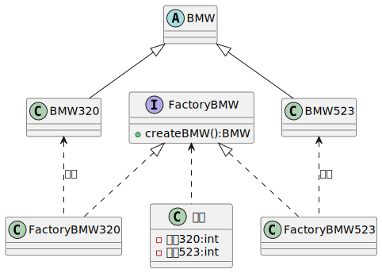
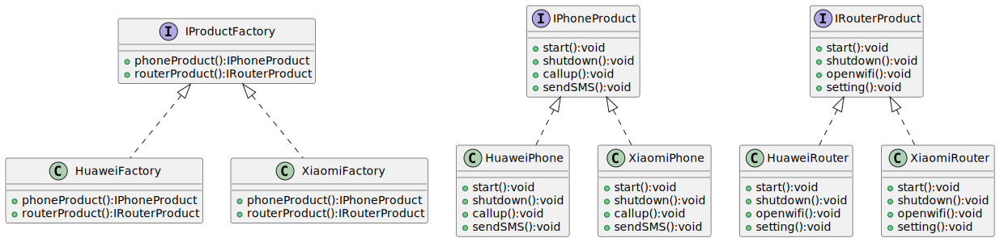
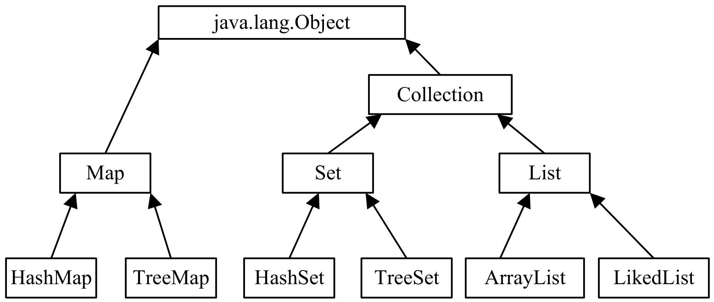
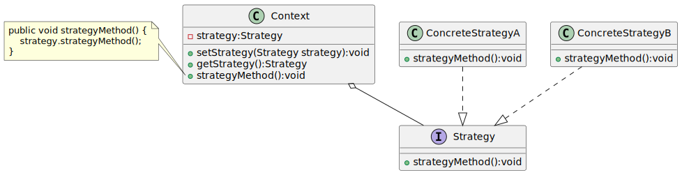
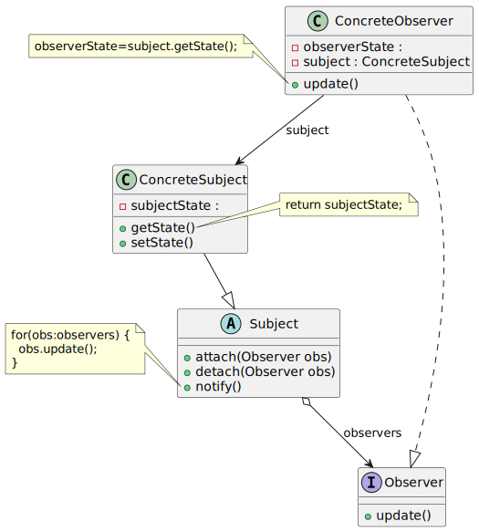

+++
weight = -6
image = 'Java_logo.svg'
categories = ['大学学习']
date = '2025-11-17T17:33:08+08:00'
title = '软件构造期末复习知识点'
description = '软件构造一些重要概念和知识点的归纳总结'
tags = ['Java', '软件构造', '设计模式']
lastmod = '2025-11-20T16:57:00+08:00'
+++

## 01 面向对象的软件构造概述

### 一、软件构造基本流程及目标

#### 1. 传统软件开发过程模型的问题

- 瀑布模型：线性推进、阶段划分清晰，但无法适应需求增加或变化，灵活性差。
- 增量过程、原型过程虽有改进，但传统模型整体对需求变更的响应能力较弱，难以支持快速迭代。

#### 2. 测试驱动的开发（TDD）

- 核心流程：红灯（测试用例编译失败）→ 绿灯（编写功能代码使测试通过）→ 重构（优化代码且保证测试通过）。
- 核心逻辑：先写测试用例，再编写仅满足测试的功能代码，通过测试推动开发。
- 优势：强化需求理解、促使松耦合设计、尽早发现错误、便于维护重构、测试代码即文档、提升开发信心。

#### 3. 软件构造的目标

- 可理解性：遵循命名规范、有充足注释、代码布局合理、文件组织清晰、方法长度适中、避免多层嵌套。
- 可维护性：模块化编程（高内聚低耦合），灵活运用设计模式，以小代价适应软件变化。
- 可复用性：构造可重复使用的模块/API，通过模块化、泛型化、抽象化实现多场景复用。
- 时空性能：兼顾内存性能、算法性能和 I/O 性能，保障软件运行效率。

### 二、面向对象思想

#### 1. 结构化方法（面向过程）v.s. 面向对象方法

| 对比维度 | 结构化方法 | 面向对象方法 |
|----------|------------|--------------|
| 核心思路 | 聚焦“过程/功能”，设计算法解决问题 | 聚焦“对象”，模拟客观世界事物及联系 |
| 数据与行为关系 | 数据与行为分离，需单独设计数据存储和处理逻辑 | 数据与行为封装在对象中，对象负责自身任务 |
| 复用方式 | 重复编写相似功能代码，复用性差 | 通过类和继承复用代码，支持快速扩展 |
| 应对变化 | 一处变化需修改多处相关代码，维护成本高 | 封装使变化局部化，仅需修改对应对象/类 |
| 典型示例 | 自己开车去深圳北站（需关注每一步操作流程） | 打车去深圳北站（创建出租车对象，调用其方法） |

#### 2. 面向对象三大特性

- 封装（Encapsulation）：隐藏对象属性和实现细节，仅对外公开访问方法。既能增强数据安全性，也能简化编程，减少外部依赖。
- 继承（Inheritance）：子类继承父类的特征和行为，无需重复编写相同代码，实现高效代码复用。
- 多态（Polymorphism）：同一行为有多种表现形态，即“一个接口，多个方法”。可降低代码耦合度，提高程序扩展性和可维护性（如不同球员对“投篮”指令的不同执行方式）。

---

## 02 Java 语言基础

### 一、Java 基本数据类型与常量

#### 1. 8 种基本数据类型及表数范围

Java 基本数据类型共 8 种，分四类，存储大小和表数范围固定，确保跨平台可移植性。

- 整数类型（4 种）：
  - `byte`：1 字节，表数范围 -128~127
  - `short`：2 字节，表数范围 -2¹⁵~2¹⁵-1
  - `int`：4 字节，表数范围 -2³¹~2³¹-1（约 21 亿），整型常量默认为此类型
  - `long`：8 字节，表数范围 -2⁶³~2⁶³-1，声明常量需在数字末尾加“l”或“L”
- 浮点类型（2 种）：
  - `float`：4 字节，表数范围 -3.403E38~3.403E38，声明常量需加“f”或“F”
  - `double`：8 字节，表数范围 -1.798E308~1.798E308，浮点型常量默认为此类型
- 字符类型（1 种）：
  - `char`：2 字节，基于 UTF-16 编码，可表示单个字符、转义字符（如 '\n'）或 Unicode 值（如 '\u000a'），支持运算（对应 Unicode 码）
- 布尔类型（1 种）：
  - `boolean`：仅取值 true 和 false，用于逻辑判断，不可用 0 或非 0 整数替代

#### 2. 不同数据类型间的转换

数据类型转换分自动转换和强制转换，核心依据精度等级（从低到高：`byte` → `short` → `int` → `long` → `float` → `double`）。

- 自动转换：低精度值赋给高精度变量时，系统自动完成，例如 `int` 型 200 可直接赋值给 `float` 变量。
- 强制转换：高精度值赋给低精度变量时，需用语法“(目标类型名) 要转换的值”，可能导致精度丢失，例如 `long` 型 26 转换为 `int` 需写为 `(int)26L`。
- 特殊转换：字符串数字可通过包装类方法转换为数值，如 `Integer.parseInt("260")` 将字符串转为 `int` 型，`Float.parseFloat("23.5")` 转为 `float` 型。

#### 3. 常量的用法

常量是程序运行中值不变的量，分直接常量和符号常量。

- 直接常量分类：包括布尔常量（`true`、`false`）、整数常量（十进制、八进制、十六进制）、浮点常量（`float` 需加 `f`/`F`，`double` 可加 `d`/`D` 或无后缀）、字符常量（单引号包裹，支持转义字符、Unicode 值）、字符串常量（双引号包裹）。
- 符号常量定义：需用 `final` 关键字，格式为 `[修饰符] final 类型标识符 常量名 = 直接常量`，修饰符可指定作用域（`public`、`private` 等）。
- 符号常量特点：定义时必须初始化，命名通常全大写，单词间用下划线分隔（如 `MONTH_OF_YEAR`），分静态常量、成员常量和局部常量三类。

### 二、数组

#### 1. 数组的创建与访问

数组是 Java 内建类型，长度创建后不可更改，支持随机访问。

- 声明方式：两种合法声明，推荐第一种 `类型[] 数组名`（如 `int[] a`），第二种为 C 语言风格 `类型 数组名[]`（如 `int a[]`）。
- 创建方式：指定长度创建（如 `int[] c = new int[2]`）或直接赋值创建（如 `int[] d = new int[]{0,1}`）。
- 访问规则：数组下标从 0 开始，最大下标为“数组长度 - 1”，通过 `数组名[下标]` 访问元素；通过 `length` 属性获取数组长度（如 `a.length`）。

#### 2. 数组的越界异常

数组访问存在下标范围限制，超出范围会抛出异常。

- 异常触发条件：访问下标小于 0 或大于等于数组长度时，触发 `ArrayIndexOutOfBoundsException` 异常（如 `int[] a = new int[2]`，访问 `a[2]` 会报错）。
- 异常特点：与集合越界异常类似，均为运行时异常，需通过代码逻辑避免（如循环中控制下标范围在 0 ~ length - 1 之间）。

### 三、Java 虚拟机与垃圾回收

#### 1. Java 虚拟机（JVM）的概念及其特点

- 概念：JVM 是通过软件模拟 Java 字节码指令集的运行环境，可模拟完整硬件系统，为 Java 程序提供隔离运行空间，不仅支持 Java 语言，还能运行 Groovy、Kotlin 等转换后的字节码文件。
- 核心特点：
  - 一次编译，到处运行：Java 程序编译为字节码文件后，可在不同操作系统（Windows、Linux、Mac）的对应 JVM 上运行，无需重新编译。
  - 自动内存管理：JVM 负责内存的分配与管理，屏蔽底层内存细节，开发者无需手动处理内存分配。
  - 自动垃圾回收功能：内置垃圾回收机制，自动识别并回收无用对象占用的内存，减少内存泄漏风险。

#### 2. 垃圾回收的分配机制

Java 采用隐式分配器实现垃圾回收，与 C/C++ 的显式分配器形成区别。

- 核心逻辑：开发者仅需创建对象并使用堆内存，内存回收无需手动操作，由 JVM 中的垃圾回收器自动完成。
- 对比显式分配器：C/C++ 需通过 `malloc()` 分配内存、`free()` 释放内存，手动释放不当易导致内存泄漏；Java 隐式分配器无需手动释放，降低开发难度和内存泄漏风险。
- 垃圾回收器作用：跟踪监控所有 Java 对象，回收不可达对象的内存，同时清理内存碎片，优化内存使用效率。

---

## 03 类和对象

### 一、对象与类：类与对象的关系

- 类是对象的抽象，是创建对象的模板，封装了同一批对象的共性特征与行为。
- 对象是类的具体实例，是客观存在的实体，具有自身的属性差异。
- 同一个类可创建多个对象，二者是一对多的对应关系。

### 二、类的声明与构造

#### 1. 类修饰符

- `public`：公共类，可被其他所有类访问。
- `abstract`：抽象类，用于继承场景，不能直接实例化。
- `final`：最终类，不可被其他类继承。

#### 2. 属性的封装

- 核心是用 `private` 关键字隐藏类的属性，外部无法直接访问。
- 必须通过 `getter` 方法（取值）和 `setter` 方法（赋值）操作属性，`setter` 可添加数据合法性校验。

#### 3. 封装的优点

- 安全性：控制属性访问权限，避免非法数据赋值。
- 高内聚：内部实现细节隐藏，外部无需关心，便于修改内部代码。
- 低耦合：降低不同对象间的依赖，简化外部调用。
- 可复用性：便于组织代码，提升开发效率。

#### 4. 构造方法

- 与类名同名，无返回值类型（无需写 `void`）。
- 一个类可声明多个构造方法（重载），参数列表不同。
- 若未显式定义构造方法，系统会自动生成默认构造方法（无参、空实现）。

#### 5. `this` 关键字的用法

- 作用：区分类的成员变量与方法参数（同名时），如 `this.name = name`。
- 与 `super` 关键字的异同：
  - 相同点：均用于访问类的成员，需在非静态方法中使用。
  - 不同点：`this` 指代当前对象，访问本类成员；`super` 指代父类对象，访问父类成员（如继承中调用父类构造方法）。


相同点：两者均为 Java 关键字，可用于访问类的成员（属性、方法），且两者调用构造方法时均需位于方法首行，简化代码复用与引用逻辑。

不同点：`this` 指向当前对象实例，用于访问本类成员或调用本类构造方法；`super` 指向父类对象实例，用于访问父类成员或调用父类构造方法；`this` 可单独使用（如返回当前对象），`super` 不可单独使用。


### 三、类的访问域

4 种访问权限的作用范围如下：

| 访问权限 | 同一个类中 | 同一个包中 | 子类中 | 全局范围内 |
|----------|------------|------------|--------|------------|
| `private` | √          |            |        |            |
| `default`（无修饰符） | √      | √          |        |            |
| `protected` | √        | √          | √      |            |
| `public` | √          | √          | √      | √          |

### 四、`static` 修饰符

#### 1. 类属性的特点与好处

- 特点：属于类本身，而非单个对象，所有对象共享一个副本。
- 加载时机：类初次加载时初始化，早于对象创建。
- 访问方式：`类名.属性名`（推荐）或 `对象名.属性名`。
- 好处：节省内存空间（避免重复存储相同公共数据），可直接通过类名访问，无需实例化对象。

#### 2. 非静态与静态方法的相互访问

- 核心规则：
  - 静态方法（`static` 修饰）：不能访问非静态属性和非静态方法。
  - 非静态方法：可以访问静态属性和静态方法。
- 原因：
  - 非静态成员依赖对象实例，必须创建对象后才能调用。
  - 静态成员属于类，无需实例化即可通过类名访问，加载时机早于对象。

#### 3. 静态块的使用

- 格式：`static { 代码逻辑 }`。
- 位置：可置于类中任意位置，一个类可包含多个静态块。
- 执行规则：类加载时执行，且仅执行一次，按定义顺序依次执行。
- 用途：初始化静态属性、调用静态方法，完成类级别的预处理操作。

### 五、数组

#### 1. 数组声明（一维/多维）

- 核心要求：声明时不能指定长度。
- 一维数组声明（两种方式）：
  - 推荐：`int[] arr`
  - 不推荐（C 语言风格）：`int arr[]`
- 多维数组声明：
  - 二维数组：`int[][] arr`（推荐）或 `int arr[][]`
  - 注意：`int[][3] arr` 为非法声明，不能在第二维指定长度。

#### 2. 数组初始化（动态/静态）

##### （1）一维数组初始化

- 动态初始化：先分配空间，后赋值

  ```java
  int[] arr = new int[3];
  arr[0] = 3;
  arr[1] = 9;
  arr[2] = 8;
  ```

- 静态初始化：声明时直接赋值（两种方式）

  ```java
  int[] arr = new int[] {3, 9, 8};
  int[] arr = {3, 9, 8}; // 简化写法
  ```

##### （2）多维数组初始化

- 动态初始化：
  - 规则矩阵：`int[][] arr = new int[2][3];`（2 个一维数组，每个含 3 个元素）
  - 不规则矩阵：`int[][] arr = new int[2][];`（先指定一维数组个数，后续单独初始化每个一维数组）

    ```java
    arr[0] = new int[3];
    arr[1] = new int[2];
    ```

- 静态初始化：

  ```java
  int[][] arr = new int[][] {{1,2,3}, {4,5}, {6}};
  ```

#### 3. 数组引用

- 一维数组：通过下标访问，下标从 0 开始，范围为“0 ~ 数组长度 - 1”。
- 多维数组：通过多层下标访问，如 `arr[0][1]`（访问二维数组第 1 个一维数组的第 2 个元素）。
- 长度获取：通过 `length` 属性，一维数组 `arr.length` 表示元素个数，二维数组 `arr.length` 表示一维数组的个数。

#### 4. 与集合的异同（核心区别）

- 相同点：均用于存储多个数据。
- 不同点：
  - 数组：长度固定，只能存储相同数据类型，访问效率高，不支持动态增删元素。
  - 集合（如 `ArrayList`）：长度可变，支持动态增删元素，可存储不同类型对象（需使用泛型限制），底层依赖数组实现，访问效率略低。

#### 5. 常见错误

- 声明时指定长度：`int[] arr = new int[3];` 合法，但 `int[] arr[3]` 非法。
- 数组越界：访问下标超出“0 ~ 长度 - 1”范围，抛出 `ArrayIndexOutOfBoundsException`。
- 静态初始化拆分：`int[] arr = new int[3]; arr = {1,2,3};` 非法，静态初始化必须在一条语句中完成。

---

## 04 接口与继承

### 一、继承

#### 核心结论

继承是面向对象三大特性之一，通过 `extends` 关键字实现子类复用父类属性和方法，同时存在优缺点。

#### 继承的特点

- 子类与父类是“is-a-kind-of”的关系，子类是父类的具体延伸。
- 子类能复用父类的非私有属性和方法，还可新增专属属性和方法。
- Java 中仅支持单继承，一个子类只能有一个直接父类。

#### Java 中继承的使用

- 定义父类：无需特殊关键字，按普通类声明格式定义，包含共性属性和方法。

```java
public class Person {
    private String name;
    private int age;
    // 父类构造方法
    public Person(String name, int age) {
        this.name = name;
        this.age = age;
    }
    // 父类成员方法
    public String getName() {
        return name;
    }
}
```

- 定义子类：使用 `extends` 关键字指定父类，子类不能直接继承父类构造方法，需通过 `super` 关键字调用。

```java
public class Student extends Person {
    // 子类新增属性
    private String school;
    // 子类构造方法，通过 super 调用父类构造
    public Student(String name, int age, String school) {
        super(name, age);
        this.school = school;
    }
    // 子类新增方法
    public String getSchool() {
        return school;
    }
}
```

#### 继承的优缺点

- 优点：提高代码可复用性，减少重复代码；增强程序扩展性，子类可灵活扩展功能；为多态提供基础。
- 缺点：增加类的耦合性，父类的修改可能影响子类；限制类的灵活性，单继承机制使子类无法同时继承多个父类的特性。

### 二、接口与抽象类

#### 1. 抽象方法与抽象类的定义

- 抽象方法：用 `abstract` 修饰，无方法体，仅定义方法签名，格式为 `public abstract 返回值类型 方法名(参数列表);`。
- 抽象类：包含抽象方法的类，需用 `abstract` 修饰，格式如下：

```java
public abstract class Person {
    // 普通成员方法
    public String getName() {
        return name;
    }
    // 抽象方法
    public abstract void getMission();
}
```

#### 2. 抽象类的作用与限制

- 核心作用：定义“规范”，强制子类实现抽象方法；作为父类支持多态；只能被继承，不能直接实例化（`Person p = new Person();` 会编译错误）。

#### 3. 接口的定义

- 接口用 `interface` 关键字定义，所有方法默认是 `public abstract` 类型，无字段（可定义常量），类通过 `implements` 关键字实现接口。

```java
// 接口定义
public interface Person {
    void getMission();
    void getDuty();
}
// 类实现接口
public class Student implements Person {
    @Override
    public void getMission() {
        System.out.println("为中华之崛起而读书");
    }
    @Override
    public void getDuty() {
        System.out.println("好好学习");
    }
}
```

#### 4. 接口与抽象类的对比

| 对比维度 | 抽象类（Abstract Class） | 接口（Interface） |
| --- | --- | --- |
| 抽象方法 | 可定义抽象方法，也可包含普通方法 | 所有方法均为抽象方法（默认 `public abstract`） |
| 字段 | 可定义普通字段、静态字段 | 无普通字段，仅可定义常量（默认 `public static final`） |
| 继承规则 | 只能通过 `extends` 继承一个抽象类 | 可通过 `implements` 实现多个接口，接口间可多继承 |


抽象类和接口的相同点在于，二者都不能直接实例化，核心作用都是为子类或实现类提供统一的抽象规范，便于代码的复用和扩展。它们都可包含抽象方法，这些方法无需提供具体实现，需由子类或实现类完成重写以实现特定功能。

不同点体现在多个方面：属性上，抽象类可包含普通属性、静态属性且支持各种访问修饰符，接口中只能是公开静态常量；方法上，抽象类可包含抽象方法、普通方法、静态方法等多种类型，接口中早期仅能有抽象方法，后期版本可包含默认方法和静态方法且均为公开访问；继承方面，一个类只能单继承一个抽象类，却能实现多个接口；作用上，抽象类侧重体现类之间的继承关系和共性属性与方法的复用，接口侧重定义类的行为规范，实现不同类之间的行为统一。


### 三、多态与重写

#### 1. 多态的定义

多态指程序中定义的变量和方法在编译时不确定，运行时才确定具体实现，即同一方法调用可根据对象类型呈现不同行为。

#### 2. 多态的三种实现方式

1. 重写（Override）：子类定义与父类名称、参数列表、返回类型完全一致的方法，覆盖父类方法逻辑，需添加 `@Override` 注解校验。

```java
// 父类
public class Person {
    public void getTarget() {
        System.out.println("美好生活");
    }
}
// 子类重写方法
public class Student extends Person {
    @Override
    public void getTarget() {
        System.out.println("功夫到家");
    }
}
```

2. 抽象类与抽象方法：抽象类定义规范，子类实现抽象方法，通过父类引用指向子类对象实现多态。

```java
Person engineer = new Engineer();
engineer.getTarget(); // 调用 Engineer 类的实现
```

3. 接口：接口定义方法规范，类实现接口后，通过接口引用指向实现类对象实现多态。

```java
GetTarget talent = new Talent();
talent.getTarget(); // 调用 Talent 类的实现
```

#### 3. 注意点

- 必须添加 `@Override` 注解，帮助编译器检查重写是否正确（如方法签名不一致会报错）。
- 多态的核心语法：`父类/接口 引用名称 = new 子类/实现类();`，如 `Person student = new Student();`。

### 四、Java 多继承问题

#### 1. Java 不直接支持多继承的原因

- 成员变量冲突：若子类继承的多个父类有同名成员变量，子类无法确定引用哪个父类的变量。
- 方法冲突：若多个父类有同名同参数方法，且子类未重写，调用时无法确定执行哪个父类的方法，会导致歧义。

#### 2. Java 实现多继承的两种方式

1. 内部类：子类通过定义内部类分别继承不同父类，间接获取多个父类的属性和方法。

```java
// 父类 1
public class Father {
    public int strong() {
        return 9;
    }
}
// 父类 2
public class Mother {
    public int smart() {
        return 8;
    }
}
// 子类通过内部类实现多继承
public class Son {
    // 内部类继承 Father
    class FatherInner extends Father {
        @Override
        public int strong() {
            return super.strong() + 1;
        }
    }
    // 内部类继承 Mother
    class MotherInner extends Mother {
        @Override
        public int smart() {
            return super.smart() + 2;
        }
    }
    // 子类对外提供方法，调用内部类功能
    public int getStrong() {
        return new FatherInner().strong();
    }
    public int getSmart() {
        return new MotherInner().smart();
    }
}
```

2. 接口：接口支持多继承，类可实现多个接口，间接获得多个“规范”的实现。

```java
// 接口 1
public interface Father {
    void strong();
}
// 接口 2
public interface Mother {
    void smart();
}
// 接口多继承
public interface Daughter extends Father, Mother {
    void kind();
}
// 类实现接口，实现所有抽象方法
public class Girl implements Daughter {
    @Override
    public void strong() {
        System.out.println("She's not strong.");
    }
    @Override
    public void smart() {
        System.out.println("She's very smart.");
    }
    @Override
    public void kind() {
        System.out.println("She's very kind.");
    }
}
```

### 五、超类与 `super` 关键字

#### 1. `Object` 类的特性

- `Object` 类是 Java 中所有类的始祖，所有类默认直接或间接继承 `Object`。
- 显式继承：`public class Student extends Object {}`；隐式继承：`public class Student {}`（编译时自动导入 `java.lang.Object`）。
- `Object` 类型变量可引用任何对象，需强制类型转换才能调用具体类的方法：

```java
Object obj = new Student("Zhangsan", 19);
Student zhangsan = (Student) obj;
```

#### 2. `equals()` 方法

- 作用：比较两个对象的引用是否指向同一个对象（默认实现），返回 `boolean` 类型。

```java
Student student1 = new Student("Zhangsan", 19);
Student student2 = new Student("Lisi", 18);
Student student3 = student1;
System.out.println(student1.equals(student2)); // false（不同对象）
System.out.println(student1.equals(student3)); // true（同一对象引用）
```

#### 3. `super` 关键字的作用

1. 调用父类构造方法：在子类构造方法中使用 `super(参数列表)`，必须位于子类构造方法第一行。

```java
public class Student extends Person {
    public Student(String name, int age, String school) {
        super(name, age); // 调用父类有两个参数的构造方法
        this.school = school;
    }
}
```

2. 访问父类成员：当子类与父类有同名成员变量或方法时，用 `super.成员名` 访问父类成员。

```java
class Person {
    int age = 39;
    void getTarget() {
        System.out.println("美好生活");
    }
}
class Student extends Person {
    int age = 18;
    @Override
    void getTarget() {
        System.out.println("功夫到家");
    }
    void display() {
        System.out.println("父类年龄：" + super.age); // 访问父类变量
        super.getTarget(); // 访问父类方法
    }
}
```

### 六、异常的继承框架

#### 1. 异常的定义

异常是程序运行时发生的不被期望的事件，会阻止程序正常执行，例如输入非数字、文件不存在等场景。

#### 2. 异常的继承框架

- 根类：`java.lang.Throwable`，继承自 `Object`。
- 两大分支：
  - `Error`：严重错误，程序无法处理（如栈溢出），无需捕获。
  - `Exception`：可处理的异常，分为两类：
    - 运行时异常（`RuntimeException` 子类）：编译时可忽略（如空指针异常、数组越界异常）。
    - 检查性异常：编译时必须处理（如 `SQLException`、`IOException`）。

#### 3. 设计自定义异常

- 规则：必须继承 `Throwable` 子类，继承 `Exception` 为检查性异常，继承 `RuntimeException` 为运行时异常。
- 实例：自定义成绩校验异常。

```java
// 自定义异常类
public class MyException extends Exception {
    // 无参构造
    public MyException() {
        super();
    }
    // 带异常信息的构造
    public MyException(String message) {
        super(message);
    }
}
// 测试类
import java.util.Scanner;
public class ExceptionTest {
    public static void main(String[] args) {
        Scanner input = new Scanner(System.in);
        System.out.println("请输入你的考试成绩：");
        try {
            int score = input.nextInt();
            if (score < 0) {
                throw new MyException("成绩为负！");
            } else if (score > 100) {
                throw new MyException("你的优秀已经溢出了！");
            } else {
                System.out.println("你的成绩为：" + score);
            }
        } catch (InputMismatchException e1) {
            System.out.println("输入的成绩不是数字！");
        } catch (MyException e2) {
            System.out.println(e2.getMessage());
        }
    }
}
```

## 05 设计模式导论

### 一、面向对象设计原则

面向对象设计需遵循 7 个核心原则，旨在提升代码可复用性、灵活性和可维护性：

1. **单一职责原则（SRP）**：一个类仅有一个引起它变化的原因，避免职责耦合。
2. **开闭原则（OCP）**：对扩展开放、对修改关闭，通过抽象类/接口实现稳定抽象层。
3. **里氏代换原则（LSP）**：子类可替换父类，引用父类的地方能透明使用子类对象。
4. **依赖倒转原则（DIP）**：高层与低层模块均依赖抽象，针对接口编程而非实现。
5. **合成复用原则（CARP）**：优先使用对象组合/聚合复用，而非继承，继承需遵循 LSP。
6. **接口隔离原则（ISP）**：使用多个专门接口，避免客户端依赖无需的接口。
7. **迪米特法则（LoD）**：软件实体应尽量少与其他实体交互，限制通信宽度和深度。

### 二、设计模式概述

#### 1. 概念和作用

- **概念**：一套被反复使用、分类编目的代码设计经验总结，描述重复问题的核心解决方案，本质是面向对象设计原则的实际运用。
- **作用**：重用设计与代码、简化团队沟通、降低开发错误、支持系统扩展、节省开发时间。

#### 2. 分类方式

##### 按目的分类（核心用途）

- 创建型模式：分离对象创建与使用，如单例、工厂方法等。
- 结构型模式：描述类/对象的组合布局，如适配器、装饰器等。
- 行为型模式：描述类/对象协作与职责分配，如策略、观察者等。

##### 按范围分类（适用对象）

- 类模式：处理类与子类关系，基于继承，静态且编译期确定。
- 对象模式：处理对象间关系，基于组合/聚合，动态且运行期可变。

### 三、单例模式

#### 1. 目的

保证一个类仅有一个实例，并提供全局访问点，避免重复实例化造成的资源浪费（如数据库连接、系统时钟）。

#### 2. 实现方法

##### （1）饿汉式

类加载时立即实例化，天然线程安全，调用效率高。

```java
public class Singleton {
    // 类初始化时直接实例化
    private static final Singleton instance = new Singleton();
    // 私有构造器阻止外部创建实例
    private Singleton() {}
    // 全局访问方法
    public static Singleton getInstance() {
        return instance;
    }
}
```

- **优点**：实现简单无锁，天然线程安全，获取实例速度快（类加载时初始化）。
- **缺点**：类加载即创建实例，若实例长期未使用，会造成内存资源浪费。

##### （2）懒汉式

调用访问方法时才实例化，默认线程不安全。

```java
public class Singleton {
    private static Singleton instance;
    private Singleton() {}
    public static Singleton getInstance() {
        if (instance == null) {
            instance = new Singleton(); // 多线程下可能创建多个实例
        }
        return instance;
    }
}
```

- **优点**：延迟加载，仅在首次调用时创建实例，节省内存资源。
- **缺点**：线程不安全，多线程并发调用时可能创建多个实例，破坏单例特性。

##### （3）同步锁

通过 `synchronized` 保证线程安全，但效率较低。

```java
public class Singleton {
    private static Singleton instance;
    private Singleton() {}
    public static synchronized Singleton getInstance() {
        if (instance == null) {
            instance = new Singleton();
        }
        return instance;
    }
}
```

- **优点**：兼具延迟加载特性，通过同步锁（synchronized）保证线程安全。
- **缺点**：锁竞争导致性能损耗，多线程下每次获取实例都需等待锁，效率较低。

### 四、简单工厂模式与工厂方法模式

#### 1. 遵循的设计原则

- 简单工厂模式：部分遵循“单一职责原则”（工厂集中创建对象），**不遵循开闭原则**（新增产品需修改工厂逻辑）。
- 工厂方法模式：遵循“开闭原则”（新增产品只需扩展子类）、“依赖倒转原则”（面向抽象接口编程）。


工厂模式的核心优势在于将对象创建与使用逻辑分离，降低了代码间的耦合度，使得对象创建的细节被封装在工厂类中，使用者无需关注具体实现就能获取所需对象，大幅提升了代码的可维护性。当需要新增或修改对象类型时，只需调整工厂类或扩展新的工厂子类，无需改动现有使用代码，很好地符合了开闭原则，同时也简化了对象创建过程中复杂参数的配置与管理，让代码结构更清晰。

不过工厂模式也存在一定局限，随着产品类型的增多，可能需要创建大量对应的工厂类或在工厂中添加复杂判断逻辑，导致系统类的数量增加、结构变得臃肿，增加了维护成本。此外，工厂模式对产品类型的抽象要求较高，若产品之间的差异过大，抽象工厂接口或基类的设计会变得困难，后续扩展新的产品类型时，可能需要修改抽象层代码，违背开闭原则的初衷，同时也提高了系统的初始设计与实现难度。


#### 2. UML结构图

##### （1）简单工厂模式



##### （2）工厂方法模式



#### 3. 区别（特点）

| 对比维度 | 简单工厂模式 | 工厂方法模式 |
|----------|--------------|--------------|
| 核心逻辑 | 工厂类集中创建所有产品，含判断逻辑 | 抽象工厂定义接口，子类负责具体产品创建 |
| 开闭原则 | 违反，新增产品需修改工厂代码 | 遵循，新增产品只需扩展工厂和产品子类 |
| 客户端感知 | 无需感知具体产品类，仅需传入参数 | 需感知具体工厂类，由子类决定产品类型 |
| 类复杂度 | 工厂类逻辑随产品增多而复杂 | 类数量成倍增加，但单个类逻辑简单 |
| 扩展方式 | 横向扩展（新增产品）需修改工厂 | 横向扩展（新增产品/工厂）仅需新增子类 |


简单工厂模式通过一个单独的工厂类负责所有产品的创建，客户端只需传入参数即可获取对应产品，无需关注创建细节，但工厂类集中了所有产品的创建逻辑，新增产品时需修改工厂类代码，违背开闭原则。工厂方法模式将产品创建逻辑分散到多个具体工厂类中，每个具体工厂只负责一种产品的创建，核心是定义抽象工厂接口，由具体工厂实现创建逻辑，客户端通过实例化具体工厂来获取产品。

两者的核心区别在于创建逻辑的集中程度，简单工厂是集中式创建，工厂方法是分散式创建；简单工厂违背开闭原则，工厂方法通过扩展具体工厂支持新增产品，符合开闭原则；简单工厂中客户端依赖单一工厂类，工厂方法中客户端依赖抽象工厂接口和具体产品对应的具体工厂，耦合度更低，灵活性更强。


### 五、抽象工厂设计模式

#### 1. 核心概念

- **产品族**：同一品牌下的所有产品（如华为的手机、路由器）。
- **产品等级**：不同品牌下的同种产品（如华为手机、小米手机）。

#### 2. 特点及优缺点

##### 特点

- 围绕超级工厂创建其他工厂，超级工厂称为“工厂的工厂”。
- 用于创建多个产品族的产品，客户端通过工厂接口获取整套产品。

##### 优点

- 保证客户端始终使用同一产品族的对象，避免产品搭配错误。
- 新增产品族（如新增苹果品牌）无需修改原有代码，符合开闭原则。

##### 缺点

- 新增产品等级（如新增笔记本电脑）需修改工厂抽象类和所有具体工厂，扩展困难。
- 系统抽象性和理解难度较高。

#### 3. 结构图



---

## 06 软件测试及代码质量保障

### 一、软件测试的定义和分类

#### 1. 软件测试的定义

根据 IEEE 定义，软件测试是使用人工或自动的手段来运行或测量被测系统，或静态检查被测系统的过程。

#### 2. 软件测试的目的

校验被测系统是否满足需求，找出实际系统输出和预期结果之间的差异，且软件测试是以需求为中心，并非以缺陷为中心。

#### 3. 软件测试的常见分类

##### 按测试阶段划分

- 单元测试：对应编码阶段，测试对象是单个模块或组件。
- 集成测试：对应详细设计阶段，测试对象是一组模块或组件。
- 系统测试：对应概要设计阶段，测试对象是整个系统。
- 验收测试：对应需求阶段，包括 Alpha 测试和 Beta 测试。

##### 是否查看源代码划分

- 白盒测试：基于程序源代码，已知产品内部工作过程，针对内部结构测试。
- 黑盒测试：不考虑内部逻辑结构，着眼于程序外部结构，针对软件界面和功能测试。
- 灰盒测试：介于白盒测试和黑盒测试之间，部分了解内部结构。

### 二、测试用例

#### 1. 测试用例的定义

测试用例（Test Case）是对一项特定软件产品进行测试任务的描述，体现测试方案、方法、技术和策略。其内容包括测试目标、测试环境、输入数据、测试步骤、预期结果、测试脚本等，最终形成文档。简单来说，它是为某个特殊目标编制的一组测试输入、执行条件以及预期结果，用于核实是否满足某个特定软件需求。

#### 2. 测试用例的设计原则

- 正确性：输入用户实际数据验证系统是否满足需求规格说明书，测试点至少覆盖各项功能且正常。
- 全面性：覆盖所有需求功能项，兼顾正常使用、关联使用、非正常情况（不合理、非法、越界及极限输入数据）操作和环境设置等。
- 连贯性：用例组织有条理、主次分明，尤其是业务测试用例，每个用例执行粒度适中，仅覆盖特定测点，用例间保持连贯性。
- 可判定性：测试执行结果的正确性可判定，每个测试用例都有相应期望结果。
- 可操作性：清晰写明测试操作步骤及对应测试结果。

#### 3. 测试用例的常用设计方法

测试用例的设计方法主要分为两大类，分别是白盒测试法和黑盒测试法。

### 三、白盒测试

#### 1. 白盒测试的定义

白盒测试也称作结构测试或逻辑驱动测试，基于程序的源代码，已知产品的内部工作过程，主要对程序内部结构展开测试，关注程序实现细节，检验程序中的每条通路是否都按照预定要求正确工作。

#### 2. 白盒测试的优势和劣势

##### 优势

- 针对性强，可快速定位 Bug。
- 函数级别测试，Bug 修复成本低。
- 有助于了解测试的覆盖程度。
- 有助于优化代码，预防缺陷。

##### 劣势

- 对测试人员技术要求高。
- 测试成本高。

#### 3. 逻辑覆盖方法的覆盖指标及其强度比较

##### 覆盖指标（按强度从弱到强排序）

1. 语句覆盖：至少执行程序中所有语句一次，是最弱的逻辑覆盖准则。
2. 判定覆盖：也称分支覆盖，至少执行程序中每个分支一次，保证每个判定节点取得每种可能结果至少一次。
3. 条件覆盖：保证程序中每个复合判定表达式中，每个简单判定条件的取真和取假情况至少执行一次。
4. 判定条件覆盖：同时满足条件覆盖和判定覆盖，既保证每个简单判定条件取真取假至少一次，也保证每个判定节点取得每种可能结果至少一次。
5. 条件组合覆盖：保证程序每个判定节点中，所有简单判定条件的所有可能取值组合情况至少执行一次。
6. 路径覆盖：使程序中每一条可能的路径至少执行一次，是最强的逻辑覆盖准则，但一般不可实现。

#### 4. 常用白盒测试用例的设计方法

##### 语句覆盖

设计测试用例时，确保程序中所有语句都至少执行一次。例如针对代码

```java
int Func1(int a, int b, int x) {
    if ((a > 1) && (b == 0))
        x = x / a; 
    if ((a == 2) || (x > 1))
        x = x + 1; 
    return x;
}
```

设计测试用例 `a=2，b=0，x=4`，可覆盖所有语句。

##### 判定覆盖

设计测试用例时，保证程序中每个判定节点的每种可能结果（真、假）都至少执行一次。例如针对上述 Func1 函数，设计测试用例 `a=1，b=1，x=2` 和 `a=3，b=0，x=3`，可覆盖所有分支。

##### 条件覆盖

设计测试用例时，确保每个复合判定表达式中的每个简单判定条件都取到真、假两种结果。例如针对 Func1 函数的 4 个简单判定条件（`a>1`、`b==0`、`a==2`、`x>1`），设计测试用例覆盖每个条件的真假情况。

##### 判定条件覆盖

设计测试用例时，同时满足判定覆盖和条件覆盖的要求。例如针对 Func1 函数，设计测试用例既覆盖所有分支，又覆盖每个简单判定条件的真假情况。

##### 条件组合覆盖

设计测试用例时，覆盖每个判定节点中所有简单判定条件的所有可能取值组合。例如针对 Func1 函数的两个复合判定表达式，覆盖每个表达式内简单条件的所有组合情况。

##### 路径覆盖

设计测试用例时，覆盖程序中所有可能的执行路径。例如针对 Func1 函数的 4 条执行路径（L13：p1->p3、L14：p1->p4、L23：p2->p3、L24：p2->p4），设计对应的测试用例。

### 四、黑盒测试

#### 1. 黑盒测试的定义

黑盒测试也称作功能测试或数据驱动测试，着眼于程序外部结构，在完全不考虑程序内部逻辑结构和内部特性的情况下，在程序接口进行测试，仅检查程序功能是否按照需求规格说明书的规定正常使用，是否能适当接收输入数据并产生正确的输出信息。

#### 2. 黑盒测试的优势和劣势

##### 优势

- 方法简单有效。
- 可以整体测试系统行为。
- 开发与测试可以并行进行。
- 对测试人员技术要求相对较低，入门门槛低。

##### 劣势

- 测试覆盖率较低。
- 直接依赖于需求规格说明书。

#### 3. 常用黑盒测试用例的设计方法

##### 等价类划分

- 核心思想：将输入域划分为若干个等价类，每个等价类中的输入数据对揭示程序错误是等效的，通过测试等价类完成穷尽测试。
- 等价类分类：
  - 有效等价类：符合软件规格说明书，合理、有意义的输入数据集合，用于检验系统是否能完成指定功能。
  - 无效等价类：不符合软件规格说明书，不合理、无意义的输入数据集合，用于考察系统的容错性。
- 划分原则：
  1. 输入条件规定取值范围或取值个数，确定一个有效等价类和两个无效等价类。
  2. 输入条件规定输入值集合，且软件对每个输入值进行不同处理，确定 n 个有效等价类和一个无效等价类。
  3. 输入条件规定“必须是”的情况，确定一个有效等价类和一个无效等价类。
  4. 输入为布尔表达式，确定一个有效等价类和一个无效等价类。

##### 边界值分析

- 核心思想：大量缺陷常发生在输入域或输出域的边界上，选择系统边界或边界附近的数据设计测试用例，可提高测试回报率。
- 边界点：等价类中恰好处于边界，可能导致系统内部处理机制发生变化的点。
- 设计步骤：先确定每个输入条件的边界点，再组织测试数据设计测试用例，需平衡用例数量、覆盖度、冗余度、缺陷定位能力和复杂度。

##### 场景法

- 核心思想：以事件流为核心，测试软件的主要业务流程、主要功能的正确性和异常处理能力。
- 测试步骤：
  1. 定义基本流（正确业务流程）和备选流（出错环节）。
  2. 基于基本流和备选流定义场景。
  3. 从场景设计测试用例。
  4. 输入测试数据，完善测试用例。

---

## 07 集合与策略、迭代器模式

### 一、集合类概述及继承框架

#### 1. 集合的定义及与数组的区别

- 定义：Java 中 `java.util` 包下的容器类，用于存储和操作多个对象，接口定义基本特性，具体类提供不同实现。
- 与数组的区别：
  1. 数组长度固定，集合长度可变，支持动态添加/删除元素。
  2. 数组可存储基本类型（如 `int`）和引用类型（如 `String`），集合只能存储引用类型（基本类型需通过包装类如 `Integer` 存储）。


集合与数组的核心差别体现在存储、长度、类型和功能上。数组长度固定，集合长度动态可变；数组可存储基本数据类型和对象，集合仅存储对象；数组功能简单，仅提供长度查询和元素访问，集合提供增删改查、排序、遍历等丰富操作；数组初始化需指定长度或直接赋值，集合通过构造方法创建，支持动态添加元素。


#### 2. 常用集合类举例

- List：有序、可重复元素的集合，如 `ArrayList`、`LinkedList`。
- Set：无序、不可重复元素的集合，如 `HashSet`、`TreeSet`。
- Map：键值对（key-value）映射集合，key 不可重复，每个 key 最多映射一个 value，如 `HashMap`、`TreeMap`。

#### 3. 集合继承框架



- 核心关系：`List` 和 `Set` 继承 `Collection` 接口，`Map` 独立存在，不继承 `Collection` 接口。

### 二、`List` 接口及其标准实现类 `ArrayList` 与 `LinkedList`

#### 1. 特点及异同

| 特性                | `ArrayList`                          | `LinkedList`                          |
|---------------------|-----------------------------------|------------------------------------|
| 底层结构            | 动态数组                          | 双向链表                          |
| 访问效率            | 高（通过下标 `get(index)` 直接访问） | 低（需遍历链表查找节点）          |
| 增删效率（中间/开头）| 低（需移动后续元素）              | 高（仅修改节点指针）              |
| 增删效率（末尾）    | 高（直接扩容，无需移动元素）      | 高（直接添加节点）                |
| 内存占用            | 连续内存，占用较少                | 每个节点含数据和指针，占用较多    |


`ArrayList` 适合读取操作频繁、随机访问需求高的场景，其基于动态数组实现，通过索引访问元素效率高，能快速获取指定位置的元素，在需要频繁查询数据、较少进行插入或删除操作（尤其非首尾位置）时表现更优。

`LinkedList` 适合插入和删除操作频繁的场景，其基于双向链表实现，调整节点连接即可完成元素的增删，无需移动大量元素，在需要频繁在首尾或中间位置添加、移除元素，且随机访问需求较低的场景中更为合适。


#### 2. 核心方法

##### `ArrayList`

- 增加元素：`add(E e)`（末尾添加）、`add(int index, E e)`（指定位置添加）

  ```java
  ArrayList<String> list = new ArrayList<>();
  list.add("Google"); // 末尾添加
  list.add(1, "Weibo"); // 索引1位置添加
  ```

- 删除元素：`remove(int index)`（按索引删除）、`remove(Object o)`（按元素删除）

  ```java
  list.remove(3); // 删除索引3的元素
  ```

- 访问元素：`get(int index)`（按索引获取）

  ```java
  String elem = list.get(1); // 获取索引1的元素
  ```

- 修改元素：`set(int index, E e)`（修改指定索引元素）

  ```java
  list.set(2, "Wiki"); // 将索引2的元素改为"Wiki"
  ```

- 迭代元素：`for` 循环（按索引遍历）、`for-each` 循环

  ```java
  // for循环
  for (int i = 0; i < list.size(); i++) {
      System.out.println(list.get(i));
  }
  // for-each循环
  for (String elem : list) {
      System.out.println(elem);
  }
  ```

##### `LinkedList`

- 增加元素：`add(E e)`（末尾）、`addFirst(E e)`（开头）、`add(int index, E e)`（指定位置）

  ```java
  LinkedList<String> list = new LinkedList<>();
  list.addFirst("Wiki"); // 开头添加
  list.add(1, "Weibo"); // 索引1位置添加
  ```

- 删除元素：`removeFirst()`（开头）、`removeLast()`（末尾）、`remove(int index)`（按索引）

  ```java
  list.removeFirst(); // 删除开头元素
  ```

- 访问元素：`getFirst()`（开头）、`getLast()`（末尾）、`get(int index)`（按索引）

  ```java
  String first = list.getFirst(); // 获取开头元素
  ```

- 修改元素：`set(int index, E e)`（修改指定索引元素）

  ```java
  list.set(2, "Wiki"); // 修改索引2的元素
  ```

- 迭代元素：`for` 循环、`for-each` 循环（同 ArrayList）

### 三、Set与Map接口

#### 1. 特点及异同

| 特性                | Set                                | Map                                |
|---------------------|-----------------------------------|------------------------------------|
| 存储结构            | 单元素集合                        | 键值对（key-value）映射            |
| 元素特性            | 无序、不可重复                    | key 无序、不可重复；value 可重复    |
| 核心接口方法        | 继承 `Collection` 接口方法        | 独立方法（如 `put`、`get`）        |
| 关联实现类          | `HashSet` 对应 `HashMap`（底层依赖） | `HashMap`、`TreeMap`               |

#### 2. Set 核心方法（以 `HashSet` 为例）

- 添加元素：`add(E e)`（重复元素不会被添加）

  ```java
  HashSet<String> set = new HashSet<>();
  set.add("Google");
  set.add("Amazon"); // 重复添加无效
  ```

- 删除元素：`remove(Object o)`（删除指定元素）、`clear()`（清空集合）

  ```java
  set.remove("Taobao"); // 删除元素
  set.clear(); // 清空所有元素
  ```

- 访问元素：无直接按索引访问方法，需通过迭代（`for-each`）

  ```java
  for (String elem : set) {
      System.out.println(elem);
  }
  ```

- 判断元素是否存在：`contains(Object o)`（返回 `boolean`）

  ```java
  boolean exists = set.contains("Taobao"); // 判断是否包含该元素
  ```

- 计算大小：`size()`（返回元素个数）

#### 3. Map 核心方法（以 `HashMap` 为例）

- 添加元素：`put(K key, V value)`（key 重复时覆盖原 value）

  ```java
  HashMap<Integer, String> map = new HashMap<>();
  map.put(1, "Google");
  map.put(2, "Amazon");
  ```

- 删除元素：`remove(Object key)`（按 key 删除键值对）、`clear()`（清空）

  ```java
  map.remove(4); // 删除 key=4 的键值对
  ```

- 访问元素：`get(Object key)`（按 key 获取 value，无此 key 返回 `null`）

  ```java
  String value = map.get(3); // 获取 key=3 对应的 value
  ```

- 迭代元素：遍历 key（`keySet()`）、遍历 value（`values()`）、遍历键值对

  ```java
  // 遍历 key
  for (Integer key : map.keySet()) {
      System.out.println("key: " + key + ", value: " + map.get(key));
  }
  // 遍历 value
  for (String val : map.values()) {
      System.out.println(val);
  }
  ```

- 计算大小：`size()`（返回键值对个数）

### 四、策略模式

#### 1. 目的、应用场景及实现

- 目的：在多种相似算法场景下，避免多重 `if-else`，使算法可独立于客户灵活切换。
- 应用场景：多种方案可选的场景（如会员折扣计算、出行方式选择、排序算法切换）。
- 实现核心：定义算法家族（策略），封装每个算法，使算法可相互替换。


策略模式的核心目的是将算法或行为与使用它们的客户端代码分离，使这些算法或行为能够独立于客户端变化并灵活替换。通过定义一系列可相互替代的策略类封装不同实现逻辑，让客户端可以根据具体需求在运行时选择合适的策略，无需修改原有代码结构，既提高了代码的可扩展性和维护性，也符合开闭原则，避免了大量条件判断语句导致的代码冗余与复杂性提升。


#### 2. 三大角色及 UML 结构图

##### 角色作用

- 抽象策略（Strategy）：接口/抽象类，定义所有具体策略的统一接口。
- 具体策略（ConcreteStrategy）：实现抽象策略，封装具体算法。
- 环境（Context）：持有抽象策略引用，提供接口供客户端调用策略。

##### UML 结构图



#### 3. 算法与对象分离的解决方案

- 定义一系列算法，每个算法封装为独立的具体策略类。
- 环境类持有抽象策略引用，不直接实现算法。
- 客户端选择具体策略类，通过环境类调用算法，实现算法与客户代码分离。

#### 4. 优缺点

- 优点：
  1. 算法可自由切换，支持动态替换。
  2. 避免多重条件判断，代码结构清晰。
  3. 扩展性好，新增算法只需添加具体策略类（符合开闭原则）。
  4. 高内聚、低耦合，算法封装独立。
- 缺点：
  1. 客户端需了解所有策略类，才能选择合适算法。
  2. 策略类数量可能过多，增加系统复杂度。

### 五、迭代器模式

#### 1. 目的、应用场景及实现

- 目的：提供统一方式顺序访问聚合对象（如集合）的元素，不暴露对象内部结构。
- 应用场景：需遍历不同聚合结构（如 `ArrayList`、`HashSet`）、需多种遍历方式、需隐藏聚合对象内部实现的场景。
- 实现核心：将遍历行为封装为迭代器类，聚合对象提供获取迭代器的方法。

#### 2. 聚合对象与遍历行为分离的解决方案

- 引入迭代器接口（如 `Iterator`），定义遍历核心方法（`hasNext()`、`next()`、`remove()`）。
- 聚合类（如 `ArrayList`、`HashSet`）实现迭代器接口，提供专属迭代器实例。
- 客户端通过迭代器遍历聚合对象，无需关心聚合对象的底层结构（数组/链表）。

#### 3. 效果（优缺点）

- 优点：
  1. 支持多种遍历方式（如正向、反向），迭代器可灵活扩展。
  2. 简化聚合类，遍历逻辑封装在迭代器中，聚合类专注于数据存储。
  3. 同一聚合对象可同时存在多个遍历（多个迭代器独立工作）。
  4. 新增聚合类或迭代器类无需修改原有代码（符合开闭原则）。
- 缺点：
  1. 简单遍历场景（如数组）中，迭代器方式繁琐、效率较低。
  2. 增加系统类数量（每个聚合类可能对应一个迭代器类）。

---

## 08 流与输入输出

### 一、流

#### 1. 流的概念

流是一组有序的数据序列，是输入输出设备的抽象，用于在 Java 程序中实现数据在不同设备（文件、网络、内存等）之间的传输。

#### 2. 流的分类

- 按方向划分：输入流（数据从设备流向程序）、输出流（数据从程序流向设备）。
- 按内容（数据单位）划分：字节流（基本单位为字节，可处理文本、图片、声音、视频等多种类型数据）、字符流（基本单位为字符，仅限处理纯文本数据）。

### 二、输入输出流

#### 1. Java 的系统流

- `System.in`：标准输入流，默认设备是键盘。
- `System.out`：标准输出流，默认设备是控制台。

#### 2. 读取控制台输入

需通过 `BufferedReader` 包装 `System.in` 来创建字符流，核心代码如下：

```java
import java.io.*;
public class BRRead {
    public static void main(String[] args) throws IOException {
        BufferedReader br = new BufferedReader(new InputStreamReader(System.in));
        // 读取单个字符（直到输入 'q' 退出）
        char c;
        do {
            c = (char) br.read();
            System.out.println(c);
        } while (c != 'q');
        // 读取字符串（直到输入 'end' 退出）
        String str;
        do {
            str = br.readLine();
            System.out.println(str);
        } while (!str.equals("end"));
        br.close();
    }
}
```

#### 3. 文件的输入输出

核心使用 `FileInputStream`（文件输入流）和 `FileOutputStream`（文件输出流），示例代码如下：

```java
import java.io.*;
public class FileStreamTest {
    public static void main(String[] args) throws IOException {
        File f = new File("a.txt");
        // 写入文件
        FileOutputStream fop = new FileOutputStream(f);
        OutputStreamWriter writer = new OutputStreamWriter(fop, "UTF-8");
        writer.append("中文输入");
        writer.append("\r\n");
        writer.append("English");
        writer.close();
        fop.close();
        // 读取文件
        FileInputStream fip = new FileInputStream(f);
        InputStreamReader reader = new InputStreamReader(fip, "UTF-8");
        StringBuffer sb = new StringBuffer();
        while (reader.ready()) {
            sb.append((char) reader.read());
        }
        System.out.println(sb.toString());
        reader.close();
        fip.close();
    }
}
```

### 三、Java 流继承框架

#### 1. 四大流家族的根节点

- 字节流：输入流根节点为 `InputStream`，输出流根节点为 `OutputStream`。
- 字符流：输入流根节点为 `Reader`，输出流根节点为 `Writer`。

#### 2. 流的关闭要求

所有流都实现了 `java.io.Closeable` 接口，均包含 `close()` 方法。流使用结束后必须调用 `close()` 关闭，避免耗费系统资源。

### 四、操作文件

#### 1. `Path` 和 `Files` 类核心代码示例

```java
import java.nio.file.*;
import java.nio.charset.StandardCharsets;
import java.util.List;
public class FileOperation {
    public static void main(String[] args) throws IOException {
        Path path = Paths.get("test.txt");
        // 读取文件
        byte[] bytes = Files.readAllBytes(path);
        String content = Files.readString(path, StandardCharsets.UTF_8);
        List<String> lines = Files.readAllLines(path, StandardCharsets.UTF_8);
        // 写入文件
        Files.writeString(path, "测试内容", StandardCharsets.UTF_8);
        Files.write(path, lines, StandardCharsets.UTF_8);
        // 创建文件和目录
        Files.createFile(Paths.get("newFile.txt"));
        Files.createDirectory(Paths.get("newDir"));
        // 复制、移动、删除文件
        Path fromPath = Paths.get("test.txt");
        Path toPath = Paths.get("copy.txt");
        Files.copy(fromPath, toPath, StandardCopyOption.REPLACE_EXISTING);
        Files.move(fromPath, toPath, StandardCopyOption.ATOMIC_MOVE);
        Files.deleteIfExists(path);
        // 获取文件信息
        boolean exists = Files.exists(path);
        boolean isHidden = Files.isHidden(path);
        long size = Files.size(path);
    }
}
```

#### 2. 主要功能

- 创建：通过 `createFile()` 创建文件，`createDirectory()` 创建目录。
- 复制：通过 `copy()` 方法实现文件复制，支持覆盖目标文件等选项。
- 移动：通过 `move()` 方法实现文件移动，支持原子性操作。
- 删除：通过 `delete()` 或 `deleteIfExists()` 方法删除文件/空目录。
- 获取文件信息：通过 `exists()`、`isHidden()`、`size()` 等方法获取文件属性。

### 五、对象输入输出流及序列化

#### 1. 序列化及反序列化的概念

- 序列化：把对象转换为字节序列的过程。
- 反序列化：把字节序列恢复为对象的过程。

#### 2. 对象序列化的步骤及简单实现

1. 实体类需实现 Serializable 接口：

```java
import java.io.Serializable;
public class Person implements Serializable {
    private String name;
    private int age;
    public Person(String name, int age) {
        this.name = name;
        this.age = age;
    }
    @Override
    public String toString() {
        return "Person{" + "name='" + name + '\'' + ", age=" + age + '}';
    }
}
```

2. 序列化（写入对象）：

```java
import java.io.FileOutputStream;
import java.io.ObjectOutputStream;
public class SeriDemo {
    public static void main(String[] args) {
        try (ObjectOutputStream oos = new ObjectOutputStream(new FileOutputStream("person.dat"))) {
            Person p1 = new Person("zhangsan", 30);
            oos.writeObject(p1);
            System.out.println("序列化成功：" + p1);
        } catch (Exception e) {
            e.printStackTrace();
        }
    }
}
```

3. 反序列化（读取对象）：

```java
import java.io.FileInputStream;
import java.io.ObjectInputStream;
public class DeseriDemo {
    public static void main(String[] args) {
        try (ObjectInputStream ois = new ObjectInputStream(new FileInputStream("person.dat"))) {
            Person zhangsan = (Person) ois.readObject();
            System.out.println("反序列化成功：" + zhangsan);
        } catch (Exception e) {
            e.printStackTrace();
        }
    }
}
```

4. 注意点：实体类必须实现 `Serializable` 接口；`writeObject()` 用于序列化对象，`readObject()` 用于反序列化对象；非静态和非瞬时（`transient`）字段会被序列化。

### 六、数据访问对象模式

#### 1. 用处

将低级的数据访问操作从高级的业务服务中分离，降低耦合度。

#### 2. 参与者

- 数据访问对象接口：定义模型对象的标准操作（如增删改查）。
- 数据访问对象实体类：实现上述接口，负责从数据源（数据库、XML 等）获取数据。
- 模型对象/数值对象：普通 Java 对象，包含 get/set 方法，用于存储检索到的数据。

#### 3. 优缺点

- 优点：隔离数据层，数据访问相关错误仅在 DAO 层抛出，不影响服务层和实体类。
- 缺点：增加额外代码量（实际应用中可忽略）。

---

## 09 Swing 图形用户界面

### 一、Swing 框架

#### 1. 核心元素

Swing GUI 由**组件**和**容器**两类元素构成，二者形成包含层级关系。

#### 2. 组件继承体系

所有 Swing 组件均继承于 `JComponent` 类，`JComponent` 类继承于 `Component` 类及其子类 `Container`，提供组件通用功能。常见组件包括标签 `JLabel`、按键 `JButton`、输入框 `JTextField`、复选框 `JCheckBox`、列表 `JList` 等。

#### 3. 容器分类

- 重量级容器（顶层容器）：不继承于 `JComponent`，包括 `JFrame`、`JApplet`、`JDialog`。不能被其他容器包含，仅作为界面最顶层容器容纳其他组件。
- 轻量级容器（中间容器）：继承于 `JComponent`，包括 `JPanel`、`JScrollPane` 等。用于整合相关组件，本身也是组件，必须包含在其他容器中。

#### 4. 布局管理器的作用

布局管理器用于控制容器中组件的位置和排列方式，无需手动计算组件坐标和间距。若禁用布局管理器（`setLayout(null)`），需通过 `setBounds()` 手动设置组件位置与大小。

常见布局管理器及特性：

- `FlowLayout`：流式布局，从左到右居中排列，一行放不下则换行。
- `BorderLayout`：边框布局，分为东、南、西、北、中心五个方位。
- `GridLayout`：网格式布局，组件均匀分布在网格中。
- `GridBagLayout`：灵活网格式布局，支持不同大小组件。
- `BoxLayout`：盒布局，组件水平或竖直排列。
- `SpringLayout`：按约束条件组织组件。

示例代码（设置布局管理器）：

```java
// 流式布局
JPanel panel = new JPanel();
panel.setLayout(new FlowLayout());
panel.add(new JButton("按钮 1"));
panel.add(new JButton("按钮 2"));

// 禁用布局管理器，手动设置位置
JPanel panel2 = new JPanel();
panel2.setLayout(null);
JButton b1 = new JButton("按钮 1");
b1.setBounds(50, 30, 80, 30); // 横坐标、纵坐标、宽度、高度
panel2.add(b1);
```

### 二、Swing 图形处理与绘制颜色原理

#### 1. `JFrame` 特性

- `JFrame` 是 Swing 中描述顶层窗口的类，扩展自 AWT 的 `Frame` 库。
- 修饰部件（按钮、标题栏、图标等）由用户窗口系统绘制，开发者只需关注内容窗格（content pane），所有组件会自动添加到内容窗格中。
- 窗体默认大小为 0×0 像素，需通过 `setSize()` 或 `pack()` 设定大小，调用 `setVisible(true)` 后才会显示。

#### 2. 绘制 2D 图形

1. 通过将 `Graphics` 对象强制转换为 `Graphics2D` 对象，使用 Java 2D 库绘制图形。
2. Java 2D 库支持的几何图形类：`Line2D`（直线）、`Rectangle2D`（矩形）、`Ellipse2D`（椭圆），采用浮点坐标，推荐使用 `Double` 子类避免类型转换。
3. 核心方法：`draw()`（绘制图形边框）、`fill()`（填充图形内部）。

示例代码（绘制矩形）：

```java
class DrawComponent extends JComponent {
    public static final int DEFAULT_WIDTH = 400;
    public static final int DEFAULT_HEIGHT = 400;

    public void paintComponent(Graphics g) {
        var g2 = (Graphics2D) g;
        double leftX = 100;
        double topY = 100;
        double width = 200;
        double height = 150;
        var rect = new Rectangle2D.Double(leftX, topY, width, height);
        g2.draw(rect); // 绘制矩形边框
    }

    public Dimension getPreferredSize() {
        return new Dimension(DEFAULT_WIDTH, DEFAULT_HEIGHT);
    }
}
```

#### 3. 颜色使用原理

1. 通过 `Graphics2D` 的 `setPaint()` 方法设置绘制颜色，后续绘制操作均使用该颜色。
2. 颜色来源：`Color` 类预定义 13 种标准颜色（如 `Color.RED`），或通过 RGB 三色分量（0~255 整数）创建自定义颜色。
3. 切换颜色需重新调用 `setPaint()` 方法。

示例代码（设置颜色）：

```java
// 使用预定义颜色绘制边框
g2.setPaint(Color.RED);
g2.draw(rect);

// 使用自定义颜色填充矩形
g2.setPaint(new Color(147, 112, 219)); // RGB 分量
g2.fill(rect);
```

### 三、事件机制

#### 1. 核心概念

事件处理机制包含三类对象：

- 事件（Event）：用户对组件的一次操作（如点击按钮、输入键盘），对应事件类（`ActionEvent`、`MouseEvent` 等）。
- 事件源（Event Source）：事件发生的组件（如按钮 `JButton`、文本框 `JTextField`）。
- 事件监听器（Event Listener）：实现监听器接口（如 `ActionListener`）的类实例，用于响应事件。

#### 2. 工作流程

1. 事件源注册监听器（通过 `addXxxListener()` 方法）。
2. 用户操作触发事件，事件源创建事件对象并发送给所有注册的监听器。
3. 监听器调用对应方法（如 `actionPerformed()`），利用事件对象信息处理事件。

#### 3. 代码示例（按钮点击事件）

```java
public class ButtonTest {
    public static void main(String[] args) {
        // 创建事件源（按钮）
        JButton button = new JButton("OK");
        // 创建监听器并注册
        button.addActionListener(new ActionListener() {
            @Override
            public void actionPerformed(ActionEvent e) {
                // 事件处理逻辑
                System.out.println("按钮被点击了！");
                System.out.println("事件源：" + e.getSource());
            }
        });

        // 创建窗口并添加按钮
        JFrame frame = new JFrame("事件示例");
        frame.add(button);
        frame.setSize(200, 150);
        frame.setDefaultCloseOperation(JFrame.EXIT_ON_CLOSE);
        frame.setVisible(true);
    }
}
```

#### 4. 简洁写法（Lambda 表达式）

```java
// 适用于简单事件处理逻辑
exitButton.addActionListener(event -> System.exit(0));

// 多个关联按钮的辅助方法
public void makeButton(String name, Color backgroundColor) {
    var button = new JButton(name);
    buttonPanel.add(button);
    button.addActionListener(event -> buttonPanel.setBackground(backgroundColor));
}
```

### 四、Swing 基本用户组件

#### 1. 文本输入组件（继承自 `JTextComponent` 抽象类）

- 文本域（`JTextField`）：接收单行文本，常用方法 `setText()`（设置文本）、`getText()`（获取文本）、`trim()`（去除首尾空格）。
- 文本区（`JTextArea`）：接收多行文本，支持回车键换行，构造时可指定行数和列数；需滚动条时，需嵌套在 `JScrollPane` 中。
- 密码域（`JPasswordField`）：接收单行文本，输入内容以回显字符（如 *）显示，通过 `getPassword()` 方法获取密码（返回 `char[]`，而非 `String`，更安全）。

示例代码（文本区与滚动窗格）：

```java
int TEXTAREA_ROWS = 5;
int TEXTAREA_COLUMNS = 20;
var textArea = new JTextArea(TEXTAREA_ROWS, TEXTAREA_COLUMNS);
var scrollPane = new JScrollPane(textArea); // 为文本区添加滚动条
```

#### 2. 选择组件

##### 复选框（`JCheckBox`）

- 用于“是/否”选择，自带标识标签，构造时指定标签文本。
- 常用方法：`setSelected(true)`（默认选中）、`isSelected()`（获取选中状态）。

代码示例：

```java
JCheckBox bold = new JCheckBox("Bold");
bold.setSelected(true); // 默认选中
boolean isBold = bold.isSelected(); // 获取选中状态
```

##### 单选按钮（`JRadioButton`）

- 多个选项中仅能选中一项，需通过 `ButtonGroup` 分组管理。
- 常用方法：`setActionCommand()`（设定动作命令）、`getSelection().getActionCommand()`（获取选中项命令）。

代码示例：

```java
// 创建单选按钮
JRadioButton small = new JRadioButton("小杯");
JRadioButton medium = new JRadioButton("中杯");
JRadioButton large = new JRadioButton("大杯");

// 分组管理
ButtonGroup sizeGroup = new ButtonGroup();
sizeGroup.add(small);
sizeGroup.add(medium);
sizeGroup.add(large);
medium.setSelected(true); // 默认选中中杯

// 设定动作命令并监听
small.setActionCommand("small");
sizeGroup.addListener(new ActionListener() {
    @Override
    public void actionPerformed(ActionEvent ev) {
        String choice = sizeGroup.getSelection().getActionCommand();
        System.out.println("选中：" + choice);
    }
});
```

##### 组合框（`JComboBox`）

- 提供下拉选择列表，支持添加、删除选项和监听选择事件。
- 常用方法：`addItem()`（添加选项）、`removeItem()`（删除选项）、`getSelectedItem()`（获取选中项）。

代码示例：

```java
// 创建组合框并添加选项
JComboBox<String> faceCombo = new JComboBox<>();
faceCombo.addItem("small");
faceCombo.addItem("medium");
faceCombo.addItem("large");

// 监听选择事件
faceCombo.addActionListener(event -> {
    String selected = faceCombo.getSelectedItem().toString();
    label.setText(selected);
});

// 删除选项
faceCombo.removeItem("small");
faceCombo.removeItemAt(0); // 按索引删除
```

##### 菜单（`JMenuBar`、`JMenu`、`JMenuItem`）

- 菜单栏（`JMenuBar`）位于窗口顶部，包含下拉菜单（`JMenu`），菜单中可添加菜单项（`JMenuItem`）、分隔符和子菜单。

代码示例：

```java
// 创建菜单栏并添加到窗口
var menuBar = new JMenuBar();
frame.setJMenuBar(menuBar);

// 创建菜单和菜单项
var fileMenu = new JMenu("File");
var editMenu = new JMenu("Edit");
menuBar.add(fileMenu);
menuBar.add(editMenu);

var pasteItem = new JMenuItem("Paste");
editMenu.add(pasteItem);
editMenu.addSeparator(); // 添加分隔符

// 子菜单
var optionMenu = new JMenu("Options");
var readonlyItem = new JCheckBoxMenuItem("Read-only");
optionMenu.add(readonlyItem);
editMenu.add(optionMenu);
```

### 五、MVC 模式

#### 1. 各部分作用

- 模型（Model）：存储组件的内容数据（如文本域中的文本、按钮的选中状态），提供数据操作方法（更新、查询），无用户界面。
- 视图（View）：显示模型中的内容，一个模型可对应多个视图，模型更新时视图需同步刷新。
- 控制器（Controller）：隔离视图与模型，处理用户输入事件（如点击、输入），决定将事件转化为对模型或视图的更改。

#### 2. 工作流程

1. 视图向用户展示模型中的内容。
2. 用户通过视图触发事件，控制器接收并处理事件。
3. 控制器根据事件类型，调用模型的方法更新数据，或直接调整视图。
4. 模型数据更新后，通知所有关联视图同步刷新显示。

#### 3. 简单案例分析（文本框输入案例）

- 模型：存储文本框中的字符串数据，提供 `setContent()`（设置文本）、`getContent()`（获取文本）方法。
- 视图：`JTextField` 组件，显示模型中的字符串。
- 控制器：实现 `ActionListener` 接口，监听文本框的输入事件，调用模型的 `setContent()` 方法更新数据，模型通知视图刷新显示最新文本。


MVC 模式中，模型负责封装应用核心数据与业务逻辑，维护数据状态并处理数据操作；视图专注于数据展示与用户界面呈现，接收用户交互并反馈模型状态；控制器作为中间协调者，接收视图传递的用户请求，调用模型执行对应业务逻辑，再通知视图更新展示。

Swing 框架并非严格意义上的 MVC 实现，其组件（如 `JButton`、`JTextField`）将视图与部分控制器功能耦合，组件自身可处理基础用户交互（如点击事件）。但 Swing 支持 MVC 思想的应用，开发者可通过自定义模型（如继承 `AbstractTableModel`）封装数据与业务逻辑，让组件仅承担视图展示职责，控制器则可通过事件监听器衔接视图交互与模型操作，实现符合 MVC 思想的分层设计。


---

## 10 多线程

### 一、进程与线程

#### 1. 核心结论

进程是操作系统资源分配的基本单位，线程是操作系统调度执行的最小单位，二者在资源占用、层级关系等方面存在关键差异。

#### 2. 进程与线程的区别

| 进程（Process） | 线程（Thread） |
| --- | --- |
| 重量级 | 轻量级 |
| 一个应用可以包含多个进程 | 一个进程可以包含多个线程 |
| 多个进程间不共享内存 | 一个进程的多个线程间共享内存 |
| 表现为虚拟机 | 表现为虚拟CPU |

### 二、Java 中对线程的控制

#### 1. 核心结论

Java 中线程有 6 种状态，支持两种无返回值的创建方式（`Runnable` 更常用），提供了丰富的线程控制方法，需区分不同状态的切换逻辑和方法归属。

#### 2. 线程的 6 种状态

1. 新建状态（NEW）：线程对象创建后未启动。
2. 可运行状态（RUNNABLE）：调用 `start()` 方法后，等待 CPU 时间片。
3. 运行状态（RUNNING）：获取 CPU 时间片后执行 `run()` 方法逻辑。
4. 阻塞状态（BLOCKED）：试图获取对象锁时被其他线程持有。
5. 等待状态（WAITING）：通过 `wait()`、`join()` 等方法主动进入，需被唤醒。
6. 计时等待状态（TIMED_WAITING）：通过 `wait(time)`、`sleep(time)` 等进入，超时自动恢复。
7. 终止状态（TERMINATED）：`run()` 方法正常退出或异常终止。

#### 3. 线程的两种建立方式

1. 继承 `Thread` 类：重写 `run()` 方法，直接调用 `start()` 启动。

   ```java
   class Thread1 extends Thread {
       @Override
       public void run() {
           System.out.println("New Thread");
       }
   }
   // 启动
   new Thread1().start();
   ```

2. 实现 `Runnable` 接口：实现 `run()` 方法，通过 `Thread` 实例启动。

   ```java
   class Thread2 implements Runnable {
       @Override
       public void run() {
           System.out.println("New Thread");
       }
   }
   // 启动
   new Thread(new Thread2()).start();
   ```

#### 4. `Runnable` 更常用的原因

1. 任务与运行机制解耦，降低开销。
2. 更容易实现多线程资源共享。
3. 避免 Java 单继承的局限。


使用 `Runnable` 接口相比继承 `Thread` 类，核心优势是避免单继承限制，让类可同时继承其他父类以复用更多功能。同时，`Runnable` 将线程任务与线程对象解耦，便于任务逻辑的复用和独立维护，也更符合面向接口编程思想，使代码结构更灵活、扩展性更强。


#### 5. Interrupt 用法

1. 作用：给线程设置中断标志（`boolean` 类型），不会立刻打断线程。
2. 线程需主动检查标志（如 `isInterrupted()`），决定是否响应中断。
3. 若线程处于等待/计时等待状态，调用 `interrupt()` 会抛出 `InterruptedException` 异常。

#### 6. 等待状态与计时等待状态的区别

1. 等待状态（WAITING）：需通过 `notify()`/`notifyAll()` 唤醒，无超时时间。
2. 计时等待状态（TIMED_WAITING）：设置超时时间，超时后自动恢复，无需唤醒。

#### 7. 守护线程的作用

1. 为其他线程提供服务（如垃圾回收器 GC）。
2. 通过 `setDaemon(true)` 标识，必须在 `start()` 前调用。
3. 主线程结束或自身 `run()` 方法执行完后自动结束。

#### 8. `Thread` 类与 `Object` 中的线程相关方法区分

| 归属类 | 核心方法 | 说明 |
| --- | --- | --- |
| `Thread` 类 | `start()` | 启动线程，进入就绪状态 |
| `Thread` 类 | `run()` | 线程执行逻辑，不可直接调用 |
| `Thread` 类 | `sleep(time)` | 静态方法，休眠时不释放锁 |
| `Thread` 类 | `join()`/`join(time)` | 让调用者线程阻塞，等待目标线程完成 |
| `Thread` 类 | `interrupt()` | 设置线程中断标志 |
| `Object` 类 | `wait()`/`wait(time)` | 释放锁，进入等待/计时等待状态 |
| `Object` 类 | `notify()` | 随机唤醒一个等待的线程 |
| `Object` 类 | `notifyAll()` | 唤醒所有等待的线程 |

### 三、同步、死锁及如何避免

#### 1. 核心结论

多线程共享资源时需通过同步保证原子操作，避免数据不一致；死锁由线程间循环等待锁导致，可通过统一锁顺序等方式避免。

#### 2. 为什么需要线程同步

1. 多线程同时读写共享变量时，可能出现数据不一致。
2. 原子操作（不可中断的指令集）在多线程环境下可能被拆分执行（如 `n = n + 1` 对应 3 条指令）。
3. 同步可保证一组指令原子执行，其他线程需等待。

#### 3. 同步的实现方式

使用 `synchronized` 关键字对对象加锁，锁定代码块或方法：

```java
// 代码块同步
synchronized (lockObject) {
    // 需原子执行的逻辑（如共享变量读写）
    Counter.count += 1;
}
```

#### 4. 死锁的产生条件

1. 线程 A 持有锁 A，试图获取锁 B。
2. 线程 B 持有锁 B，试图获取锁 A。
3. 双方互相等待，无法释放已持有锁，导致永久阻塞。

#### 5. 死锁的避免方法

1. 线程获取锁的顺序保持一致（如统一先获取锁 A，再获取锁 B）。
2. 避免长时间持有锁，减少锁的持有范围。

### 四、多线程应用——生产者与消费者模式

#### 1. 核心结论

生产者消费者模式通过缓冲区解耦生产和消费流程，支持高并发，需通过同步机制保证缓冲区数据一致性。

#### 2. 模式特点

1. 生产者：负责产生数据，提交到缓冲区。
2. 消费者：从缓冲区获取数据并处理。
3. 缓冲区：作为中间层，平衡生产和消费速度。
   - 缓冲区满时阻塞生产者，唤醒消费者。
   - 缓冲区空时阻塞消费者，唤醒生产者。

#### 3. 简单实现方式

1. 缓冲区：用集合存储数据，通过 `synchronized` 同步，结合 `wait()`/`notifyAll()` 实现阻塞唤醒。
2. 生产者：实现 `Runnable` 接口，向缓冲区提交数据。
3. 消费者：实现 `Runnable` 接口，从缓冲区获取数据。

核心代码示例：

```java
// 缓冲区
public class Buffer {
    private List<Integer> data = new ArrayList<>();
    private static final int MAX = 2; // 缓冲区最大容量

    // 生产者放入数据
    public void put(int value) throws InterruptedException {
        synchronized (this) {
            while (data.size() == MAX) {
                System.out.println("缓冲区满，生产者等待...");
                this.wait(); // 缓冲区满，阻塞生产者
            }
            data.add(value);
            System.out.println("生产者放入：" + value);
            this.notifyAll(); // 唤醒消费者和其他生产者
        }
    }

    // 消费者获取数据
    public Integer take() throws InterruptedException {
        synchronized (this) {
            while (data.size() == 0) {
                System.out.println("缓冲区空，消费者等待...");
                this.wait(); // 缓冲区空，阻塞消费者
            }
            Integer val = data.remove(0);
            System.out.println("消费者取出：" + val);
            this.notifyAll(); // 唤醒生产者和其他消费者
            return val;
        }
    }
}

// 生产者
public class Producer implements Runnable {
    private Buffer buffer;
    public Producer(Buffer buffer) { this.buffer = buffer; }
    @Override
    public void run() {
        try {
            buffer.put(new Random().nextInt(100));
        } catch (InterruptedException e) {
            e.printStackTrace();
        }
    }
}

// 消费者
public class Consumer implements Runnable {
    private Buffer buffer;
    public Consumer(Buffer buffer) { this.buffer = buffer; }
    @Override
    public void run() {
        try {
            buffer.take();
        } catch (InterruptedException e) {
            e.printStackTrace();
        }
    }
}
```

#### 4. 缓冲区判断条件用 `while` 而非 `if` 的原因

1. 线程被唤醒后，需重新检查条件（可能其他线程已修改缓冲区状态）。
2. `if` 仅判断一次，可能导致错误执行（如缓冲区仍满时生产者继续放入）。
3. `while` 循环会在唤醒后再次校验条件，确保逻辑正确。

#### 5. `wait` 方法放在同步块里的原因

1. `wait()` 方法调用时会释放对象锁，需先通过 `synchronized` 获取锁。
2. 若不在同步块中调用，会抛出 `IllegalMonitorStateException` 异常。
3. 保证等待和唤醒的原子性，避免线程安全问题。

#### 6. 模式优点

1. 解耦：生产者和消费者通过缓冲区通讯，无需直接关联。
2. 高并发：支持多个生产者和消费者异步执行，提高效率。
3. 平衡速度：通过缓冲区缓解生产和消费速度不匹配的问题。


解耦生产者与消费者，降低模块间依赖；平衡两者处理速度，避免一方空闲或过载；支持并发执行，提升系统吞吐量；增强系统扩展性，可独立增减生产者或消费者数量。


### 五、任务与线程池

#### 1. 核心结论

`Callable` 接口支持线程返回结果和抛出异常，结合 `FutureTask` 可获取执行结果；线程池通过复用线程降低开销，提供高效的任务管理机制。

#### 2. 线程的另一种建立方式（有返回值、可抛异常）

1. 实现 `Callable` 接口：重写 `call()` 方法，指定返回值类型，可抛出异常。
2. 结合 `FutureTask` 使用：`FutureTask` 实现 `Runnable` 接口，可通过 `Thread` 启动，同时提供 `get()` 方法获取结果。

代码示例：

```java
// 实现 Callable 接口
Callable<String> callable = new Callable<String>() {
    @Override
    public String call() throws Exception {
        return "任务执行结果";
    }
};

// 结合 FutureTask
FutureTask<String> task = new FutureTask<>(callable);
new Thread(task).start(); // 启动线程

// 获取执行结果（会阻塞直到任务完成）
String result = task.get();
System.out.println(result);
```

#### 3. 引入线程池的原因

1. 降低资源消耗：重复利用线程，减少线程创建和销毁的开销。
2. 提高响应速度：任务到达时无需等待线程创建，可直接执行。
3. 便于管理：统一分配、调优和监控线程，避免无限制创建线程导致系统不稳定。

#### 4. 线程池的多任务控制方式

1. 核心参数：核心线程数（corePoolSize）、最大线程数（maximumPoolSize）、空闲线程存活时间（keepAliveTime）、阻塞队列（workQueue）等。
2. 控制流程：
   - 若工作线程数 < 核心线程数，创建核心线程执行任务。
   - 若工作线程数 ≥ 核心线程数，且队列未满，将任务加入队列。
   - 若队列已满，且工作线程数 < 最大线程数，创建非核心线程执行任务。
   - 若队列已满且工作线程数 ≥ 最大线程数，按拒绝策略处理任务（默认抛异常）。

---

## 11 泛型与反射

### 一、泛型基础：为什么需要泛型？什么是泛型？

#### 1. 为什么需要泛型

传统集合（如未指定类型的 `ArrayList`）允许添加任意类型对象，缺乏类型检查，获取元素时需强制转型，易出现类型转换异常。

#### 2. 什么是泛型

Java 5 引入的编译时类型安全监测机制，通过参数类型（type parameters）指定操作的数据类型，将数据类型作为参数传递。

#### 3. 使用泛型的优点

- 无需强制转型：编译器明确集合元素类型，获取时直接返回指定类型。
- 编译时类型检查：非法数据类型在编译阶段被检测，避免运行时异常。

示例：

```java
// 泛型使用
ArrayList<String> list = new ArrayList<>();
list.add("str"); // 合法
list.add(100); // 编译报错，Required type: String, Provided: int
String name = list.get(0); // 无需强制转型
```

### 二、泛型类、泛型方法、泛型接口

#### 1. 泛型类的定义

- 语法：类名后声明类型变量（如 `T`、`E`、`K`、`V`），先声明后使用。
- 类型变量含义：`T`（Type）、`E`（Element）、`K`（Key）、`V`（Value）等。

示例：

```java
// 单个泛型类
class Generic<T> {
    public T t;
    public Generic(T t) { this.t = t; }
    public T fun(T t) { return t; }
}

// 多个泛型类
class Generic<T, E> {
    public T t;
    public E e;
    public void fun(T t, E e) {}
}

// 使用示例
Generic<String> g1 = new Generic<>("test");
Generic<String, Integer> g2 = new Generic<>("num", 100);
```

#### 2. 泛型方法的定义

- 特征：方法声明时显式指定泛型（如 `<T>`），与所在类是否为泛型类无关。
- 定义位置：可在普通类或泛型类中定义。
- 静态泛型方法：不能使用泛型类的类型变量，需独立声明泛型。

示例：

```java
// 普通类中的泛型方法
class GenericFun {
    public <T> T fun2(T t) { return t; }
    public <T, E> void fun1(T t, E e) {}
}

// 泛型类中的泛型方法（与类泛型同名时覆盖类泛型）
class GenericClass<K> {
    public <T> T fun(T t) { return t; }
    // 静态泛型方法
    public static <T> GenericClass<T> staticFun(T t) {
        return new GenericClass<>();
    }
}

// 调用示例
GenericFun gf = new GenericFun();
gf.fun2("str"); // 省略类型参数
gf.<Integer>fun2(100); // 显式指定类型参数
```

#### 3. 泛型接口的定义

- 语法：接口名后声明类型变量，实现类分两种情况。

示例：

```java
// 泛型接口
interface GenericInterface<T> {
    T fun1();
}

// 实现类为非泛型类（需指定具体类型）
class Impl1 implements GenericInterface<String> {
    @Override
    public String fun1() { return "test"; }
}

// 实现类为泛型类（与接口泛型一致）
class Impl2<T> implements GenericInterface<T> {
    @Override
    public T fun1() { return null; }
}
```

### 三、泛型的通配符

#### 1. 为什么需要通配符

`Object` 是所有类型的父类，但 `List<Object>` 并非 `List<String>` 的父类，无法接收不同泛型类型的集合参数，通配符解决类型参数灵活适配问题。

#### 2. 三种通配符的用法

- 无限定通配符 `<?>`：接收任意类型的泛型集合，仅用于读取。
- 上界通配符 `<? extends T>`：仅接收 `T` 类及其子类的泛型集合。
- 下界通配符 `<? super T>`：仅接收 `T` 类及其超类的泛型集合。

示例：

```java
// 无限定通配符
public static void printAll(List<?> list) {
    for (Object obj : list) { System.out.println(obj); }
}

// 上界通配符（仅接收Number及其子类）
public static void printNumber(List<? extends Number> list) {}

// 下界通配符（仅接收Double及其超类）
public static void printSuperDouble(List<? super Double> list) {}

// 调用示例
List<String> strList = new ArrayList<>();
List<Integer> intList = new ArrayList<>();
printAll(strList); // 合法
printNumber(intList); // 合法
```

#### 3. 类型参数 T 与通配符 ? 的区别

- `T`：确定的类型变量，用于泛型类、泛型方法的定义。
- `?`：不确定的类型，用于泛型方法的参数或调用，不能用于定义类或泛型方法。

示例：

```java
T t = new Object(); // 合法（定义时使用）
? obj = new Object(); // 非法（不能直接声明变量）
```

### 四、泛型的设计——模板方法模式

#### 1. 理解模板方法模式

定义算法骨架，将可变步骤延迟到子类实现，子类不改变算法结构即可重定义特定步骤。

#### 2. 抽象操作与钩子操作的定义时机

- 抽象操作：子类必须实现的核心步骤，父类声明为抽象方法。
- 钩子操作：父类提供默认实现，子类可根据需求重写拓展。

示例：

```java
// 抽象类（算法骨架）
abstract class AbstractClass {
    // 模板方法（算法骨架）
    public void templateMethod() {
        primitiveOperation1(); // 抽象操作
        hookOperation(); // 钩子操作
    }

    // 抽象操作（子类必须实现）
    public abstract void primitiveOperation1();

    // 钩子操作（子类可重写）
    public void hookOperation() {
        System.out.println("默认钩子实现");
    }
}

// 具体子类
class ConcreteClass extends AbstractClass {
    @Override
    public void primitiveOperation1() {
        System.out.println("子类实现抽象操作");
    }

    // 可选重写钩子操作
    @Override
    public void hookOperation() {
        System.out.println("子类重写钩子操作");
    }
}
```

### 五、反射

#### 1. 理解 `Class` 类

Java 运行时系统为所有对象维护的运行时类型标识符，存储类的完整结构信息（包名、类名、方法、字段等），一个类仅产生一个 `Class` 对象。

#### 2. 正常方式与反射方式的区别

- 正常方式：编译时确定类，通过 `new` 实例化，直接调用方法/字段。
- 反射方式：运行时动态获取类信息、实例化对象、调用方法/字段，灵活性更高。

#### 3. 获取 `Class` 类对象的三种方式

1. `getClass()` 方法：通过对象实例获取。

   ```java
   Student student = new Student();
   Class<?> clazz1 = student.getClass();
   ```

2. `Class.forName()` 方法：通过完整类名（包名+类名）获取，需处理 `ClassNotFoundException`。

   ```java
   Class<?> clazz2 = Class.forName("com.example.Student");
   ```

3. `T.class` 方式：通过类名直接获取，无需实例化。

   ```java
   Class<?> clazz3 = Student.class;
   ```

#### 4. 通过反射构造类的实例

##### `Class.newInstance()`

- 调用类的无参构造函数，无参构造不存在时抛出异常。
- 示例：

  ```java
  Class<?> clazz = Student.class;
  Student student = (Student) clazz.newInstance();
  ```

##### `Constructor.newInstance()`

- 通过 `Constructor` 对象获取指定构造函数（支持有参、私有构造），需先获取构造器。
- 示例：

  ```java
  // 获取有参构造器
  Constructor<?> constructor = clazz.getConstructor(String.class, int.class);
  Student student = (Student) constructor.newInstance("Tom", 18);

  // 获取私有构造器
  Constructor<?> privateConstructor = clazz.getDeclaredConstructor();
  privateConstructor.setAccessible(true); // 忽略访问权限
  Student privateStudent = (Student) privateConstructor.newInstance();
  ```

##### 两种方法的区别

- `Class.newInstance()`：仅支持无参构造，已过时。
- `Constructor.newInstance()`：支持有参、私有构造，更灵活，推荐使用。

#### 5. 通过反射获取和修改成员变量

1. 获取字段：`getFields()`（公有）、`getDeclaredFields()`（所有访问权限）。
2. 修改字段：需调用 `setAccessible(true)` 忽略访问权限，通过 `set()` 方法修改值。

示例：

```java
Class<?> clazz = Student.class;
Student student = (Student) clazz.newInstance();

// 获取私有字段
Field nameField = clazz.getDeclaredField("name");
nameField.setAccessible(true); // 突破私有访问限制

// 读取字段值
Object name = nameField.get(student);
// 修改字段值
nameField.set(student, "Jerry");
```

#### 6. 通过反射获取和调用成员方法

1. 获取方法：`getMethods()`（公有，含父类）、`getDeclaredMethods()`（所有访问权限）。
2. 调用方法：通过 `Method.invoke()` 执行，静态方法第一个参数为 `null`。

示例：

```java
Class<?> clazz = Student.class;
Student student = (Student) clazz.newInstance();

// 获取公有方法
Method getNameMethod = clazz.getMethod("getName");
// 调用方法
String name = (String) getNameMethod.invoke(student);

// 获取私有方法
Method privateMethod = clazz.getDeclaredMethod("privateMethod");
privateMethod.setAccessible(true);
privateMethod.invoke(student);
```

### 六、设计安全的全局单例

#### 1. 通过反射破坏单例模式（饿汉式）

饿汉式单例默认私有构造器，但反射可通过 `setAccessible(true)` 突破访问限制，调用私有构造器创建新实例。

示例：

```java
// 饿汉式单例
class Singleton {
    private static final Singleton INSTANCE = new Singleton();
    private Singleton() {} // 私有构造器
    public static Singleton getInstance() { return INSTANCE; }
}

// 反射破坏单例
Class<?> clazz = Singleton.class;
Constructor<?> constructor = clazz.getDeclaredConstructor();
constructor.setAccessible(true); // 突破私有限制
Singleton instance1 = Singleton.getInstance();
Singleton instance2 = (Singleton) constructor.newInstance();
System.out.println(instance1 == instance2); // false，单例被破坏
```

#### 2. 抵御反射破坏

在私有构造器中添加判断，若单例实例已存在则抛出异常，阻止重复创建。

示例：

```java
class Singleton {
    private static final Singleton INSTANCE = new Singleton();
    private Singleton() {
        // 抵御反射破坏
        if (INSTANCE != null) {
            throw new RuntimeException("单例构造器禁止通过反射调用");
        }
    }
    public static Singleton getInstance() { return INSTANCE; }
}
```

---

## 12 网络编程

### 一、网络通信的基本原理及IP地址

#### 1. TCP 的特点

- 面向连接，通信前需建立连接（三次握手）。
- 可靠传输，通过确认、重传机制保障数据完整送达。
- 基于字节流，数据以连续字节流形式传输。
- 适用于对可靠性要求高的场景，如文件传输、网页访问等。

#### 2. IP 地址

- 作用：在互联网中唯一标识一个网络接口，是主机通信的基础标识。
- 分类：分为 IPv4 和 IPv6 两种。
  - IPv4：32 位地址，格式为四段十进制数（如 101.202.99.12），目前已耗尽。
  - IPv6：128 位地址，格式为八段十六进制数（如 2001:0DA8:100A:0000:0000:1020:F2F3:1428），地址资源充足。
- 特殊地址：本机地址（127.0.0.1），用于本机内部通信。
- 域名关联：IP 地址不易记忆，通过域名系统（DNS）将字符形式的域名（如 <www.baidu.com）解析为对应的> IP 地址（如 112.80.248.74）。

### 二、Socket 编程类库与 URL 的使用

#### 1. Socket 核心特性

Socket（套接字）是基于 TCP 协议的通信机制，通过 IP 地址和端口号唯一标识，允许将网络连接当作流进行数据传输。

#### 2. Socket 用法

##### 服务器端流程

1. 实例化 `ServerSocket` 并指定监听端口，如 `ServerSocket ss = new ServerSocket(6666)`。
2. 调用 `accept()` 方法阻塞等待客户端连接，获取客户端对应的 `Socket` 对象，如 `Socket sock = ss.accept()`。
3. 通过 `Socket` 的 `InputStream` 和 `OutputStream` 进行数据读写，通常启动新线程处理每个客户端连接。

##### 客户端流程

1. 实例化 `Socket` 并指定服务器 IP（或域名）和端口，如 `Socket sock = new Socket("localhost", 6666)`。
2. 通过 `Socket` 获取输入流（读取服务器数据）和输出流（向服务器发送数据）。
3. 通信完成后关闭 `Socket`，释放连接资源。

##### 数据传输

```java
// 服务器/客户端获取流对象
InputStream in = sock.getInputStream(); // 读取网络数据
OutputStream out = sock.getOutputStream(); // 写入网络数据
```

#### 3. URL 用法

##### 定义

URL（Uniform Resource Locator，统一资源定位符）用于从主机读取资源（仅读不写），由协议名、主机名、端口号、路径、查询参数组成。

##### URL 结构示例

`https://zh.wikipedia.org:443/w/index.php?title=统一资源定位符`

- 协议：https
- 主机名：zh.wikipedia.org
- 端口号：443
- 路径：/w/index.php
- 查询参数：?title=统一资源定位符

##### 创建 URL 对象

URL 类提供 4 种构造方法，常用示例：

```java
// 1. 通过完整字符串创建
URL myurl1 = new URL("http://www.edu.cn");
// 2. 指定协议、主机名、文件路径（端口使用默认值）
URL myurl2 = new URL("http", "www.edu.cn", "index.html");
// 3. 指定协议、主机名、端口号、文件路径
URL myurl3 = new URL("http", "www.edu.cn", 80, "index.html");
```

##### 通过 URL 获取网页资源

```java
import java.net.URL;
import java.io.*;

public class Main {
    public static void main(String[] args) throws Exception {
        URL url = new URL("https://www.baidu.com/");
        // 打开输入流读取网页内容
        BufferedReader reader = new BufferedReader(new InputStreamReader(url.openStream()));
        // 创建输出流保存内容到文件
        BufferedWriter writer = new BufferedWriter(new FileWriter("info.html"));
        String line;
        while ((line = reader.readLine()) != null) {
            System.out.println(line);
            writer.write(line);
            writer.newLine(); // 换行
        }
        reader.close();
        writer.close();
    }
}
```

### 三、观察者模式

#### 1. 核心定义

- 定义对象间的一对多依赖关系，当一个对象（观察目标）状态改变时，所有依赖它的对象（观察者）会被自动通知并更新。
- 关键角色：观察目标（状态改变的对象）、观察者（接收通知并更新的对象）。

#### 2. UML 类图



#### 3. 优缺点

##### 优点

- 实现表示层与数据逻辑层分离，降低模块耦合度。
- 观察目标与观察者间为抽象耦合，支持各自独立扩展和复用。
- 支持广播通信，简化一对多系统的设计。
- 符合开闭原则，新增观察者或观察目标无需修改原有代码。

##### 缺点

- 通知所有观察者可能消耗较多时间，影响系统响应速度。
- 若存在循环依赖，可能导致系统崩溃。
- 观察者仅知道目标状态发生改变，无法获知具体改变细节。


