+++
weight = -7
image = ''
categories = ['大学学习']
date = '2025-11-24T16:02:30+08:00'
title = '计算机网络期末复习知识点'
description = '计算机网络一些重要公式和知识点的归纳总结'
tags = ['计算机网络']
lastmod = '2025-12-11T21:50:00+08:00'
+++

## 1 计算机网络体系结构

### 一、计算机网络概述

#### （一）计算机网络的概念、组成与功能

1. **概念**：计算机网络是互连的（interconnected）、自治的（autonomous）计算机集合，是通信技术与计算机技术紧密结合的产物，本质是一种通信网络。
2. **组成**
    - 硬件组成：主机（hosts，又称端系统 end systems）、通信链路（communication links，如光纤、铜缆、无线电、卫星等）、交换设备（路由器 routers、交换机 switches）。
    - 软件与协议：网络协议（network protocol）是数据交换的规则、标准或约定，是网络运行的核心。
3. **功能**：为网络应用（如 Web、VoIP、email、电子商务等）提供通信基础设施，支持数据传输、资源共享等。

#### （二）计算机网络的分类

1. 按覆盖范围分类
    - 个人区域网 PAN（Personal Area Network）：~10 米
    - 局域网 LAN（Local Area Network）：~1 公里
    - 城域网 MAN（Metropolitan Area Network）：~5 - 50 公里
    - 广域网 WAN（Wide Area Network）：~几十 - 几千公里
2. 按使用者分类
    - 专用网（private network）
    - 公用网（public network）
3. 按拓扑结构分类：总线拓扑（bus topology）、星形拓扑（star topology）、环形拓扑（ring topology）、树形拓扑（tree topology）、网状拓扑（mesh topology）、混合拓扑（hybrid topology）

#### （三）计算机网络的性能指标

1. **速率（bit rate）**：单位时间内传输的比特数，单位为 b/s（bps）、kb/s（10³ b/s）、Mb/s（10⁶ b/s）、Gb/s（10⁹ b/s），通常指额定速率。
2. **带宽（bandwidth）**：数字信道的最高数据率，单位与速率一致。
3. **时延（delay/latency）**：分组从源到目的的总延迟，包括四类：
    - 结点处理延迟 \(d_{proc}\)：差错检测、确定输出链路，通常 < 1ms
    - 排队延迟 \(d_{queue}\)：分组在路由器缓存中等待输出链路，取决于网络拥塞程度
    - 传输延迟 \(d_{trans}\)：\(d_{trans} = \frac{L}{R}\)（L 为分组长度 bits，R 为链路带宽 bps）
    - 传播延迟 \(d_{prop}\)：\(d_{prop} = \frac{d}{s}\)（d 为物理链路长度 m，s 为信号传播速度 ~2×10⁸ m/s）
    - 总时延：\(d_{nodal} = d_{proc} + d_{queue} + d_{trans} + d_{prop}\)
4. **时延带宽积**：传播时延 × 带宽，即链路中可容纳的比特数。
5. **往返时间 RTT（Round - Trip Time）**：发送方发送完数据到收到确认的总时间，\(RTT = 2 t_{P} + t_{PRC}\)（\(t_{P}\) 为单向传播时延，\(t_{PRC}\) 为接收方处理时延）。
6. **吞吐量（Throughput）**：发送端与接收端之间的实际数据传输速率，受瓶颈链路（bottleneck link）限制，端到端吞吐量为路径中最小链路带宽。
7. **利用率（utilization）**：信道或网络被利用的时间占比，信道利用率 \(U = \frac{t_{PKT}}{t_{PKT} + RTT + t_{ACK}}\)（\(t_{PKT}\) 为分组传输时间，\(t_{ACK}\) 为确认分组传输时间）。
8. **丢包率（loss rate）**：丢包率 = 丢包数/已发分组总数，因路由器缓存容量有限，分组到达已满队列时会丢失。

### 二、计算机网络体系结构与参考模型

#### （一）计算机网络分层结构

1. **分层意义**：结构清晰、便于模块化更新维护、利于标准化，下层为上层提供透明服务（服务透明性）。
2. **核心概念**
    - 实体（entity）：可发送/接收信息的硬件或软件进程。
    - 接口（interface）：相邻层实体间的交互界面，通过服务访问点 SAP（Service Access Point）交换原语。
    - 服务（service）：下层为上层提供的功能支持，是“垂直的”。
    - 协议（protocol）：控制对等实体通信的规则集合，是“水平的”，定义语法（syntax）、语义（semantics）、时序（timing）三要素。

#### （二）ISO/OSI 参考模型

1. **分层（7 层，自下而上）**
    - 物理层（Physical Layer）：比特传输，定义机械/电气/功能/规程特性、比特编码、同步、传输模式（单工/半双工/全双工）。
    - 数据链路层（Data Link Layer）：结点 - 结点数据传输，功能包括组帧、物理寻址、流量控制、差错控制、访问控制。
    - 网络层（Network Layer）：源主机到目的主机分组传输，功能包括逻辑寻址（如 IP 地址）、路由（确定传输路径）、转发（分组交换）。
    - 传输层（Transport Layer）：端 - 端（进程间）完整报文传输，功能包括分段与重组、SAP 寻址（端口号）、连接控制、流量控制、差错控制。
    - 会话层（Session Layer）：建立/维护会话，插入同步点，功能较简单。
    - 表示层（Presentation Layer）：处理信息语法与语义，功能包括数据编码/解码、加密/解密、压缩/解压缩。
    - 应用层（Application Layer）：支持网络应用，典型协议有 HTTP、FTP、SMTP 等。
2. **数据封装**：每层在接收上层数据后，添加本层控制信息（头部/尾部），形成协议数据单元 PDU，逐层向下传递；接收端则逐层解封装。

#### （三）TCP/IP 模型

1. **分层（4 层，自下而上）**
    - 网络接口层（Network Interface Layer）：对应 OSI 物理层 + 数据链路层，负责具体网络的接入。
    - 网际层（Internet Layer）：对应 OSI 网络层，核心协议为 IP，实现跨网络分组传输。
    - 传输层（Transport Layer）：对应 OSI 传输层，协议有 TCP（可靠传输）、UDP（无连接传输）。
    - 应用层（Application Layer）：对应 OSI 会话层 + 表示层 + 应用层，包含 HTTP、SMTP、DNS、RTP 等协议。
2. **核心思想**：Everything over IP（所有应用基于 IP ）、IP over Everything（IP 适配所有网络）。

#### （四）5 层参考模型（综合 OSI 与 TCP/IP 优点）

1. 分层（自下而上）：物理层、数据链路层、网络层、传输层、应用层。
2. 通信过程：源主机逐层封装数据，经物理介质传输至中间设备（路由器/交换机），中间设备仅处理低三层协议，最终目的主机逐层解封装，交付应用层。

---

## 2 物理层

### 一、通信基础

#### （一）基本概念

1. 信道（Channel）：信号传输通道，狭义指物理介质，广义含传输介质及发送设备、接收设备等变换装置，分为恒参信道（如有线信道、微波视线传播链路）和随参信道（如多数无线信道）。
2. 信号（Signal）：数据的电气或电磁表示，公式为 \( y(t)=A\sin(\omega t+\theta) \)，分为模拟信号（参数取值连续）和数字信号（参数取值离散）。
3. 带宽（Bandwidth）：信号的有效频率范围，单位为 Hz。
4. 码元（Code）：信号的基本波形，是信号传输的基本单元。
5. 波特（Baud）：码元传输速率的单位，表示每秒传输的码元数。
6. 速率（Rate）：分为数据传输速率（比特率，单位 b/s 或 bps，指每秒传输的比特数）和码元传输速率（波特率），多进制调制下关系为 \( R_b = R_B \log_2 M \)（\( R_b \) 为比特率，\( R_B \) 为波特率，\( M \) 为进制数）。
7. 信源（Source）：将消息转换为信号的设备（如计算机），是数据的发送端。
8. 信宿（Sink）：信号的终点，将信号转换为可识别消息的设备，是数据的接收端。
9. 编码（Encoding）：将数据转换为适合传输的信号形式（如数字基带编码、信源编码 PCM）。
10. 调制（Modulation）：将基带信号加载到载波上，使其适合在带通信道传输（如 ASK、FSK、PSK、QAM）。
11. 电路交换（Circuit Switching）：通信前建立专用物理链路，通信中独占链路，通信后释放链路，特点是时延小、无冲突，但资源利用率低。
12. 报文交换（Message Switching）：以完整报文为单位转发，无需建立专用链路，采用存储 - 转发机制，资源利用率高，但时延大。
13. 分组交换（Packet Switching）：将报文分割为较小分组转发，结合电路交换和报文交换优点，资源利用率高、时延适中，分为数据报和虚电路两种方式。
14. 数据报（Datagram）：分组独立传输，无需预先建立连接，每个分组携带完整地址信息，路由灵活，但分组可能失序、丢失。
15. 虚电路（Virtual Circuit）：通信前建立逻辑连接，分组按虚电路标识转发，无需携带完整地址，分组有序到达，可靠性高。

#### （二）核心定理

1. 奈奎斯特定理（Nyquist's Theorem）：理想无噪声信道的信道容量公式为
   $$ C = 2B\log_2 M $$
   其中 \( C \) 为信道容量（b/s），\( B \) 为信道带宽（Hz），\( M \) 为进制数（信号状态数）。
2. 香农定理（Shannon's Theorem）：有噪声信道的信道容量公式为
   $$ C = B\log_2(1 + S/N) $$
   其中 \( C \) 为信道容量（b/s），\( B \) 为信道带宽（Hz），\( S/N \) 为信噪比（无量纲），信噪比（dB）= \( 10\log_{10}(S/N) \)。

#### （三）编码与调制

1. 信源编码：将模拟数据转换为数字数据，典型方式为 PCM（脉冲编码调制），步骤为采样 → 量化 → 编码，量化级数为 \( N \) 时，编码位数为 \( \log_2 N \)。
2. 数字基带编码：直接传输数字基带信号，典型码型包括单极不归零码（NRZ）、双极不归零码、单极归零码（RZ）、双极归零码、差分码、AMI 码、曼彻斯特码（双相码）、差分曼彻斯特码、nBmB 码（如 4B5B 码）。
   - 单极不归零码：码型易于产生，但不适合长距离传输

     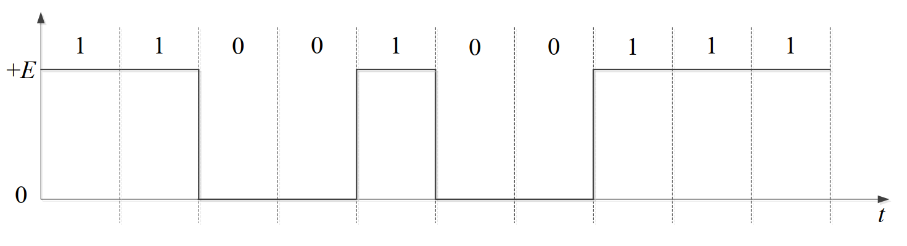

   - 双极不归零码

     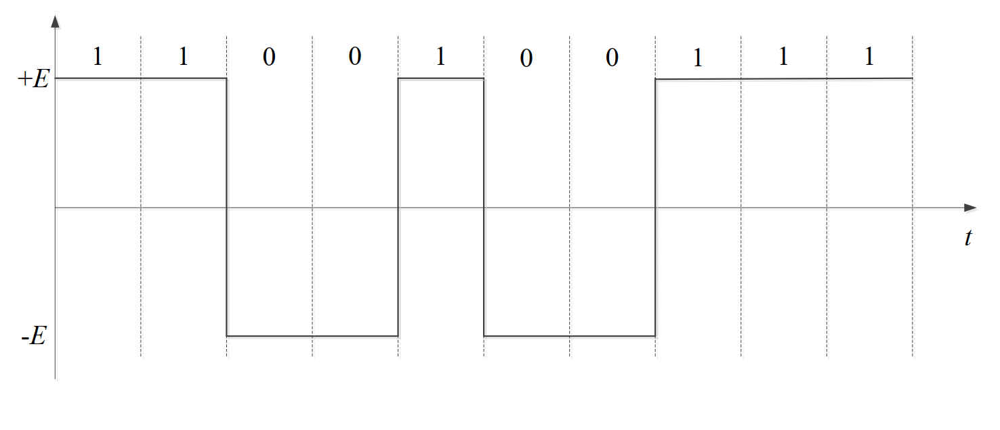

   - 单极归零码：码元不为零的时间占一个码元周期的百分比称为占空比

     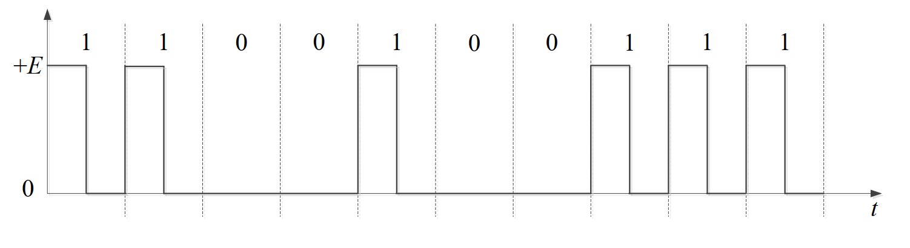

   - 双极归零码

     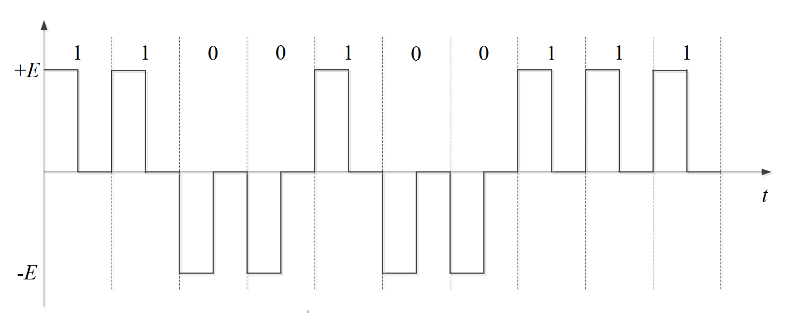

   - 差分码：相邻脉冲有电平跳变表示 1，无跳变表示 0

     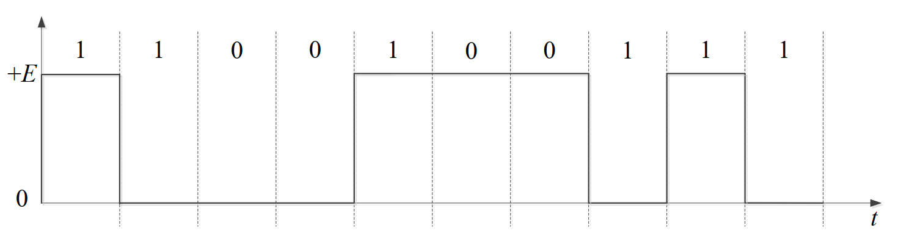

   - AMI 码：信息码中的 0 编码为 AMI 传输码中的 0，信号码中的 1 交替编码为 AMI 传输码中的 +1 和 -1

     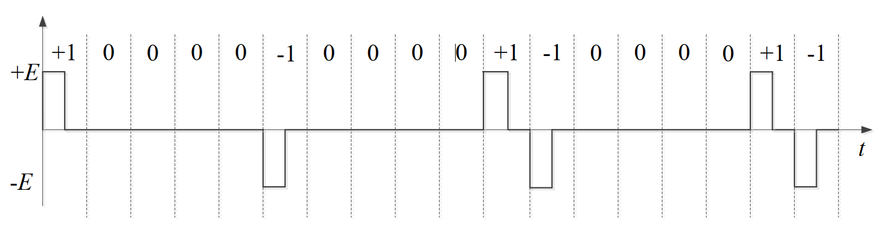

   - 双相码：又称为曼彻斯特码，双相码只有正、负两种电平，每个比特持续时间的中间时刻要进行电平跳变，正电平跳到负电平表示 1，负电平跳到正电平表示 0；双相码在每个比特周期中间时刻都会有电平跳变，因此便于提取定时信息；10 Mbps 的以太网采用曼彻斯特码

     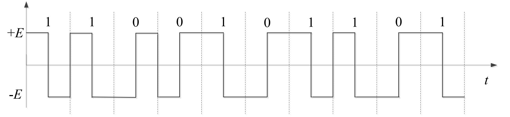

   - 差分双相码：也称为差分曼彻斯特码，利用每个比特开始处是否存在电平跳变编码信息，有跳变表示 0，无跳变表示 1；IEEE 802.5 令牌环网采用差分曼彻斯特码

     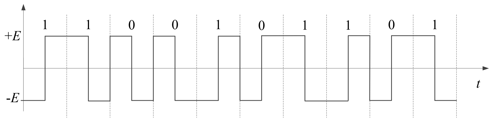
3. 数字调制：将数字基带信号调制到载波上，常见方式有：
    - 二进制调制：2ASK（幅移键控）、2FSK（频移键控）、2PSK（相移键控）、2DPSK（差分相移键控）
    - 多进制调制：QAM（正交幅值调制），如 16QAM、64QAM，高频带利用率，调制信号同时受幅值和相位控制，公式为 \( y'(t) = A_n\cos(2\pi ft) + B_n\sin(2\pi ft) \)

### 二、传输介质

#### （一）导引型传输介质（Guided Media）

1. 双绞线（Twisted Pair）：分为屏蔽双绞线（STP）和非屏蔽双绞线（UTP），常用于基带传输，UTP 分类及应用：
    - 3 类：带宽 16 MHz，用于低速网络、电话网络
    - 4 类：带宽 20 MHz，用于 10Base - T 以太网
    - 5 类：带宽 100 MHz，用于 10Base - T 以太网、100Base - T 快速以太网
    - 5E 类（超 5 类）：带宽 100 MHz，用于 100Base - T 快速以太网、1000Base - T 吉比特以太网
    - 6 类：带宽 250 MHz，用于 1000Base - T 吉比特以太网、ATM 网络
2. 同轴电缆（Coaxial Cable）：具有外导体屏蔽层，抗干扰能力强，主要用于频带传输。
3. 光纤（Optical Fiber）：利用光的全反射原理传输，分为多模光纤和单模光纤，优点是带宽大、抗干扰性强、传输距离远。

#### （二）非导引型传输介质（Unguided Media）

1. 无线传输介质：包括无线电波、红外线、可见光、紫外线等，依赖自由空间传播。
2. 无线电波频段及应用：
    - 极低频（ELF，3 ~ 30 Hz）：远程导航、水下通信
    - 超低频（SLF，30 ~ 300 Hz）：水下通信
    - 特低频（ULF，300 ~ 3000 Hz）：远程导航
    - 甚低频（VLF，3 ~ 30 kHz）：远程导航、水下通信、声纳
    - 低频（LF，30 ~ 300 kHz）：导航、水下通信、无线电信标
    - 中频（MF，300 ~ 3000 kHz）：广播、海事通信、测向、救险、海岸警卫
    - 高频（HF，3 ~ 30 MHz）：远程广播、电报、电话、传真、搜救、飞机与舰船通信
    - 甚高频（VHF，30 ~ 300 MHz）：电视、调频广播、陆地交通、空中交通管制、导航、飞机通信
    - 特高频（UHF，0.3 ~ 3 GHz）：电视、蜂窝网、微波链路、导航、卫星通信、GPS、监视雷达
    - 超高频（SHF，3 ~ 30 GHz）：卫星通信、微波链路、机载雷达、气象雷达、公用陆地移动通信
    - 极高频（EHF，30 ~ 300 GHz）：雷达着陆系统、卫星通信、移动通信、铁路业务
    - 亚毫米波（300 GHz ~ 3 THz）：实验应用
    - 红外线（43 ~ 430 THz）：光通信系统
    - 可见光（430 ~ 750 THz）：光通信系统
    - 紫外线（750 ~ 3000 THz）：光通信系统
3. 无线电波传播方式：地波传播（频率 < 2 MHz）、天波传播（2 ~ 30 MHz，依赖电离层反射）、视线传播（频率 > 30 MHz，需无遮挡或中继）。

#### （三）物理层接口特性

1. 机械特性（Mechanical Characteristics）：指明接口接线器的形状、尺寸、引线数目、排列及固定锁定装置等。
2. 电气特性（Electrical Characteristics）：指明接口电缆各线的电压范围等电路特性。
3. 功能特性（Functional Characteristics）：指明某条线上的电平表示的意义。
4. 规程特性（Procedural Characteristics）：指明不同功能事件的出现顺序。

### 三、物理层设备

1. 中继器（Repeater）：工作在物理层，功能是比特再生，放大并还原衰减的信号，延长传输距离，仅连接相同速率的网段。
2. 集线器（Hub）：多端口中继器，所有端口内部物理连通，属于共享设备，所有端口处于同一冲突域，转发信号时采用广播方式，常用于 10Base - T、100Base - T 以太网。

---

## 3 数据链路层

### 一、数据链路层的功能

- 核心作用：实现相邻结点间的 node-to-node 数据传输，为网络层提供服务。
- 主要功能：组帧（Framing）、物理寻址（Physical addressing）、流量控制（Flow control）、差错控制（Error control）、访问控制（Access control）。
- 服务类型：无连接服务、面向连接服务；通信模式：全双工通信、半双工通信。
- 实现载体：网络接口卡（NIC，适配器），集成硬件、软件与固件。

### 二、组帧

- 定义：将网络层数据报封装为帧，实现帧同步（区分帧的开始与结束）。
- 常用方法：
  1. 字节计数法（Byte count）：通过计数字节标识帧长，计数字节出错会导致帧同步失败。
  2. 带字节填充的定界符法（Flag bytes with byte stuffing）：用特殊字节（如 0x7E）作为定界符，有效载荷中出现定界符时，通过转义字节（ESC）填充。
  3. 带比特填充的定界符法（Flag bits with bit stuffing）：定界符为 01111110（0x7E），有效载荷中出现连续 5 个 1 时插入 1 个 0。
  4. 物理层编码违例（Physical layer coding violations）：利用数据部分不会出现的码字作为定界符（如 4B/5B 未使用码字）。

### 三、差错控制

#### （一）基本原理

- 核心逻辑：将数据 D 扩展为 D+R（R 为冗余比特），通过编码实现差错检测或纠正，差错编码无法保证 100% 可靠。
- 汉明距离（Hamming distance）：两个码字对应位不同的数目，决定编码检错/纠错能力：
  - 检错码：\(d_s = r + 1\)，可检测 r 位差错。
  - 纠错码：\(d_s = 2r + 1\)，可纠正 r 位差错。

#### （二）检错编码

1. 奇偶校验码：1 比特校验位，检测奇数位差错；二维奇偶校验可检测部分偶数位差错，纠正同一行/列奇数位错。
2. Internet 校验和（Checksum）：将数据划分为 16 位整数序列，补码求和后取反码作为校验和，接收端计算结果为全 0 则无错。
3. 循环冗余校验码（CRC）：将数据 D 视为二进制数，选择 r+1 位生成多项式 G，使 <D,R> 能被 G 整除（模 2），可检测所有突发长度小于 r+1 位的差错，广泛应用于以太网、WiFi 等。
    
循环冗余校验码计算过程：假设源数据 M 为 10110011，生成多项式为 $G(x) = x^4 + x + 1$，转换为二进制下 P 为 10011，校验码长度为最高次项次数 4；在源数据后添加 4 个 0，得到 101100110000，进行模 2 除法运算，除数是 P，得到 4 位余数 0100；将校验码附加到原始数据后，得到发送数据 101100110100；接收端收到数据后也使用相同的除数 P 进行模 2 除法运算，若余数为 0 则无差错，否则有差错。
    

#### （三）纠错编码

- 前向纠错（FEC）：接收端直接纠正比特差错，无需重传。
- 反馈重传：接收端检测到差错后，通知发送端重传（如停-等协议、滑动窗口协议）。

### 四、流量控制与可靠传输机制

#### （一）流量控制

- 定义：协调发送方与接收方速率，避免接收端被数据“淹没”。
- 实现方式：基于反馈的流量控制（接收方反馈调整发送速率）、基于速率的流量控制（发送方自行限速）。

#### （二）可靠传输

- 核心要求：数据传输不错、不丢、不乱、不多。
- 关键机制：差错检测（校验和/CRC）、确认（ACK/NAK）、序列号（防重复）、定时器（处理丢包）。

#### （三）滑动窗口机制

- 核心思想：通过窗口限制未确认分组数量，窗口滑动实现连续传输，提升信道利用率。
- 信道利用率公式：
  $$
  U = \frac{W_s \times t_{trans}}{t_{trans} + RTT + t_{ACK}}
  $$
  其中 \(W_s\) 为发送窗口大小，\(t_{trans}\) 为发送时延，\(t_{ACK}\) 为确认帧发送时延。

#### （四）典型协议

1. 停止-等待协议（停-等协议）：
   - 发送方发送 1 个分组后等待确认，收到 ACK 再发送下一个，超时重传。
   - 信道利用率低，适用于低速率、低误码率链路。

2. 后退 N 帧协议（GBN）：
   - 发送窗口大小 \(W_s = N\)，接收窗口 \(W_r = 1\)，累积确认（ACK(n) 表示前 n 个分组已正确接收）。
   - 超时重传所有未确认分组，支持流水线传输，存在“重传过多”缺陷。

3. 选择重传协议（SR）：
   - 发送窗口 \(W_s = N\)，接收窗口 \(W_r = N\)，对每个分组单独确认，仅重传未确认分组。
   - 需缓存乱序到达分组，窗口大小约束：\(W_s + W_r \leq 2^k\)（k 为序列号位数），\(W_r \leq W_s\)，典型 \(W_s = W_r \leq 2^{k-1}\)。

### 五、介质访问控制

#### （一）信道划分

- 核心思想：将信道资源划分为多个子信道，多个结点同时使用不同子信道，无冲突。
- 常见类型：
  1. 频分复用（FDMA）：划分频带，每个结点占用固定频带。
  2. 时分复用（TDMA）：划分时隙，每个结点在固定时隙传输。
  3. 波分复用（WDMA）：光域的频分复用，利用不同波长传输。
  4. 码分复用（CDMA）：每个结点分配独特码片序列，可同时占用整个信道，通过码片正交性解码。

每个站点指派一个唯一的 m 位码片序列。发送 1 时，发送该码片序列；发送 0 时，发送该码片序列的反码。当多个站点同时发送时，各路数据在信道中线性相加，要求各个站点的码片序列相互正交。

令 $\mathbf{S}$ 表示 A 站的码片向量，$\mathbf{T}$ 表示 B 站的码片向量，为了方便计算，将码片中的 0 写为 -1，1 写为 +1，设 $\mathbf{S} = (-1 -1 -1 +1 +1 -1 +1 +1)$，$\mathbf{T} = (-1 -1 +1 -1 +1 +1 +1 -1)$，则 $\mathbf{S}$ 与 $\mathbf{T}$ 的规格化内积为 0：

$$
\mathbf{S} \cdot \mathbf{T} = \frac{1}{m}\sum\limits_{i=1}^{m} S_i T_i = 0
$$

设接收端收到的数据为 $\mathbf{D}$，则 A 站的数据可通过计算 $\mathbf{D} \cdot \mathbf{S}$ 得到，B 站的数据可通过计算 $\mathbf{D} \cdot \mathbf{T}$ 得到，内积结果为 +1 表示发送 1，-1 表示发送 0。


#### （二）随机访问

- 核心思想：结点随机发送数据，允许冲突，通过检测和恢复机制处理冲突。
- 典型协议：
  1. ALOHA 协议：无时隙同步，随时发送，冲突概率高，最大效率 1/(2e) ≈ 0.18。
  2. 时隙 ALOHA 协议：时间划分为时隙，仅在时隙开始时发送，最大效率 1/e ≈ 0.37。
  3. CSMA 协议：发送前监听信道（载波监听），信道空闲则发送，忙则推迟：
     - 1-坚持 CSMA：信道空闲立即发送，忙则持续监听。
     - 非坚持 CSMA：信道忙则随机延迟后监听。
     - P-坚持 CSMA：信道空闲以概率 P 发送，否则延迟。
  4. CSMA/CD 协议（载波监听多路访问/冲突检测）：
     - 边发边听，检测到冲突立即中止发送并发送阻塞信号，采用二进制指数退避重传。
     - 二进制指数退避算法：第 m 次冲突后，从 0 到 \(2^m - 1\) 中随机选择一个数 k，等待 k 个基本退避时间（常取 512 bits 的传输时间）后重传，m 最大为 10。
     - 最小帧长公式：\(L_{min} = R \times 2d_{max}/V\)（R 为传输速率，\(d_{max}\) 为最大传播距离，V 为信号传播速度）。
  5. CSMA/CA 协议（载波监听多路访问/冲突避免）：
     - 无线链路中无法检测冲突，通过 RTS-CTS 预约信道（发送方发 RTS，AP 广播 CTS），接收方接收数据后发送 ACK 确认。
     - 最快传输时间：DIFS + 3SIFS（忽略传播、处理、传输时延）。

     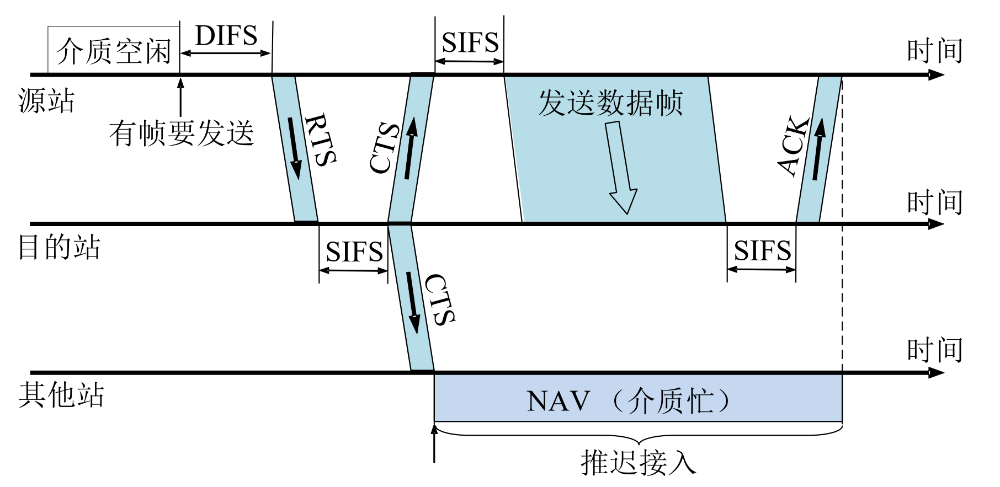

#### （三）轮询访问

- 核心思想：结点轮流使用信道，避免冲突，兼顾负载重时的公平性和负载轻时的效率。
- 典型协议：
  1. 轮询（Polling）：主结点轮流邀请从属结点发送数据，存在轮询开销、等待延迟和单点故障。
  2. 令牌传递（Token passing）：控制令牌在结点间依次传递，持有令牌者可发送数据，存在令牌开销、等待延迟和单点故障（如 FDDI、令牌环网）。

### 六、局域网

#### （一）基本概念与体系结构

- 定义：地理范围较小（如校园、办公室），结点物理连接紧密，共享传输介质或通过交换机互联。
- 体系结构：遵循 IEEE 802 标准，分为逻辑链路控制（LLC）子层和介质访问控制（MAC）子层。

#### （二）以太网与 IEEE 802.3

- 核心特性：无连接、不可靠服务，采用 CSMA/CD 介质访问控制协议，二进制指数退避重传。
- 帧结构：前导码（8 B，时钟同步）、目的 MAC 地址（6 B）、源 MAC 地址（6 B）、类型/长度字段（2 B）、数据（46-1500 B）、CRC（4 B），最小帧长 64 B，最大帧长 1518 B。
- 速率演进：10 Mbps（传统以太网）→ 100 Mbps（快速以太网）→ 1 Gbps（千兆以太网）→ 10 Gbps（万兆以太网）→ 40/100 Gbps 以太网，支持全双工/半双工模式（万兆及以上仅支持全双工）。
- 物理拓扑：早期总线型，现主流星型（通过交换机互联）。

#### （三）IEEE 802.11 无线局域网

- 核心特性：支持基础设施模式（AP 连接有线网络）和自组网模式（无 AP），采用 CSMA/CA 协议。
- 关键技术：
  1. 关联过程：主机通过被动扫描（监听 AP 信标帧）或主动扫描（发送探测请求）与 AP 关联，获取 SSID、IP 地址等信息。
     
被动扫描：发送 3 帧：各 AP 发送信标帧；主机向选择的 AP 发送关联请求帧；AP 向主机发送关联响应帧

主动扫描：发送 4 帧：主机主动广播探测请求帧；AP 发送探测响应帧；主机向选择的 AP 发送关联请求帧；AP 向主机发送关联响应帧
     
  2. 帧结构：含 4 个地址字段，支持 RTS-CTS 预约、速率适应（根据 SNR 调整传输速率）、功率管理（休眠/唤醒机制）。
    |To DS|From DS|Address1（A1）|Address2（A2）|Address3（A3）|Address4（A4）|
    | ---- | ---- | ---- | ---- | ---- | ---- |
    |0|0|目的地址（DA）|源地址（SA）|基础服务集标识（BSSID）|未使用|
    |0|1|目的地址（DA）|发送AP地址（TA/BSSID）|源地址（SA）|未使用|
    |1|0|接收AP地址（RA/BSSID）|源地址（SA）|目的地址（DA）|未使用|
    |1|1|接收端地址（RA）|发送端地址（TA）|目的地址（DA）|源地址（SA）|
  3. 常见标准：802.11b（11 Mbps，2.4 GHz）、802.11g（54 Mbps，2.4 GHz）、802.11n（600 Mbps，2.4/5 GHz，MIMO）、802.11ac（3.47 Gbps，5 GHz）、802.11ax（14 Gbps，2.4/5 GHz）。

#### （四）VLAN 的基本概念与基本原理

- 定义：虚拟局域网，在物理 LAN 基础上通过划分不同广播域，实现流量隔离、安全控制和灵活管理。
- 划分方式：基于端口（最常用）、基于 MAC 地址、基于协议、基于子网。
- 关键技术：
  1. 中继端口（Trunk port）：承载多个 VLAN 帧，通过 802.1Q 协议添加 4 字节 VLAN 标记（含 VLAN ID）。
  2. 跨交换机 VLAN：通过 Trunk 链路互联，交换机之间传递带 VLAN 标记的帧，实现同一 VLAN 跨物理交换机通信。

### 七、广域网

#### （一）基本概念

- 定义：地理范围广阔（如城市、国家间），结点分布分散，通过公用通信网络（如电信网络）互联，典型技术包括 PPP、ATM、帧中继等。

#### （二）点对点协议（PPP）

- 核心特性：支持点对点链路，简单灵活，可承载多种网络层协议（IP、IPX 等），提供差错检测、连接活性检测、网络层地址协商功能。
- 帧结构：标志字段（0x7E）、地址字段（0xFF，无效）、控制字段（0x03）、协议字段（2 B，标识上层协议）、信息字段（可变长度）、校验字段（CRC）。
- 透明传输：
  - 异步传输：字节填充（0x7E → 0x7D 0x5E，0x7D → 0x7D 0x5D）。
  - 同步传输：零比特填充（连续 5 个 1 后插入 0）。
- PPPoE：以太网链路上的 PPP 协议，结合以太网的低成本和 PPP 的认证、计费功能，广泛应用于宽带接入。

### 八、数据链路层设备

#### （一）以太网交换机及其工作原理

- 核心特性：链路层设备，存储-转发以太网帧，基于 MAC 地址选择性转发，透明、即插即用，支持自学习功能。
- 关键机制：
  1. 自学习：通过帧的源 MAC 地址记录主机与交换机接口的映射关系，写入交换表（含 MAC 地址、接口、时间戳）。
  2. 转发逻辑：收到帧后，根据目的 MAC 地址查询交换表，命中则转发到对应接口，未命中则泛洪（除接收接口外所有接口），广播帧直接泛洪。
  3. 冲突域隔离：每个接口对应一个独立冲突域，结点间可同时传输，无冲突（全双工模式）。
  4. 交换模式：存储转发模式（默认，校验 CRC 后转发）、直通模式（收到目的地址即转发）、无碎片模式（收到前 64 字节转发）。

#### （二）设备对比

| 设备       | 层次 | 冲突域隔离 | 即插即用 | 转发依据       |
|------------|------|------------|----------|----------------|
| 集线器（Hub） | 物理层 | 否         | 是       | 广播所有端口   |
| 交换机（Switch） | 数据链路层 | 是         | 是       | MAC 地址       |
| 网桥（Bridge） | 数据链路层 | 是         | 是       | MAC 地址       |

---

## 4 网络层

### 一、网络层的功能

#### （一）异构网络互连

网络层可实现不同链路层技术（如以太网、无线局域网等）的异构网络互连，为主机到主机的数据传输提供统一的逻辑通路，屏蔽底层链路的差异。

#### （二）路由与转发

- **转发（forwarding）**：路由器将分组从输入端口转移到合适的输出端口的过程，依据**转发表**完成，操作粒度为单个分组，属于数据层面的快速处理。
- **路由（routing）**：通过**路由算法/协议**确定分组从源主机到目的主机的端到端传输路径，进而生成并维护转发表，属于控制层面的路径规划。

#### （三）SDN 基本概念

SDN（软件定义网络）将网络的**控制平面**与**数据平面**分离，控制平面由集中式控制器负责路由决策等策略制定，数据平面的交换机仅负责根据控制器下发的规则完成分组转发，实现网络的灵活管控。

#### （四）拥塞控制

- **拥塞定义**：过多发送主机发送过量数据或发送速率过快，导致网络无法及时处理，表现为分组丢失（路由器缓存溢出）、分组延迟过大（缓存排队）。
- **拥塞与流量控制区别**：拥塞控制针对网络整体负载，流量控制针对端到端的发送接收速率匹配。
- **拥塞成因与代价**
    1. 场景1（无限缓存无重传）：拥塞时分组延迟剧增，吞吐量达到上限后不再提升。
    2. 场景2（有限缓存有重传）：分组丢失触发重传，无效重传增加网络负载，浪费资源，且重传机制会使实际发送速率大于有效传输速率（goodput）。
    3. 场景3（多跳超时重传）：分组在多跳链路中被丢弃时，上游链路的传输资源全部被浪费。
- **拥塞控制方法**
    1. **网络层辅助拥塞控制**：路由器向发送方显式反馈拥塞信息（如 1 bit 拥塞指示、DECbit、ECN、ATM 相关机制）。
    2. **传输层端到端拥塞控制**：端系统通过观察分组丢失、延迟等判断拥塞（如 TCP 拥塞控制），无需网络层显式支持。
- **网络层拥塞控制策略**：流量感知路由、准入控制、流量调节（抑制分组）、背压、负载脱落。
- **案例：ATM ABR 拥塞控制**：ABR 为弹性服务，发送方发送 RM（resource management）信元，交换机通过置 RM 信元的 NI 位（速率不许增长）、CI 位（拥塞指示）或修改 ER（显式速率）字段反馈拥塞，接收方将 RM 信元返回发送方，发送方据此调整速率。

### 二、路由算法

#### （一）静态路由与动态路由

- **静态路由**：手工配置路由规则，路由更新慢，优先级高，适用于拓扑简单的网络。
- **动态路由**：通过路由协议自动更新路由信息，能快速响应链路费用或网络拓扑变化，可定期更新或触发更新。

#### （二）距离-向量路由算法（DV）

- **核心思想**：基于 Bellman - Ford 方程，每个结点维护**距离向量** $D_x=[D_x(y):y\in N]$（$D_x(y)$ 为结点 x 到 y 的最小费用估计），仅与直连邻居交换距离向量，异步迭代更新。
- **Bellman - Ford 方程**：
  $$
  d_x(y)=\min_v\{c(x,v)+d_v(y)\}
  $$
  其中，$c(x,v)$ 为 x 到邻居 v 的链路费用，$d_v(y)$ 为 v 到 y 的最短路径费用。
- **算法流程**
    1. 结点初始化自身到各目的结点的距离（直连结点为链路费用，非直连为 $\infty$）。
    2. 不定时向邻居发送自身距离向量。
    3. 收到邻居距离向量后，按 Bellman - Ford 方程更新自身距离向量，若距离变化则向所有邻居通告。
- **问题**：存在**无穷计数（count to infinity）**问题（坏消息传播慢），可通过**毒性逆转**（若结点 x 到目的 y 的最短路径经邻居 v，则 x 向 v 通告到 y 的距离为 $\infty$）或**最大度量**（如 16 跳为不可达）缓解。

#### （三）链路状态路由算法（LS）

- **核心思想**：基于 Dijkstra 算法，所有结点通过**链路状态广播**掌握完整的网络拓扑和链路费用，独立计算从自身到所有其他结点的最短路径。
- **符号定义**
  - $c(x,y)$：结点 x 到 y 的链路费用，不直连为 $\infty$。
  - $D(v)$：源结点到 v 的当前路径费用。
  - $p(v)$：源到 v 路径上 v 的前序结点。
  - $N'$：已找到最短路径的结点集合。
- **Dijkstra 算法流程**
    1. 初始化：$N'=\{源结点 u\}$，$D(v)$ 对直连结点为 $c(u,v)$，非直连为 $\infty$。
    2. 循环：找出不在 $N'$ 中 $D(w)$ 最小的结点 w，将 w 加入 $N'$，更新 w 的所有非 $N'$ 邻居 v 的 $D(v)=\min(D(v),D(w)+c(w,v))$。
    3. 直至所有结点加入 $N'$，得到源结点到所有结点的最短路径。
- **算法复杂度**：n 个结点时，基础实现为 $O(n^2)$，高效实现可优化至 $O(n\log n)$，存在路由震荡可能（链路费用为通信量时易触发）。

#### （四）层次路由

- **必要性**：扁平路由无法适配大规模网络（路由表过大、信息交换量巨），且不同网络有自治管理需求。
- **核心概念**：将网络划分为**自治系统（AS，autonomous systems）**，同一 AS 内路由器运行相同的**内部网关协议（IGP，intra - AS 协议）**，不同 AS 可运行不同 IGP。
- **关键设备**：**网关路由器**位于 AS 边缘，用于连接其他 AS 的网关路由器。
- **路由协同**：转发表由 AS 内部路由算法和 AS 间路由算法共同配置，AS 内部算法负责 AS 内目的网络路由，AS 间算法负责 AS 外目的网络路由及网关选择。

### 三、IPv4

#### （一）IPv4 分组

- **分组格式**（固定部分 20 B，含可变选项字段）

    | 字段 | 长度 | 功能说明 |
    |------|------|----------|
    | 版本号 | 4 bit | 标识 IP 协议版本，IPv4 为 4 |
    | 首部长度 | 4 bit | 以 4 B 为单位，最小值为 5（对应 20 B 首部） |
    | 服务类型（TOS） | 8 bit | 1998 年改为区分服务（DiffServ），用于请求特定服务，一般为 00H |
    | 总长度 | 16 bit | 整个 IP 分组的字节数（首部 + 数据），最大值 65535 B |
    | 标识 | 16 bit | 标识一个 IP 分组，分片时所有分片标识相同 |
    | 标志位 | 3 bit | 保留位；DF（1 禁止分片，0 允许分片）；MF（1 非最后一片，0 最后一片/未分片） |
    | 片偏移 | 13 bit | 以 8 B 为单位，标识分片在原分组中的相对偏移 |
    | 生存时间（TTL） | 8 bit | 分组可经过的路由器数，每经过一个路由器减 1，TTL=0 时丢弃分组 |
    | 协议 | 8 bit | 标识封装的上层协议（6 为 TCP，17 为 UDP） |
    | 首部检验和 | 16 bit | 仅校验首部，计算时字段置 0，采用反码求和再取反，逐跳校验 |
    | 源/目的 IP 地址 | 32 bit | 标识发送/接收方的网络接口地址 |
    | 选项字段 | 可变（1~40 B） | 携带安全、源选路径等信息，极少使用 |
    | 填充字段 | 可变（0~3 B） | 保证首部长度为 4 B 整数倍 |

    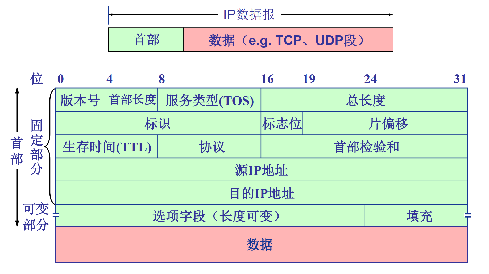

- **IP 分片与重组**
    1. **MTU 限制**：链路层存在最大传输单元（MTU），不同链路 MTU 不同，大分组向小 MTU 链路转发时需分片。
    2. **分片计算**
        - 最大分片数据长度：$d=\lfloor\frac{M - 20}{8}\rfloor\times8$（M 为链路 MTU）
        - 总片数：$n=\lceil\frac{L - 20}{d}\rceil$（L 为原分组总长度）
        - 第 i 片偏移：$(i - 1)\times d/8$，MF 位（i < n 为 1，i = n 为 0）
    3. 重组：仅在目的主机进行，依据标识、标志位、片偏移完成。

#### （二）IPv4 地址与 NAT

- **IPv4 地址格式**：32 bit，点分十进制表示（如 223.1.1.1），标识主机/路由器的网络接口。
- **有类编址**

    | 地址类别 | 首位标识 | 地址范围 | 网络号（NetID）长度 | 主机号（HostID）长度 |
    |----------|----------|----------|--------------------|--------------------|
    | A 类 | 0 | 0.0.0.0~127.255.255.255 | 8 bit | 24 bit |
    | B 类 | 10 | 128.0.0.0~191.255.255.255 | 16 bit | 16 bit |
    | C 类 | 110 | 192.0.0.0~223.255.255.255 | 24 bit | 8 bit |
    | D 类（多播） | 1110 | 224.0.0.0~239.255.255.255 | - | - |
    | E 类（保留） | 1111 | 240.0.0.0~255.255.255.255 | - | - |

- **特殊 IP 地址**

    | 地址形式 | 用途 |
    |----------|------|
    | 全 0 网络号 + 全 0 主机号 | 本网本机，路由表中表默认路由 |
    | 全 0 网络号 + 特定主机号 | 本网内特定主机 |
    | 全 1 网络号 + 全 1 主机号 | 本网广播（路由器不转发） |
    | 特定网络号 + 全 0 主机号 | 网络地址，标识一个网络 |
    | 特定网络号 + 全 1 主机号 | 特定网络广播地址 |
    | 127.x.x.x | 环回地址，用于本地测试 |

- **私有 IP 地址**：用于内网，无法直接访问公网，范围为 10.0.0.0/8、172.16.0.0/12、192.168.0.0/16。
- **NAT（网络地址转换）**
    1. **动机**：缓解 IPv4 地址耗尽，隐藏内网地址，变更 ISP 无需修改内网地址。
    2. **实现**：内网主机访问公网时，NAT 路由器将源 IP/端口替换为 NAT 公网 IP/新端口，记录转换表；公网响应时，依据转换表将目的 IP/端口还原为内网地址/端口。
    3. **NAT 穿透**：可通过静态端口映射、UPnP 协议、中继服务器（如 Skype）解决内网服务器对外访问问题。

#### （三）子网划分与子网掩码、CIDR、路由聚合

- **子网划分**
    1. **原理**：将 IP 地址的主机号部分划分为**子网号（SubID）**和**主机号（HostID）**，缩小广播域，提高地址利用率。
    2. **子网掩码**：32 bit，NetID 和 SubID 位为 1，HostID 位为 0，点分十进制表示（如 A 类默认掩码 255.0.0.0，B 类借 3 bit 子网掩码为 255.255.224.0）。
    3. **子网地址计算**：IP 地址与子网掩码按位与，得到子网地址。
    4. **示例**：C 类地址 201.2.3.0/24 划分为 4 个子网，掩码为 255.255.255.192，子网地址为 201.2.3.0/26、201.2.3.64/26、201.2.3.128/26、201.2.3.192/26。
- **CIDR（无类域间路由）**
    1. **特点**：消除 A/B/C 类地址界限，NetID + SubID 合并为**网络前缀**，前缀长度任意，格式为 a.b.c.d/x（x 为前缀长度）。
    2. **示例**：子网 201.2.3.64/26（掩码 255.255.255.192），200.23.16.0/23。
- **路由聚合（超网）**
    1. **原理**：将多个连续子网聚合为一个大子网，减少路由表条目，提高路由效率。
    2. **规则**：采用**最长前缀匹配优先**，即检索转发表时优先匹配目的地址前缀最长的条目。
    3. **示例**：223.1.0.0/24、223.1.1.0/24、223.1.2.0/24、223.1.3.0/24 可聚合为 223.1.0.0/22。

#### （四）ARP、DHCP 与 ICMP

- **ARP（地址解析协议）**
    1. **作用**：同一 LAN 内，根据目的 IP 地址获取其 MAC 地址。
    2. **ARP 表**：每个结点维护 <IP 地址；MAC 地址；TTL> 映射表，TTL 默认为 20min，超时失效。
    3. **工作流程**：源主机广播 ARP 查询（含目的 IP），目的主机单播回复自身 MAC，源主机缓存映射关系。
- **DHCP（动态主机配置协议）**

    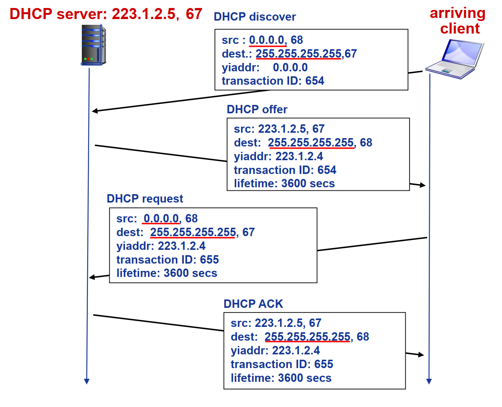

    1. **作用**：为主机动态分配 IP 地址、子网掩码、默认网关、DNS 服务器地址，支持即插即用、地址续租、移动接入。
    2. **工作流程**：主机广播 **DHCP discover** → DHCP 服务器广播 **DHCP offer** → 主机广播 **DHCP request** → 服务器广播 **DHCP ack**，报文封装在 UDP 中，基于广播传输。
- **ICMP（互联网控制报文协议）**
    1. **作用**：支持主机/路由器的差错报告和网络探询，报文封装在 IP 分组中。
    2. **报文类型**
        - **差错报告报文**：目的不可达、源抑制、超时、参数问题、重定向。
        - **网络探询报文**：回声请求/应答（ping 工具基于此）、时间戳请求/应答。
    3. **例外情况**：不对 ICMP 差错报文、后续分片、多播分组、特殊地址（127.0.0.0/8 等）发送 ICMP 差错。
    4. **应用：Traceroute**：源主机发送 TTL 递增的 UDP 分组，路由器 TTL 减至 0 时返回 ICMP 超时报文，目的主机返回端口不可达报文，据此追踪路由路径。

### 四、IPv6

#### （一）IPv6 主要特点

- **地址扩展**：地址长度为 128 bit，解决 IPv4 地址耗尽问题。
- **首部简化**：固定 40 B 基本首部，移除首部校验和、分片字段（不允许路由器分片，仅源主机可分片），提高转发效率。
- **QoS 支持**：首部含优先级和流标签字段，可标识服务优先级和同一“流”的分组。
- **协议扩展**：通过“下一个首部”字段支持扩展首部，定义新版 ICMPv6（含 Packet Too Big 等新报文，支持多播组管理）。
- **过渡机制**：支持隧道技术（IPv6 分组封装为 IPv4 载荷穿越 IPv4 网络），实现 IPv4 与 IPv6 共存。

#### （二）IPv6 地址

- **表示形式**
    1. **一般形式**：8 组 16 进制数（如 1080:0:FF:0:8:800:200C:417A）。
    2. **压缩形式**：连续全 0 段用::代替（如 FF01:0:0:0:0:0:0:43 压缩为 FF01::43）。
    3. **IPv4 嵌入形式**：::FFFF:13.1.68.3 或 0:0:0:0:0:FFFF:13.1.68.3。
    4. **地址前缀**：如 2002:43c:476b::/48（无子网掩码概念）。
- **地址类型**
    1. **单播**：一对一通信。
    2. **多播**：一对多通信。
    3. **任意播**：一对一组中最近结点通信。

### 五、路由协议

#### （一）自治系统、域内路由与域间路由

- **自治系统（AS）**：拥有独立管理权限的网络集合，AS 内用**域内路由协议（IGP）**，AS 间用**域间路由协议（EGP）**。
- **域内路由**：负责 AS 内部的路径规划，目标是优化传输性能；**域间路由**：负责 AS 之间的路径选择，需兼顾策略（如流量管控）和性能。

#### （二）RIP 路由协议

- **类型**：基于距离向量的域内路由协议，早于 1982 年随 BSD - UNIX 发布。
- **距离度量**：跳步数，每条链路计 1 跳，最大跳数 15（16 跳表示不可达）。
- **更新机制**：每隔 30s 邻居间交换 DV 通告，每次通告最多含 25 个目的子网；180s 未收到通告则判定邻居/链路失效。
- **实现**：通过应用层 routed 进程管理，通告报文封装在 UDP 数据报中传输。

#### （三）OSPF 路由协议

- **类型**：基于链路状态的域内路由协议，“开放”表示协议规范公共可用，与 IS - IS 协议相似。
- **核心机制**
    1. **链路状态广播**：LS 分组在整个 AS 内泛洪，所有路由器掌握完整拓扑。
    2. **最短路径计算**：基于 Dijkstra 算法，每个路由器独立计算最短路径生成转发表。
    3. **报文封装**：直接封装在 IP 数据报中传输。
- **优点**：支持认证（安全性高）、多条等价路径、按 TOS 设链路费用、集成单播/多播路由、支持大规模 AS 分层（划分区和主干区）。
- **分层结构**
    1. **内部路由器**：位于区内，掌握本区拓扑。
    2. **区边界路由器（ABR）**：汇总本区网络距离，通告给其他区。
    3. **主干路由器**：在主干区内运行 OSPF，负责区间流量转发。
    4. **AS 边界路由器（ASBR）**：连接其他 AS，交互外部路由信息。

#### （四）BGP 路由协议

- **类型**：路径向量型的域间路由协议，是 Internet 域间路由的事实标准。
- **核心功能**
    1. **eBGP**：在不同 AS 的网关路由器间交换子网可达性信息。
    2. **iBGP**：在 AS 内部路由器间传播子网可达性信息。
    3. **路径选择**：基于策略（本地偏好）、AS - PATH 长度、热土豆路由（最近下一跳）等准则选择路由。
- **BGP 会话与报文**
    1. **会话**：基于半永久 TCP 连接，分 eBGP（跨 AS）和 iBGP（AS 内）。
    2. **报文类型**：OPEN（建立 TCP 连接并认证）、UPDATE（通告/撤销路径）、KEEPALIVE（保活连接）、NOTIFICATION（报告差错/关闭连接）。
- **路由属性**：前缀 + 属性构成路由，关键属性为 **AS - PATH**（前缀经过的 AS 序列）、**NEXT - HOP**（下一跳 AS 的入口路由器接口）。

### 六、IP 多播

### （一）多播的概念

IP 多播是一种一对多的通信模式，源主机发送一份数据，网络将其复制并转发给多个目标主机（多播组内成员），相比单播（多次发送）和广播（全网扩散），可节省网络带宽和服务器资源。

### （二）IP 多播地址

- 对应 IPv4 的 D 类地址（224.0.0.0~239.255.255.255），用于标识多播组，一个多播地址对应一个多播组，组内成员可动态加入/退出。
- IPv6 多播地址有专门的格式标识，支持范围更广的多播通信。

### 七、移动 IP

#### （一）移动 IP 的概念

移动 IP 是为解决移动结点（如笔记本、手机）在不同网络间漫游时，保持网络层连接不中断的技术，允许移动结点以固定的**家乡地址**通信，无需改变其 IP 配置。

#### （二）移动 IP 通信过程

1. **家乡代理与外地代理**：家乡代理位于移动结点的家乡网络，外地代理位于移动结点当前接入的外地网络。
2. **地址注册**：移动结点接入外地网络后，获取**转交地址**，并向家乡代理注册该地址。
3. **数据传输**
    1. 对端主机向移动结点家乡地址发送数据，家乡代理截获后封装，通过隧道转发至移动结点的转交地址。
    2. 移动结点向外发送数据时，可直接通过外地代理转发，或经家乡代理转发。

### 八、网络层设备

#### （一）路由器的组成和功能

- **组成**：分为**控制平面**和**数据平面**
    1. **控制平面**：由路由器处理器运行路由协议（RIP/OSPF/BGP），计算路由并生成转发表，操作粒度为秒级/毫秒级。
    2. **数据平面**：含输入端口、交换结构、输出端口
        - **输入端口**：完成物理层比特接收、数据链路层帧解析、网络层查表转发（支持最长前缀匹配），存在输入端口排队和 HOL（队头阻塞）问题。
        - **交换结构**：实现分组从输入端口到输出端口的转移，类型有基于内存、总线、交叉互连网络的交换结构，交换速率需匹配端口总带宽。
        - **输出端口**：完成分组排队、链路层封装、物理层发送，存在输出端口缓存溢出导致的分组丢失，缓存大小遵循 RFC 3439 或最新的与流数相关的准则。
- **核心功能**：路由计算（控制平面）、分组转发（数据平面）、异构网络互连、拥塞控制辅助。

#### （二）路由表与路由转发

- **路由表**：由路由协议生成，存储目的网络/前缀、子网掩码、下一跳地址、输出接口等信息，支持最长前缀匹配。
- **转发流程**：分组到达输入端口后，提取目的 IP 地址，检索路由表找到匹配条目，通过交换结构转发至对应输出端口，最终发送到下一跳或目的主机。
- **设备对比**

    | 设备 | 工作层次 | 冲突域隔离 | 广播域隔离 | 即插即用 | 优化路由 | 直通传输 |
    |------|----------|------------|------------|----------|----------|----------|
    | 集线器 | 物理层 | 否 | 否 | 是 | 否 | 是 |
    | 交换机 | 数据链路层 | 是 | 否 | 是 | 否 | 是 |
    | 网桥 | 数据链路层 | 是 | 否 | 是 | 否 | 是 |
    | 路由器 | 网络层 | 是 | 是 | 否 | 是 | 否 |

---

## 5 传输层

### 一、传输层提供的服务

#### （一）传输层的功能

- 为运行在不同主机上的**应用进程**提供**逻辑通信**机制，区别于网络层的主机间逻辑通信
- 发送方：将应用层递交的消息拆分成为 **Segment（段）**，并向下传递至网络层
- 接收方：将接收到的 Segment 重组为应用层消息，向上交付至应用层
- 可对网络层服务进行增强，如 TCP 的可靠性、拥塞控制等能力

#### （二）传输层寻址与端口

- **核心作用**：实现传输层的**多路复用/分用**，让不同应用进程的数据能准确交付
- **端口分类**
  - 源端口号：占 16 bit，标识发送方应用进程
  - 目的端口号：占 16 bit，标识接收方应用进程
- **套接字标识**
  - UDP 套接字：二元组 `(目的 IP 地址, 目的端口号)`
  - TCP 套接字：四元组 `(源 IP 地址, 源端口号, 目的 IP 地址, 目的端口号)`

#### （三）无连接服务和面向连接服务

| 服务类型 | 代表协议 | 核心特点 |
|----------|----------|----------|
| 无连接服务 | UDP | 无握手过程，无连接状态维护；基于“尽力而为”传输，可能丢包、乱序；头部开销小，传输延迟低 |
| 面向连接服务 | TCP | 通信前需建立连接，维护连接状态；提供可靠、按序的字节流传输；支持流量控制、拥塞控制 |

### 二、UDP

#### （一）UDP 数据报

- **UDP 段结构**（32 bit 为基本单位）
  - 源端口号：16 bit
  - 目的端口号：16 bit
  - 长度：16 bit，标识 UDP 段（包含头部）的总长度
  - 校验和：16 bit，用于检测传输错误
  - 应用数据：报文/消息部分
- **UDP 核心特性**
  - 无连接：发送方和接收方无需握手，每个段独立处理
  - 无可靠性保证：不保证数据可靠送达、不保证按序到达
  - 无拥塞控制：应用可自主控制发送速率和时间，适用于流媒体、DNS、SNMP 等场景

#### （二）UDP 检验

- **检验范围**：伪首部 + UDP 首部 + 应用数据
  - 伪首部包含：源 IP 地址（32 bit）、目的 IP 地址（32 bit）、0（8 bit）、协议号（UDP 为 17，8 bit）、UDP 总长度（16 bit）
- **计算流程**
  1. 发送方：将校验内容视为 16 bit 整数序列，计算序列和（最高位进位回卷加到末位），对和按位求反得到校验和并填入字段
  2. 接收方：按相同规则计算序列和，若结果为 `1111 1111 1111 1111` 则无错，否则判定为传输错误

### 三、TCP

#### （一）TCP 段

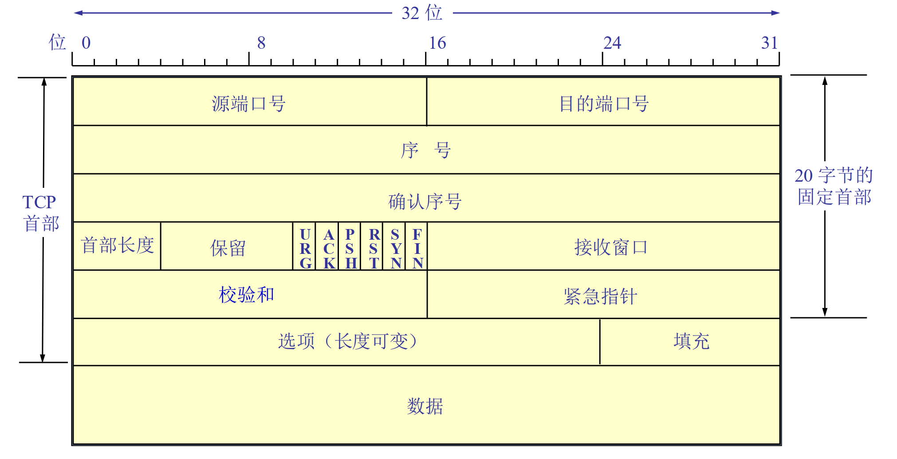

- **TCP 首部**（固定部分 20 字节，32 bit 为基本单位）
  1. 源端口号/目的端口号：各 16 bit，实现多路复用/分用
  2. 序号：32 bit，标识段中**第一个字节**的编号，建立连接时双方随机初始化
  3. 确认序号：32 bit，标识期望接收的下一个字节编号（累积确认，表明此前字节已正确接收）
  4. 首部长度：4 bit，以 4 字节为单位，标识 TCP 首部总长度
  5. 保留字段：6 bit，取值为 0
  6. 6 个标志位（各 1 bit）
     - URG：紧急指针有效标志
     - ACK：确认序号有效标志
     - PSH：要求接收方尽快交付数据至应用层
     - RST：重新建立连接
     - SYN：发起新连接请求
     - FIN：请求释放连接
  7. 接收窗口：16 bit，用于流量控制，标识接收方可用缓存空间
  8. 校验和：16 bit，覆盖伪首部、TCP 首部、应用数据
  9. 紧急指针：16 bit，URG = 1 时有效，标识紧急数据最后一个字节的位置
  10. 选项：长度可变，包含最大段长度（MSS）、时间戳等
  11. 填充：0~3 字节，保证首部长度为 4 字节的整数倍

#### （二）TCP 连接管理

##### （1）连接建立（三次握手）

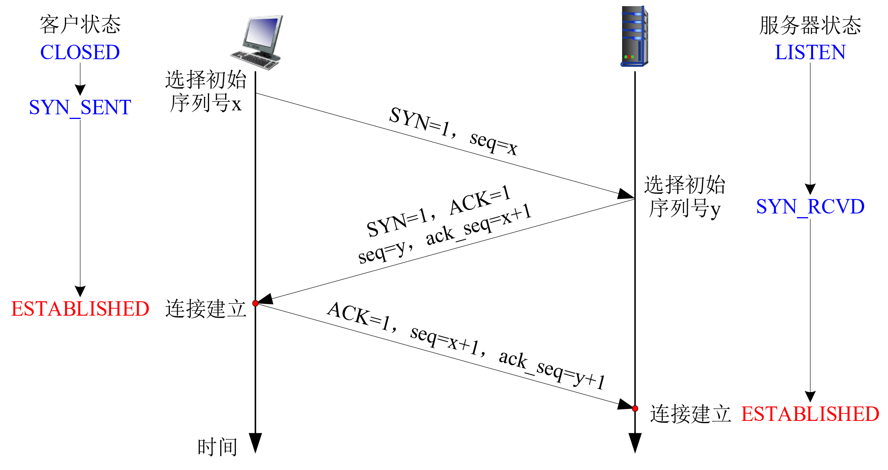

1. 客户端发送 **SYN 段**：SYN = 1，携带初始序号 `x`，无应用数据
2. 服务器回复 **SYN-ACK 段**：SYN = 1、ACK = 1，携带服务器初始序号 `y`，确认序号为 `x+1`，分配缓存资源
3. 客户端回复 **ACK 段**：ACK = 1，确认序号为 `y+1`，序号为 `x+1`，可携带应用数据，连接正式建立

##### （2）连接释放（四次挥手）

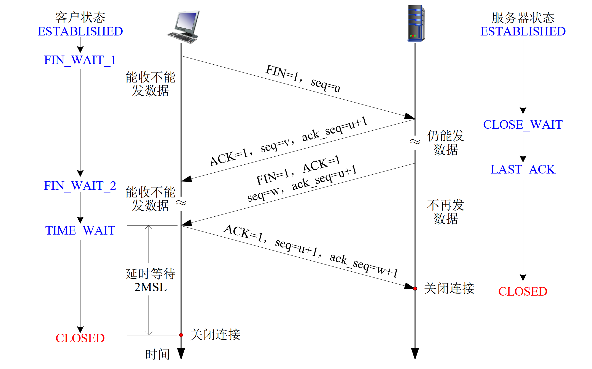

1. 客户端发送 **FIN 段**：FIN = 1，请求关闭连接
2. 服务器回复 **ACK 段**：确认客户端的 FIN，此时服务器可继续发送数据
3. 服务器发送 **FIN 段**：FIN = 1，服务器无数据发送，请求关闭连接
4. 客户端回复 **ACK 段**：确认服务器的 FIN，进入 `TIME_WAIT` 状态（等待 2 MSL），服务器收到 ACK 后连接关闭

#### （三）TCP 可靠传输

- **核心机制**：基于流水线、累积确认、单一重传定时器实现
- **RTT 与超时时间估计**
  1. 采样 RTT（SampleRTT）：段发出到收到 ACK 的时间（忽略重传）
  2. 估计 RTT（EstimatedRTT）：采用指数加权移动平均
    $$
    EstimatedRTT = (1-\alpha) \times EstimatedRTT + \alpha \times SampleRTT
    $$
     其中 $\alpha$ 典型值为 0.125
  3. RTT 偏差（DevRTT）：衡量 SampleRTT 与 EstimatedRTT 的波动
    $$
    DevRTT = (1-\beta) \times DevRTT + \beta \times |SampleRTT-EstimatedRTT|
    $$
     其中 $\beta$ 典型值为 0.25
  4. 超时时间（TimeoutInterval）
    $$
    TimeoutInterval = EstimatedRTT + 4 \times DevRTT
    $$
- **重传触发事件**
  1. 定时器超时：重传未确认段，重启定时器
  2. 收到 3 个重复 ACK（快速重传）：在超时前重传丢失段，无需等待定时器到期

#### （四）TCP 流量控制与拥塞控制

##### （1）流量控制

- **核心目标**：避免发送方速率过快淹没接收方缓存
- **实现机制**：接收方通过**接收窗口（RcvWindow）​**告知发送方可用缓存空间
  $$
  RcvWindow = RcvBuffer - (LastByteRcvd - LastByteRead)
  $$
- 发送方保证已发送未确认的数据量 ≤ 接收方的 RcvWindow

##### （2）拥塞控制

- **核心目标**：避免发送方速率过快导致网络拥塞
- **核心变量**
  - 拥塞窗口（CongWin）：动态调整，反映感知到的网络拥塞程度
  - 阈值（Threshold）：区分慢启动和拥塞避免阶段的临界值
- **核心算法**（AIMD 框架 + 慢启动）
  1. **慢启动**：CongWin < Threshold 时，每经过 1 个 RTT，CongWin 翻倍（指数增长）
  2. **拥塞避免**：CongWin > Threshold 时，每经过 1 个 RTT，CongWin 增加 1 个 MSS（线性增长，加性增）
  3. **丢包处理**
     - 3 个重复 ACK：Threshold = CongWin/2，CongWin = Threshold，进入拥塞避免（乘性减）
     - 超时：Threshold = CongWin/2，CongWin 重置为 1 个 MSS，重新进入慢启动

---

## 6 应用层

### 一、网络应用模型

#### （一）客户/服务器模型（Client-Server, C/S）

- **服务器（server）**
  - 7*24 小时提供服务
  - 拥有永久性可访问地址/域名
  - 可利用大量服务器实现可扩展性
- **客户机（client）**
  - 主动与服务器通信，使用服务器提供的服务
  - 间歇性接入网络，可能使用动态 IP 地址
  - 不会与其他客户机直接通信
- **典型示例**：Web 应用，客户机（浏览器）向 Web 服务器发送 HTTP 请求，服务器返回 HTTP 响应

#### （二）P2P 模型（Peer-to-peer, P2P）

- **核心特点**
  - 无永远在线的服务器
  - 任意端系统/节点之间可直接通信
  - 节点间歇性接入网络且可能改变 IP 地址
- **优点**：高度可伸缩
- **缺点**：难于管理
- **混合结构**：结合 C/S 和 P2P 模型优点，如 Napster，文件搜索采用 C/S 结构（集中式中央服务器登记节点内容），文件传输采用 P2P 结构（节点间直接传输）


设定以下符号定义：

- $F$：文件大小
- $N$：需要获取文件的接收者（对等方/客户端）数量
- $u_s$：服务器上传速率
- $u_i$：第 i 个对等方的上传速率
- $d_i$：第 i 个对等方的下载速率
- $d_{min}$：所有对等方中最小的下载速率

则分发时间计算公式如下：

$$
D_{C/S} = \max \left\{ \frac{NF}{u_s}, \frac{F}{d_{min}} \right\}
$$

$$
D_{P2P} = \max \left\{ \frac{F}{u_s}, \frac{F}{d_{min}}, \frac{NF}{u_s + \sum_{i=1}^{N} u_i} \right\}
$$


### 二、域名系统（DNS）

#### （一）层次域名空间

- **域名结构**：采用分层结构，从右到左依次为根、顶级域名、二级域名、三级域名等，例如 `www.hit.edu.cn`
  - 根：无实际标识，是域名空间的最顶层
  - 顶级域名：如 `edu`（教育机构）、`com`（商业机构）、`cn`（国家顶级域名）等
  - 二级域名：如 `hit`（哈尔滨工业大学）
  - 三级域名：如 `www`（服务器标识）

#### （二）域名服务器

- **分类**
    1. **根域名服务器**
        - 全球共 13 个，是域名解析的最高层
        - 本地域名服务器无法解析域名时，会先查询根域名服务器
    2. **顶级域名服务器（TLD）**
        - 负责管理顶级域名对应的域名解析，如 `com` 由 Network Solutions 维护，`edu` 由 Educause 维护
    3. **权威域名服务器**
        - 由组织或服务提供商维护，提供组织内部服务器的域名解析服务
    4. **本地域名服务器**
        - 不严格属于层级体系，每个 ISP 至少有一个
        - 主机发起 DNS 查询时，首先发送到本地域名服务器，由其作为代理转发查询

#### （三）域名解析过程

- **查询方式**
    1. **递归查询**：客户机向本地域名服务器发送查询请求后，本地域名服务器全权负责后续查询，最终将结果返回给客户机，客户机与本地域名服务器均只发送 1 次请求
    2. **迭代查询**：本地域名服务器向根域名服务器查询，根服务器返回顶级域名服务器地址，本地服务器再向顶级域名服务器查询，依此类推，直到获取目标 IP
- **解析流程**（以 `www.xyz.com` 为例）
    1. 客户机向本地域名服务器发起递归查询
    2. 本地服务器向根域名服务器查询，根服务器返回 `com` 顶级域名服务器地址
    3. 本地服务器向 `com` 顶级域名服务器查询，返回 `xyz.com` 权威域名服务器地址
    4. 本地服务器向 `xyz.com` 权威域名服务器查询，获取 `www.xyz.com` 的 IP 地址
    5. 本地服务器将 IP 地址返回给客户机
- **缓存机制**：域名服务器获取域名-IP 映射后会缓存该记录，一段时间后缓存条目失效，本地域名服务器通常缓存顶级域名服务器映射，减少根服务器访问次数

#### （四）DNS 记录

资源记录（RR，resource records），格式为 `(name, value, type, TTL)`，包括：

- Type = A：
  - Name: 主机域名
  - Value: IP地址
- Type = NS：
  - Name: 域名
  - Value: 该域权威域名服务器的主机域名
- Type = CNAME：
  - Name: 某一真实域名的别名
  - Value: 真实域名
- Type = MX：
  - Name: 邮件服务器别名
  - Value: 邮件服务器域名


在域名管理机构注册域名 `xyz.com` 时，域名管理机构向 com 顶级域名解析服务器中插入两条记录 NS 和 A 记录，例如

```text
< xyz.com, dns.xyz.com, NS, TTL >
< dns.xyz.com, 130.20.4.18, A, TTL >
```

其中，`dns.xyz.com` 为 `xyz.com` 的权威域名服务器域名，IP 地址为 `130.20.4.18`。

在权威域名解析服务器中：为 `www.xyz.com` 加入 A 记录，为 `mail.xyz.com` 加入 MX 记录、A 记录，例如

```text
< www.xyz.com, 130.20.5.10, A, TTL >
< xyz.com, mail.xyz.com, MX, TTL >
< mail.xyz.com, 130.20.4.20, A, TTL >
```

其中，`mail.xyz.com` 为 `xyz.com` 的邮件服务器主机域名，IP 地址为 `130.20.4.20`，`www.xyz.com` 网站服务器的 IP 地址为 `130.20.5.10`。



### 三、文件传输协议（FTP）

#### （一）FTP 的工作原理

- **体系结构**：采用 C/S 模型，FTP 服务器默认监听 21 端口
- **核心功能**：实现本地主机与远程主机之间的文件传输，支持文件的上传（STOR 命令）和下载（RETR 命令），同时可通过 LIST 命令查看远程目录文件列表

#### （二）控制连接与数据连接

- **控制连接**
  - 建立：FTP 客户端首先与服务器的 21 端口建立 TCP 控制连接
  - 作用：用于传输控制命令（如 USER、PASS、LIST、RETR 等）和响应状态码（如 331 用户名正确需输入密码、125 数据连接已打开），整个会话期间控制连接保持打开，采用“带外”通信方式
- **数据连接**
  - 建立：当服务器接收到文件传输命令时，主动与客户端建立 TCP 数据连接，默认使用 20 端口
  - 作用：专门用于传输文件数据，传输完一个文件后数据连接关闭，传输多个文件需建立多个数据连接
- **服务器状态**：FTP 服务器会维护状态，如当前目录、用户认证信息等

### 四、电子邮件（E-mail）

#### （一）电子邮件系统的组成结构

- **用户代理（UA）**：即邮件客户端，如 Outlook、Foxmail，用于读写邮件、与邮件服务器交互
- **邮件服务器**：核心组件，包含用户邮箱（存储邮件）和消息队列（存储待发送邮件），服务器之间通过 SMTP 协议传递邮件
- **邮件访问协议**：用户通过 POP3/IMAP/HTTP 协议从邮件服务器获取邮件
  - 用户发送邮件（客户端 → 服务器）：SMTP、HTTP
  - 邮件服务器之间发送与接收（服务器 → 服务器）：SMTP
  - 用户从服务器接收邮件（服务器 → 客户端）：IMAP、POP3、HTTP

#### （二）电子邮件格式与 MIME

- **RFC 822 标准格式**
  - 头部行（header）：包含 `To`（收件人）、`From`（发件人）、`Subject`（主题）等字段
  - 空白行：分隔头部与消息体
  - 消息体（body）：仅能包含 7 位 ASCII 字符
- **MIME（多媒体邮件扩展）**
  - 作用：解决 RFC 822 无法传输非 ASCII 数据（如图片、视频）的问题
  - 实现方式：在邮件头部增加 `MIME-Version`（MIME 版本）、`Content-Transfer-Encoding`（数据编码方式）、`Content-Type`（数据类型，如 `image/jpeg`）等字段，对多媒体数据进行编码后传输

#### （三）SMTP 与 POP3

##### （1）SMTP（简单邮件传输协议，RFC 2821）

- **传输层协议**：基于 TCP，默认端口 25
- **传输阶段**：握手、消息传输、关闭
- **交互模式**：命令/响应模式，命令为 ASCII 文本（如 HELO、MAIL FROM、RCPT TO、DATA）
- **特点**：采用“推”模式，要求消息为 7 位 ASCII 码，通过 `CRLF.CRLF` 标识消息结束

##### （2）POP3（邮局协议，RFC 1939）

- **传输层协议**：基于 TCP，用于用户从邮件服务器下载邮件
- **工作阶段**
    1. **认证阶段**：客户端发送 `User`（用户名）、`Pass`（密码）命令，服务器返回 `+OK`（成功）或 `-ERR`（失败）
    2. **事务阶段**：可执行 `List`（列出消息数量）、`Retr`（获取指定消息）、`Dele`（删除指定消息）、`Quit`（退出）等命令
- **工作模式**
  - 下载并删除：下载后服务器删除邮件，换客户端无法重读
  - 下载并保持：服务器保留邮件副本，多客户端可访问
- **特点**：无状态协议，不保留用户会话状态

### 五、万维网（WWW）

#### （一）WWW 的概念与组成结构

- **核心概念**：由 Tim Berners-Lee 提出，通过网页互相链接形成的信息网络，网页包含多个对象（HTML 文件、JPEG 图片、视频等）
- **统一资源定位器（URL）**：用于对象寻址，格式为 `Scheme://host:port/path`，例如 `www.someschool.edu/someDept/pic.gif`
- **组成结构**
  - **客户端**：即浏览器，负责请求、接收、展示 Web 对象
  - **服务器**：即 Web 服务器（如 Apache），负责响应客户端请求，发送 Web 对象

#### （二）HTTP（超文本传输协议）

##### （1）基本特性

- **体系结构**：C/S 模型
- **传输层协议**：基于 TCP，服务器默认监听 80 端口
- **无状态**：服务器不维护客户端过往请求的信息，降低服务器复杂度
- **版本**：HTTP/1.0（RFC 1945）、HTTP/1.1（RFC 2068）

##### （2）HTTP 消息

- **请求消息**
  - 格式：请求行 + 头部行 + 空行 + 实体主体（可选）
  - 请求行：`method URL version`，method 包括 GET（获取资源）、POST（提交数据，数据在实体主体）、HEAD（仅获取响应头部）、PUT（上传文件）、DELETE（删除资源）
  - 示例：

    ```http
    GET /somedir/page.html HTTP/1.1
    Host: www.someschool.edu
    User-agent: Mozilla/4.0
    Connection: close
    Accept-language: fr
    ```

- **响应消息**
  - 格式：状态行 + 头部行 + 空行 + 数据
  - 状态行：`protocol status code status phrase`，常见状态码：200 OK（请求成功）、301 Moved Permanently（永久重定向）、404 Not Found（资源未找到）
  - 示例：

    ```http
    HTTP/1.1 200 OK
    Connection: close
    Date: Thu, 06 Aug 1998 12:00:15 GMT
    Server: Apache/1.3.0 (Unix)
    Content-Length: 6821
    Content-Type: text/html
    ```

##### （3）连接方式

- **非持久性连接（HTTP/1.0）**：每个 TCP 连接仅传输一个对象，获取包含多个对象的网页需建立多个连接，响应时间为 2RTT + 响应消息发送时间（RTT 为往返时延）
- **持久性连接（HTTP/1.1 默认）**
  - 非流水：客户端收到前一个响应后再发送新请求，每个引用对象耗时 1 个 RTT
  - 流水：客户端遇到引用对象即发送请求，理想状态下获取所有引用对象仅需约 1 个 RTT

##### （4）响应时间优化方案

1. **并行连接**：浏览器打开多个并行 TCP 连接获取网页对象，减少整体耗时
2. **HTTP/2（RFC 7540）**
    - 将对象分割为“帧”，不同对象帧交替传输，避免队头阻塞
    - 支持对象优先级调度和服务器推送未请求对象
3. **HTTP/3（基于 QUIC 协议）**
    - 基于 UDP 实现，在应用层完成连接建立、差错控制、拥塞控制
    - 支持多流复用，无队头阻塞，1 个 RTT 完成连接建立（含加密和认证）
4. **Web 缓存/代理服务器**
    - 作用：缩短响应时间、减少网络流量、实现内容分发
    - 条件性 GET：客户端在请求中携带 `If-modified-since` 字段，若缓存版本最新，服务器返回 304 Not Modified，不传输对象

##### （5）Cookie

- **概念**：某些网站为了辨别用户身份、进行 session 跟踪而储存在用户本地终端上的数据（通常经过加密）。
- **组件**：
  - HTTP 响应消息的 cookie 头部行
  - HTTP 请求消息的 cookie 头部行
  - 保存在客户端主机上的 cookie 文件，由浏览器管理
  - Web 服务器端的后台数据库
- **作用**：身份认证、推荐等。

## 熟知端口号

| 端口号 | 协议名称 | 传输层协议 | 描述/用途 |
| --- | --- | --- | --- |
| **20** | **FTP-Data** (文件传输协议数据) | TCP | 用于 **FTP** 数据传输的默认端口。 |
| **21** | **FTP** (文件传输协议) | TCP | 用于 **FTP** 连接控制（命令）的默认端口。 |
| **25** | **SMTP** (简单邮件传输协议) | TCP | 用于电子邮件的**发送**和服务器之间的邮件传输。 |
| **53** | **DNS** (域名系统) | TCP/UDP | 用于将域名转换为 **IP 地址**。TCP用于区域传输，UDP用于常规查询。 |
| **67** | **DHCP** (动态主机配置协议) | UDP | DHCP **服务器**使用的端口，用于自动分配IP地址。 |
| **68** | **DHCP** (动态主机配置协议) | UDP | DHCP **客户端**使用的端口。 |
| **80** | **HTTP** (超文本传输协议) | TCP | 万维网（WWW）的基础，用于**传输网页内容**。 |
| **110** | **POP3** (邮局协议版本3) | TCP | 用于电子邮件客户端从邮件服务器上**接收**邮件。 |
| **143** | **IMAP** (互联网邮件访问协议) | TCP | 电子邮件客户端从服务器上**管理和接收**邮件，允许在服务器上保留邮件副本。 |
| **443** | **HTTPS** (安全超文本传输协议) | TCP | **HTTP** 的安全版本，通过 **SSL/TLS** 加密传输数据。 |


